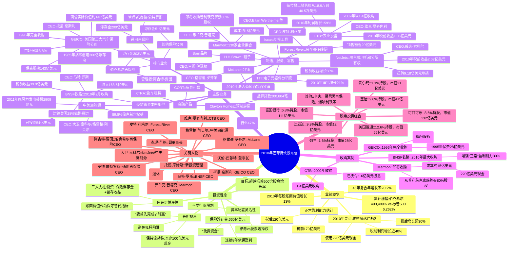

# 巴菲特2010年致股东信 - 思维导图

> 基于2010年巴菲特致股东信内容整理

---

## 时代背景分析

### 宏观经济环境
- **后金融危机时代**：2008年金融危机后经济复苏期，市场普遍存在"巨大不确定性"
- **行业影响**：金融危机余波，住宅建设相关业务持续低迷
- **复苏迹象**：BNSF铁路2010年创下新纪录

### 政策与产业趋势
- **铁路运输优势**：BNSF燃油效率500英里/加仑，是卡车的3倍
- **能源转型**：中美洲能源风力发电投资54亿美元
- **房地产困境**：预制房屋行业受政府融资政策影响（偏袒现场建造房屋）

### 美国经济长期信心
> "不要让这一现实吓倒你。在我的一生中，政客和评论员一直在哀叹美国面临的可怕问题。然而，我们的公民现在的生活水平比我出生时高出惊人的六倍。"
> 
> "美国最好的日子还在前方。"

---

## Mermaid 思维导图

---

## 结构概要表格

| 一级分支 | 二级分支 | 核心内容 | 关键数据 |
|---------|---------|---------|---------|
| **业绩概览** | 年度表现 | 2010年每股账面价值增长 | 13% |
| | 长期表现 | 46年复合年增长率 | 20.2% |
| | 累计涨幅 | 伯克希尔vs标普500 | 490,409% vs 6,262% |
| | 盈利能力 | 正常税前/税后利润 | 170亿/120亿美元 |
| **投资理念** | 核心目标 | 超越标普500含股息增长 | 长期目标 |
| | 价值衡量 | 账面价值作为保守指标 | 内在价值替代 |
| | 浮存金 | 保险业务免费资金 | 660亿美元 |
| | 流动性 | 现金储备要求 | 至少100亿美元 |
| **主要业务** | 保险 | GEICO/再保险/通用再保险 | 浮存金660亿 |
| | 制造零售 | TTI/Forest River/CTB等 | 收入666亿 |
| | 资本密集 | BNSF/中美洲能源 | 税前收益55亿 |
| | 金融产品 | Clayton/XTRA/CORT | 预制房屋领先 |
| **收购案例** | BNSF | 2010年最大收购 | 220亿美元 |
| | GEICO | 1996年完全收购 | 4.6亿美元(50%) |
| | Marmon | 即将收购80% | 15亿美元 |
| **股票组合** | 持仓前五 | 可口可乐/美国运通/富国银行 | 占组合75%+ |
| **关键人物** | 管理团队 | 20位CEO + 核心管理层 | 行业专家 |
| | 投资经理 | 托德·库姆斯(新加入) | 10-30亿美元 |

---

## 关键人物索引

- [[沃伦·巴菲特]] - 董事长
- [[查理·芒格]] - 副董事长
- [[阿吉特·贾因]] - 伯克希尔再保险CEO
- [[泰德·蒙特罗斯]] - 通用再保险CEO
- [[托尼·奈斯利]] - GEICO CEO
- [[卢·辛普森]] - GEICO投资经理（2010年退休）
- [[托德·库姆斯]] - 新投资经理
- [[马特·罗斯]] - BNSF CEO
- [[大卫·索科尔]] - NetJets/中美洲能源
- [[格雷格·阿贝尔]] - 中美洲能源CEO
- [[弗兰克·普塔克]] - Marmon CEO
- [[格雷迪·罗齐尔]] - McLane CEO
- [[皮特·利格尔]] - Forest River CEO
- [[维克·曼奇内利]] - CTB CEO
- [[吉姆·伊瑟勒]] - H.H.Brown CEO
- [[洛里默·戴维森]] - GEICO前CEO（已故）
- [[保罗·安德鲁斯]] - TTI CEO
- [[弗兰克·鲁尼]] - 前CEO顾问（89岁）
- [[埃坦·韦特海默]] - Iscar CEO
- [[雅各布·哈帕兹]] - Iscar管理者
- [[丹尼·戈尔曼]] - Iscar管理者

## 关键公司索引

### 伯克希尔旗下公司
- [[伯克希尔·哈撒韦]] - 母公司
- [[GEICO]] - 美国第三大汽车保险
- [[伯灵顿北方圣达菲铁路公司]] (BNSF) - 2010年最大收购
- [[通用再保险]] - 再保险巨头
- [[伯克希尔再保险集团]] - 阿吉特·贾因管理
- [[中美洲能源]] - 公用事业
- [[Marmon]] - 130家企业集合
- [[Iscar]] - 切削工具
- [[McLane]] - 分销业务
- [[TTI]] - 电子元器件分销商
- [[Forest River]] - 房车和船只制造
- [[CTB]] - 农业设备
- [[H.H.Brown]] - 鞋类品牌
- [[NetJets]] - 喷气式飞机部分所有权
- [[Clayton Homes]] - 预制房屋
- [[喜诗糖果]] - 糖果零售
- [[XTRA]] - 拖车租赁
- [[CORT]] - 家具租赁

### 投资组合公司
- [[美国运通公司]] - 12.6%持股
- [[可口可乐公司]] - 8.6%持股
- [[富国银行]] - 6.8%持股
- [[宝洁公司]] - 2.6%持股
- [[强生公司]] - 1.6%持股
- [[沃尔玛公司]] - 1.1%持股
- [[比亚迪]] - 9.9%持股
- [[卡夫食品]] - 5.6%持股
- [[慕尼黑再保险]] - 10.5%持股
- [[浦项制铁]] - 4.6%持股