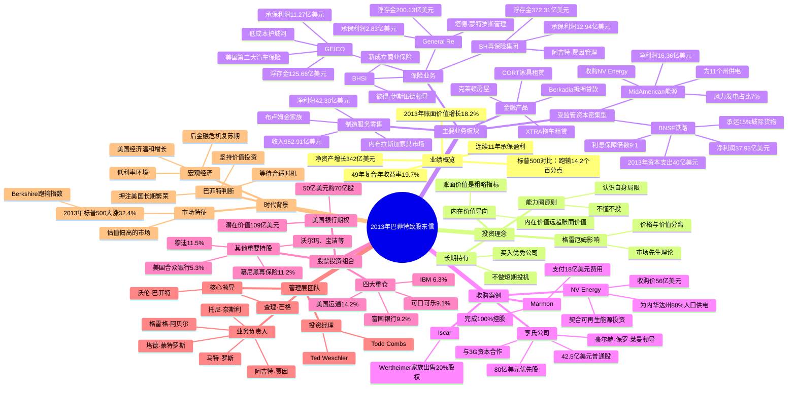

# 2013年巴菲特致股东信 - 思维导图

---

## 一、结构概要表格

| 板块 | 主要内容 | 页码/位置 |
|------|----------|----------|
| 业绩概览 | 49年业绩对比、2013年净资产增长 | 开篇 |
| 投资理念 | 本·格雷厄姆思想、内在价值、能力圈 | 投资思考章节 |
| 主要业务 | 保险、受监管资本密集型、制造零售、金融 | 四大板块 |
| 收购案例 | NV Energy、亨氏公司、Marmon、Iscar | 业务章节 |
| 股票投资组合 | 15大持股、四大重仓股 | 投资章节 |
| 关键人物 | 巴菲特、芒格及各业务负责人 | 全文 |
| 时代背景 | 后金融危机、美国经济复苏 | 全文 |

---

## 二、Mermaid思维导图

---

## 三、关键人物

| 人物 | 身份/角色 | 相关描述 |
|------|----------|----------|
| [[沃伦·巴菲特]] | 伯克希尔董事会主席 | 致股东信作者，核心投资决策人 |
| [[查理·芒格]] | 伯克希尔副董事长 | 巴菲特的合伙人，投资决策共同制定者 |
| [[阿吉特·贾因]] | BH再保险集团负责人 | 从1985年白手起家创建370亿美元浮存金业务 |
| [[托尼·奈斯利]] | GEICO管理者 | 18岁加入公司，1993年成为CEO |
| [[塔德·蒙特罗斯]] | General Re管理者 | 稳健经营，浮存金比免费还好 |
| [[彼得·伊斯伍德]] | BHSI负责人 | 资深承保人，商业保险新业务领导者 |
| [[格雷格·阿贝尔]] | MidAmerican能源CEO | 领导资本密集型业务 |
| [[马特·罗斯]] | BNSF铁路负责人 | 铁路业务杰出经理 |
| [[豪尔赫·保罗·莱曼]] | 3G资本领导者 | 亨氏收购合作方 |
| [[伯纳多·希斯]] | 亨氏新任CEO | 3G资本合伙人，负责运营 |
| [[亚历克斯·贝林]] | 亨氏董事长 | 3G资本合伙人 |
| [[罗斯·布卢姆金]]（B夫人） | NFM创始人 | 89岁出售公司，工作到103岁 |
| [[Todd Combs]] | 投资经理 | 管理超70亿美元组合，业绩超越标普 |
| [[Ted Weschler]] | 投资经理 | 管理超70亿美元组合，业绩超越标普 |
| [[本杰明·格雷厄姆]] | 投资导师 | 《聪明的投资者》作者，巴菲特思想启蒙 |
| [[凯瑟琳·格雷厄姆]] | 华盛顿邮报前董事长 | 巴菲特曾致信讨论养老金问题 |
| [[拉里·西尔弗斯坦]] | 房地产投资者 | 推荐纽约大学附近投资机会 |

---

## 四、关键公司

### 伯克希尔旗下公司

| 公司 | 业务类型 | 2013年关键数据 |
|------|----------|---------------|
| [[伯克希尔·哈撒韦]] | 控股公司 | 净资产增长342亿美元，员工330,745人 |
| [[GEICO]] | 汽车保险 | 承保利润11.27亿美元，浮存金125.66亿美元 |
| [[General Re]] | 再保险 | 承保利润2.83亿美元，浮存金200.13亿美元 |
| [[BH再保险集团]] | 再保险 | 承保利润12.94亿美元，浮存金372.31亿美元 |
| [[BNSF（伯灵顿北方圣达菲铁路）]] | 铁路运输 | 净利润37.93亿美元，承运15%城际货物 |
| [[MidAmerican Energy]] | 公用事业 | 净利润16.36亿美元，收购NV Energy |
| [[NV Energy]] | 电力公用事业 | 收购价56亿美元，服务内华达州88%人口 |
| [[内布拉斯加家具市场]] | 家具零售 | 德州新店扩张，年销售额约4.5亿美元 |
| [[Marmon]] | 工业制造 | 完成100%控股 |
| [[Iscar]] | 金属切削工具 | 收购剩余20%股权 |
| [[克莱顿房屋]] | 预制房屋 | 美国第一大家屋建造商，2013年建造29,547套 |
| [[亨氏公司]] | 食品 | 与3G资本合作收购，总投资122.5亿美元 |

### 重要投资标的

| 公司 | 持股比例 | 年末市值（亿美元） | 成本（亿美元） |
|------|----------|-------------------|---------------|
| [[富国银行]] | 9.2% | 219.50 | 118.71 |
| [[可口可乐]] | 9.1% | 165.24 | 12.99 |
| [[美国运通]] | 14.2% | 137.56 | 12.87 |
| [[IBM]] | 6.3% | 127.78 | 116.81 |
| [[宝洁]] | 1.9% | 42.72 | 3.36 |
| [[沃尔玛]] | 1.8% | 44.70 | 29.76 |
| [[慕尼黑再保险]] | 11.2% | 44.15 | 29.90 |
| [[埃克森美孚]] | 0.9% | 41.62 | 37.37 |
| [[穆迪]] | 11.5% | 19.36 | 2.48 |
| [[美国合众银行]] | 5.3% | 38.83 | 30.02 |
| [[高盛集团]] | 2.8% | 23.15 | 7.50 |
| [[美国银行]]（期权） | 潜在7亿股 | 109.00（潜在） | 50.00 |

---

## 五、时代背景分析

### 5.1 宏观经济环境

**2013年全球经济背景：**
- 美国仍处于**后金融危机复苏期**，距离2008年雷曼危机已过去5年
- 美联储维持**低利率政策**，量化宽松仍在进行
- 美国经济呈现**温和增长**态势，但增速不及预期
- 欧洲主权债务危机余波未平

### 5.2 资本市场特征

**美股市场表现：**
- 2013年标普500指数大涨**32.4%**，含股息回报
- 伯克希尔账面价值增长**18.2%**，**跑输指数14.2个百分点**
- 这是伯克希尔49年历史中第10次跑输指数
- 除一次外，所有落后都发生在标普涨幅超过15%的年份

**巴菲特的市场判断：**
> "在市场下跌或温和上涨的年份，伯克希尔的账面价值和内在价值都将跑赢标普指数。但在市场强劲的年份，我们预计会落后——2013年就是如此。"

### 5.3 行业趋势

**保险行业：**
- 竞争激烈，行业整体承保亏损
- 伯克希尔连续11年实现承保盈利，累计220亿美元
- 浮存金从410亿美元增长至770亿美元

**基础设施投资：**
- BNSF 2013年资本支出40亿美元，创铁路单年纪录
- MidAmerican成为可再生能源领导者，风力发电占比7%
- 公用事业行业监管环境相对稳定

**收购环境：**
- 大型收购机会稀缺，估值偏高
- 巴菲特与3G资本开创合作模板（亨氏收购）
- 补强型收购活跃，25笔交易总额31亿美元

### 5.4 投资主题

**核心信念：**
- 押注**美国长期繁荣**："237年来，谁曾因押注美国衰落而获益？"
- 持有优质企业，不预测宏观走势
- 专注内在价值，忽略短期市场波动

**配置策略：**
- 四大重仓股（美国运通、可口可乐、IBM、富国银行）持续增持
- 偏好有护城河的稳定业务（保险、铁路、公用事业）
- 现金储备充裕（至少200亿美元），等待大象级收购

### 5.5 历史对比

| 指标 | 2013年 | 历史平均 |
|------|--------|----------|
| 伯克希尔收益率 | 18.2% | 19.7%（49年复合） |
| 标普500收益率 | 32.4% | 9.8%（49年复合） |
| 浮存金增长 | 5.6% | 持续正增长 |
| 承保利润率 | 4.0% | 约3%平均 |

---

## 六、关键数据摘要

### 6.1 业绩核心数据

| 指标 | 数值 | 同比变化 |
|------|------|----------|
| 净资产增长 | 342亿美元 | - |
| 每股账面价值增长 | 18.2% | +3.8个百分点 |
| A股账面价值 | 134,973美元 | - |
| 税前承保利润 | 30.89亿美元 | +90% |
| 浮存金 | 772.40亿美元 | +5.6% |
| 员工总数 | 330,745人 | +42,283人 |

### 6.2 五大支柱业务利润

| 业务板块 | 2013年税前利润（亿美元） | 同比变化 |
|----------|------------------------|----------|
| 五大支柱合计 | 108.00 | +7.58 |
| 较小非保险企业 | 47.00 | +8.00 |
| 保险承保利润 | 30.89 | +14.64 |

### 6.3 投资组合规模

| 类别 | 金额（亿美元） |
|------|--------------|
| 普通股投资市值 | 1,175.05 |
| 普通股投资成本 | 565.81 |
| 未实现收益 | 609.24 |
| 四大重仓未实现收益 | 390.00 |

---

*本思维导图基于2013年巴菲特致股东信翻译版本创建*
*创建时间：2024年*
