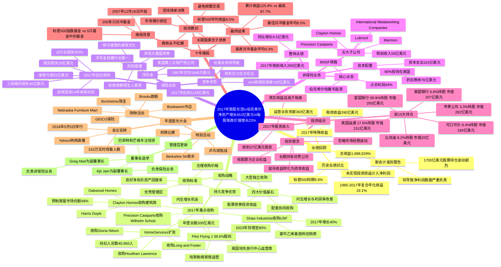

# 2017年巴菲特致股东信 - 思维导图

> 生成日期：2026-04-10  
> 文档类型：知识图谱 / 思维导图  
> 数据来源：2017年致股东信全文翻译

---

## 一、Mermaid思维导图

---

## 二、结构概要表格

### 2.1 核心财务数据

| 指标 | 2017年数据 | 历史对比 | 备注 |
|------|-----------|---------|------|
| 净资产增长 | 653亿美元 | 历史最高之一 | 其中税改贡献290亿 |
| 每股账面价值增长 | 23% | 1965-2017年均19.1% | 2015年6.4%，2016年10.7% |
| 运营业务收益 | 360亿美元 | - | 不含税改一次性收益 |
| 浮存金规模 | 1,145亿美元 | 1970年仅3900万 | 行业第一 |
| 保费规模 | 606亿美元 | 美国第二大财产险 | 含AIG巨灾再保险102亿 |
| 现金及国债 | 1,160亿美元 | 2016年末864亿 | 平均期限88天 |
| 股票投资组合 | 1,705亿美元 | - | 不含卡夫亨氏 |
| 非保险业务税前收入 | 200亿美元 | 2016年191亿 | 同比增长4.7% |
| 飓风承保损失 | 32亿美元（税前） | 结束14年承保利润 | 三场飓风 |

### 2.2 各章节核心内容

| 章节 | 核心主题 | 关键数据/要点 |
|------|---------|--------------|
| 开篇业绩 | 2017年净资产增长与历史回顾 | 53年复合年化19.1%，总收益超100万% |
| 新会计准则 | GAAP变更对净利润的影响 | 未实现损益计入净利润将导致剧烈波动 |
| 收购战略 | 四大价值创造基石 | 独立收购、配套收购、内生增长、投资收益 |
| Pilot Flying J | 旅行中心运营商收购 | 38.6%股权，年营业额200亿美元 |
| Clayton Homes | 预制房屋与建筑商收购 | 市场份额49%，收购Oakwood和Harris Doyle |
| Shaw Industries | 地面覆盖材料业务 | 收购USF，2017年销售额57亿 |
| HomeServices | 房地产经纪扩张 | 收购3家公司，经纪人达40,950人 |
| 保险业务 | 浮存金与巨灾损失 | 浮存金1145亿，飓风损失30亿 |
| 非保险业务 | 整体业绩与资本配置 | 税前收入200亿，资本支出115亿 |
| 投资组合 | 前15大持仓 | 富国银行、苹果、美国银行、可口可乐等 |
| 十年赌局 | 指数基金vs对冲基金 | 标普500累计125.8% vs 最佳87.7% |
| 股东大会 | 2018年年会安排 | 5月5日，网络直播，购物活动 |
| 管理层 | 董事会选举 | Ajit Jain和Greg Abel任副董事长 |

### 2.3 重要时间线

| 时间 | 事件 | 意义 |
|------|------|------|
| 1965年 | 现任管理层接管伯克希尔 | 53年传奇开始 |
| 1967年 | 收购National Indemnity进入保险 | 浮存金模式起点 |
| 2003年 | Clayton Homes加入伯克希尔 | 市场份额从13%增至49% |
| 2007年12月19日 | 十年赌局开始 | 指数基金vs对冲基金 |
| 2012年11月 | 债券换伯克希尔股票 | 收益率0.88% vs 预期8%+ |
| 2017年12月 | 美国税改通过 | 伯克希尔获益290亿 |
| 2017年9月 | 三场飓风袭击 | 巨灾损失30亿 |
| 2018年2月24日 | 致股东信发布 | - |
| 2018年5月5日 | 年度股东大会 | - |

---

## 三、关键人物

### 3.1 核心管理层

| 人物 | 角色 | 信中出现要点 |
|------|------|-------------|
| [[沃伦·巴菲特]] | 董事长、首席执行官 | 全文作者，与[[查理·芒格]]共同管理53年，强调长期价值投资理念 |
| [[查理·芒格]] | 副董事长 | 巴菲特的长期搭档，多次共同决策提及，强调审慎原则 |
| [[Ajit Jain]] | 新任副董事长（2018年） | 负责保险业务，伯克希尔血液流淌在veins，品格与才能相匹配 |
| [[Greg Abel]] | 新任副董事长（2018年） | 负责非保险业务监督，工作数十年，品格与才能相匹配 |

### 3.2 子公司CEO/管理层

| 人物 | 所属公司 | 信中出现要点 |
|------|---------|-------------|
| [[大吉姆·哈斯勒姆]] | Pilot Flying J | 60年前以加油站和梦想起步，创建美国领先旅行中心 |
| [[吉米·哈斯勒姆]] | Pilot Flying J | 管理27,000名员工，750个网点，哈斯勒姆家族第二代 |
| [[Kevin Clayton]] | Clayton Homes | 对加入伯克希尔体系优势的评论促成PFJ交易 |
| [[Vance Bell]] | Shaw Industries | CEO，发起并完成USF收购，使销售额达57亿美元 |
| [[Mark Donegan]] | Precision Castparts | 杰出制造业高管，押注于人比押注资产更确定 |
| [[Piet Dossche]] | U.S. Floors | 管理层，2017年实现40%销售增长 |
| [[Philippe Erramuzpe]] | U.S. Floors | 管理层，与Piet共同运营USF |

### 3.3 投资团队

| 人物 | 角色 | 信中出现要点 |
|------|------|-------------|
| [[Todd Combs]] | 投资组合经理 | 与Ted各独立管理超120亿美元 |
| [[Ted Weschler]] | 投资组合经理 | 与Todd共同管理250亿美元，包括养老金资产 |

### 3.4 其他提及人物

| 人物 | 背景 | 信中出现要点 |
|------|------|-------------|
| [[V.J. Dowling]] | 著名分析师 | 指出保险公司损失准备金类似自我评分的考试 |
| [[Carol Loomis]] | 财经记者 | 巴菲特时代杰出商业记者，主持股东大会问答 |
| [[Becky Quick]] | CNBC记者 | 主持股东大会问答 |
| [[Andrew Ross Sorkin]] | 《纽约时报》记者 | 主持股东大会问答 |
| [[Gary Ransom]] | Dowling & Partners | 保险专家，股东大会分析师 |
| [[Jonathan Brandt]] | Ruane, Cunniff & Goldfarb | 非保险业务分析师 |
| [[Gregg Warren]] | Morningstar | 非保险业务分析师 |
| [[Ariel Hsing]] | 乒乓球运动员 | 奥运选手，股东大会接受挑战 |
| [[Bob Hamman]] | 桥牌专家 | 股东大会与股东打牌 |
| [[Sharon Osberg]] | 桥牌专家 | 股东大会与股东打牌 |
| [[Bill Gates]] | 微软创始人 | 可能参加股东大会，与Ariel打球 |
| [[本·格雷厄姆]] | 价值投资之父 | 引用名言：短期是投票机，长期是称重机 |
| [[吉卜林]] | 诗人 | 引用《如果》诗句 |

---

## 四、关键公司

### 4.1 伯克希尔子公司

| 公司 | 业务领域 | 信中出现要点 |
|------|---------|-------------|
| [[伯克希尔哈撒韦]] | 母公司 | 净资产增长653亿，53年复合收益19.1% |
| [[BNSF铁路]] | 铁路运输 | 非保险业务利润前两名，税前收入重要来源 |
| [[伯克希尔哈撒韦能源]] | 能源公用事业 | 持有90.2%股份，利润前两名 |
| [[National Indemnity]] | 财产险保险 | 1967年收购，浮存金模式起点 |
| [[Clayton Homes]] | 预制房屋/建筑 | 市场份额49%，收购Oakwood和Harris Doyle |
| [[Pilot Flying J]] | 旅行中心 | 38.6%股权，年营业额200亿，750网点 |
| [[Shaw Industries]] | 地面覆盖材料 | 销售额57亿，员工22,000人 |
| [[HomeServices]] | 房地产经纪 | 美国第二大经纪公司，40,950经纪人 |
| [[Precision Castparts]] | 精密铸造 | 收购Wilhelm Schulz，制造业 |
| [[International Metalworking Companies]] | 金属加工 | 非保险业务五大之一 |
| [[Lubrizol]] | 润滑油添加剂 | 非保险业务五大之一 |
| [[Marmon]] | 多元化工业 | 非保险业务五大之一 |
| [[Forest River]] | 房车制造 | 接下来五强之一 |
| [[Johns Manville]] | 建筑材料 | 接下来五强之一 |
| [[MiTek]] | 建筑组件 | 接下来五强之一 |
| [[TTI]] | 电子元器件 | 接下来五强之一 |
| [[GEICO]] | 汽车保险 | 股东大会销售创纪录，股东折扣8% |
| [[Brooks]] | 跑鞋 | 股东大会特别纪念款，5K跑步 |
| [[Nebraska Furniture Mart]] | 家具零售 | 伯克希尔周末销售4460万美元 |
| [[Borsheims]] | 珠宝零售 | 股东专属活动 |
| [[Bookworm]] | 书店 | 出售《穷查理年鉴》等 |
| [[Gorat's]] | 牛排馆 | 股东专属开放 |
| [[U.S. Floors]] | 豪华乙烯基瓷砖 | Shaw收购，2017年增长40% |
| [[Oakwood Homes]] | 住宅建筑商 | Clayton 2017年收购 |
| [[Harris Doyle]] | 住宅建筑商 | Clayton 2017年收购 |
| [[Long and Foster]] | 房地产经纪 | HomeServices 2017年收购 |
| [[Houlihan Lawrence]] | 房地产经纪 | HomeServices 2017年收购 |
| [[Gloria Nilson]] | 房地产经纪 | HomeServices 2017年收购 |
| [[Wilhelm Schulz]] | 防腐管件 | Precision Castparts收购 |
| [[MidAmerican Energy]] | 能源（前身） | 2000年收购，意外获得HomeServices |
| [[Realogy]] | 房地产（竞争对手） | HomeServices追赶目标 |

### 4.2 重要投资持仓

| 公司 | 持股比例 | 市值（2017年末） | 成本 | 信中出现要点 |
|------|---------|-----------------|------|-------------|
| [[富国银行]] | 9.9% | 293亿美元 | 118亿 | 最大持仓 |
| [[苹果公司]] | 3.3% | 282亿美元 | 210亿 | 重要科技持仓 |
| [[美国银行]] | 6.8% | 207亿美元 | 50亿 | 银行板块核心 |
| [[可口可乐]] | 9.4% | 184亿美元 | 13亿 | 经典长期持仓 |
| [[美国运通]] | 17.6% | 151亿美元 | 13亿 | 金融服务 |
| [[纽约梅隆银行]] | 5.3% | 29亿 | 22亿 | 银行股 |
| [[比亚迪]] | 8.2% | 20亿美元 | 2.32亿 | 中国投资 |
| [[Charter Communications]] | 2.8% | 23亿 | 12亿 | 通信 |
| [[达美航空]] | 7.4% | 30亿 | 22亿 | 航空股 |
| [[通用汽车]] | 3.2% | 18亿 | 13亿 | 汽车 |
| [[高盛集团]] | 3.0% | 29亿 | 6.5亿 | 投资银行 |
| [[穆迪公司]] | 12.9% | 36亿 | 2.5亿 | 评级机构 |
| [[Phillips 66]] | 14.9% | 75亿 | 58亿 | 能源 |
| [[西南航空]] | 8.1% | 31亿 | 20亿 | 航空 |
| [[美国合众银行]] | 6.3% | 56亿 | 33亿 | 银行 |
| [[卡夫亨氏]] | - | 253亿美元（市值） | 98亿 | 按权益法核算，不含在前15表中 |

### 4.3 行业相关公司

| 公司 | 背景 | 信中出现要点 |
|------|------|-------------|
| [[劳合社]] | 保险市场 | 1980年代长尾业务问题案例 |
| [[美国国际集团]] | 保险（AIG） | 102亿美元再保险保单，世界纪录 |
| [[Protégé Partners]] | 对冲基金咨询公司 | 十年赌局对手 |
| [[Yahoo!]] | 互联网公司 | 股东大会网络直播合作方 |
| [[奥马哈女孩公司]] | 慈善机构 | 十年赌局受益者，获222万美元 |

---

## 五、时代背景

### 5.1 宏观经济环境

| 维度 | 2017年背景 | 信中的体现 |
|------|-----------|-----------|
| **美国经济** | 持续复苏，经济增长稳健 | 伯克希尔非保险业务税前收入增长4.7%，90%投资在美国 |
| **税改政策** | 2017年12月美国通过重大税法改革 | 伯克希尔获益290亿美元一次性收益，最大收益来源之一 |
| **利率环境** | 低利率持续，债券收益率低迷 | 批评0.88%的债券收益率，强调股票长期优于债券 |
| **通胀水平** | 温和通胀 | 指出即使1%通胀也会侵蚀债券购买力 |
| **股市表现** | 标普500上涨21.8%（含股息） |  Berkshire股价增长21.9%，基本同步 |
| **收购市场** | 估值高企，收购竞争激烈 | 价格创下历史新高，乐观买家众多 |
| **债务市场** | 异常廉价的债务唾手可得 | 助长了收购狂潮，推高资产价格 |

### 5.2 保险行业环境

| 维度 | 2017年背景 | 信中的体现 |
|------|-----------|-----------|
| **巨灾损失** | 飓风哈维、厄玛、玛丽亚连续袭击 | 三场飓风造成约1000亿美元保险损失，伯克希尔损失30亿 |
| **"无大灾"时期结束** | 此前连续多年无重大自然灾害 | 巴菲特预警成真，结束14年承保利润 |
| **再保险需求** | 巨灾后行业资本紧张 | 伯克希尔财务实力成为行业最终保障 |
| **长尾风险** | 石棉、工伤赔偿等长期责任 | 伯克希尔专注于此类业务，浮存金增长显著 |
| **行业竞争** | 价格战与承保纪律 | 伯克希尔坚持保守承保，拒绝追逐低价 |

### 5.3 投资行业环境

| 维度 | 2017年背景 | 信中的体现 |
|------|-----------|-----------|
| **被动投资兴起** | 指数基金持续获得资金流入 | 十年赌局结果验证指数基金优势 |
| **对冲基金挑战** | 行业整体表现不佳，费用受质疑 | 五只基金中的基金年均收益0.3%-6.5%，远低于标普500 |
| **费用结构** | 2%+20%标准收费模式 | 批评"表现来了又走，费用却永不动摇" |
| **投资顾问行业** | 规模庞大，多层收费 | 质疑投资者是否物有所值 |
| **市场估值** | 股市处于历史高位 | 提醒未来可能出现类似历史上的大幅下跌 |

### 5.4 行业趋势与结构变化

| 领域 | 趋势 | 伯克希尔的应对 |
|------|------|---------------|
| **预制房屋** | 行业整合，市场份额集中 | Clayton从13%增至49%，收购传统建筑商进入现场建造 |
| **房地产经纪** | 行业分散，整合机会大 | HomeServices快速扩张，从第2向第1迈进 |
| **旅行中心** | 州际公路经济，网络效应 | 收购PFJ，美国最大运营商 |
| **地面覆盖材料** | 豪华乙烯基瓷砖增长 | 收购USF，2017年增长40% |
| **航空业** | 行业整合后盈利能力改善 | 持仓达美航空、西南航空、美国航空、联合大陆 |
| **科技投资** | 传统价值投资者对科技谨慎 | 大幅增持苹果，成为第二大持仓 |
| **银行业** | 利率上升利好，监管放松预期 | 重仓富国银行、美国银行，看好银行股 |

### 5.5 历史对比与周期性

| 维度 | 历史参考 | 2017年情况 |
|------|---------|-----------|
| **伯克希尔股价大跌** | 1973-75年跌59%，1987年跌37%，1998-2000年跌49%，2008-09年跌51% | 提醒投资者类似下跌必将再次发生 |
| **收购周期** | 价格高企时难觅机会 | 2017年未进行大型收购，保持耐心 |
| **巨灾周期** | 多年"无大灾"后必有大灾 | 2017年三场飓风验证了周期性 |
| **债券vs股票** | 长期股票跑赢债券 | 2012年债券换股票的决策被证明正确 |

### 5.6 公司治理与股东文化

| 维度 | 2017年背景 | 伯克希尔的特点 |
|------|-----------|---------------|
| **管理层激励** | 行业普遍存在与业绩脱钩的高薪酬 | 强调经理人与股东利益一致，多数经理不需要工作 |
| **董事会结构** | 独立董事与分类董事会趋势 | 选举Ajit和Greg为副董事长，明确继任布局 |
| **股东沟通** | 即时通讯与社交媒体时代 | 坚持周五晚/周六早发布财报，避免交易时间干扰 |
| **股东大会** | 形式化趋势 | 保持奥马哈传统，5小时问答，40,000+人参与 |

---

## 六、核心投资理念总结

### 6.1 巴菲特2017年强调的关键原则

1. **长期视角**：53年复合年化19.1%，关注标准化每股盈利能力变化
2. **风险厌恶**：拒绝杠杆，持有大量国库券，不依赖陌生人善意
3. **简单决策**：十年赌局证明简单决策优于复杂策略
4. **费用意识**："表现来了又走，费用却永不动摇"
5. **企业思维**：视股票为企业权益，而非交易代码
6. **逆向投资**：市场恐慌时保持清醒，大跌是机会
7. **人才优先**：押注于人有时比押注于实物资产更确定
8. **审慎收购**：别人越不审慎，自己越要审慎

### 6.2 关键引用

> "别人处理事务越不审慎，我们就越必须审慎处理我们自己的事务。"

> "为了得到你不需要的东西而冒险失去你已有的和需要的东西，是不明智的。"

> "短期内，市场是一台投票机；但从长期来看，它变成了一台称重机。"

> "表现来了又走。费用却永不动摇。"

---

*文档生成完毕 | 基于2017年巴菲特致股东信完整翻译*
