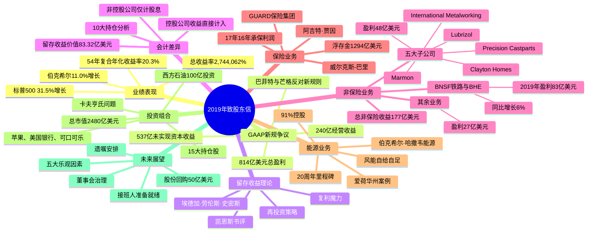

# 2019年巴菲特致股东信 - 思维导图

> 本文档是2019年巴菲特致股东信的结构化思维导图分析

---

## 一、Mermaid思维导图

---

## 二、结构概要表格

| 模块 | 核心内容 | 关键数据 |
|------|---------|---------|
| **业绩对比** | 伯克希尔与标普500指数54年对比 | 伯克希尔年化20.3%，总收益2,744,062%；标普500年化10.0%，总收益19,784% |
| **GAAP新规影响** | 2018年实施的新会计准则要求将未实现资本收益计入收益 | 2019年盈利814亿美元，其中537亿为未实现收益；2018年因股价下跌仅盈利40亿 |
| **留存收益理论** | 引用1924年埃德加·劳伦斯·史密斯的理论，阐述留存收益再投资的复利效应 | 凯恩斯评价为"新颖观点"；巴菲特强调被投公司留存收益的重要性 |
| **会计差异分析** | 控股公司与非控股公司的会计处理差异 | 10大持仓留存收益份额83.32亿美元，股息收入37.98亿美元 |
| **非保险业务** | 分三组介绍非保险业务表现 | BNSF+BHE盈利83亿；五大子公司盈利48亿；其余业务盈利27亿；总计177亿美元 |
| **保险业务** | 财产险/意外险的浮存金模式和承保记录 | 浮存金1294亿美元；17年16年承保利润；税前总收益275亿美元 |
| **能源业务** | BHE成立20周年回顾，风能发电成就 | 爱荷华州电价涨幅<1%/年；2021年实现风能自给自足；竞争对手电价高70% |
| **投资组合** | 15大持仓股详细列表 | 总市值2480亿美元；成本1103亿美元；苹果、美国银行、可口可乐为前三大持仓 |
| **未来展望** | 接班人安排、遗嘱指示、股份回购 | 阿吉特·贾因和格雷格·阿贝尔接班就绪；股份回购50亿美元；缴纳联邦税36亿美元 |
| **董事会治理** | 讨论独立董事薪酬、CEO选拔、收购决策等问题 | 批评现行董事会制度；强调董事应有实际股权投入 |

---

## 三、关键人物

### 核心人物

- **[[沃伦·巴菲特]]** - 伯克希尔·哈撒韦董事会主席，信件的作者。在信中分享了对GAAP新规的批评、对留存收益的重视、以及对接班安排的思考。强调自己99%的净资产都在伯克希尔股票中，从未出售过任何股份。

- **[[查理·芒格]]** - 巴菲特的长期合伙人，伯克希尔副董事长。与巴菲特共同反对GAAP新规，被多次提及为决策伙伴。芒格家族持有的伯克希尔股份远超该家族任何其他投资。

### 管理层人物

- **[[阿吉特·贾因]]** - 伯克希尔保险业务的无价经理。2012年以2.21亿美元收购GUARD保险集团，将其保费收入从4亿提升至19亿美元，增长379%。被指定为接班人之一，将在年会上获得更多曝光。

- **[[格雷格·阿贝尔]]** - 伯克希尔·哈撒韦能源业务的负责人，与Walter Scott, Jr.共同持有BHE剩余股份。同样是接班人候选人，将与阿吉特·贾因共同在年会上承担更多角色。

- **[[Sy Foguel]]** - GUARD保险集团首席执行官，被阿吉特·贾因发现并引入伯克希尔。带领GUARD进入新产品和全国新地区，浮存金增加265%。

- **[[汤姆·墨菲]]** - 伯克希尔受人尊敬的董事，商业管理者中的传奇人物。曾给巴菲特重要建议："要想获得好经理人的声誉，只需确保你收购好企业。"

### 历史与学术人物

- **[[埃德加·劳伦斯·史密斯]]** - 1924年《普通股作为长期投资》的作者，首次系统阐述了留存收益和复利的价值。巴菲特在信中用大量篇幅介绍其理论。

- **[[约翰·梅纳德·凯恩斯]]** - 著名经济学家，为史密斯的书撰写书评，强调"复利因素有利于稳健的工业投资"。

- **[[保罗·哈维]]** - 已故著名广播节目主持人，其名言"这是故事的其余部分"被巴菲特引用。

- **[[乔·罗森菲尔德]]** - 巴菲特的中西部朋友，80多岁时收到报纸索要讣告资料的趣事被用作引子。

- **[[Mark Millard]]** - 伯克希尔员工，负责处理股东股份回购事宜。

- **[[Larry Cunningham]]** 与 **[[Stephanie Cuba]]** - 《信任的边际》一书作者，该书将在年会上提供。

---

## 四、关键公司

### 伯克希尔核心子公司

- **[[伯克希尔·哈撒韦]]** - 母公司，2019年盈利814亿美元，其中经营收益240亿美元。

- **[[BNSF铁路]]** - 伯克希尔两大非保险业务之一，与BHE在2019年合计盈利83亿美元。

- **[[伯克希尔·哈撒韦能源(BHE)]]** - 另一大非保险业务，伯克希尔持股91%，20年来从未支付股息，保留280亿美元收益用于再投资。

- **[[National Indemnity]]** - 1967年以860万美元收购，现已成为世界上按净值衡量最大的财产险/意外险公司。

- **[[GUARD保险集团]]** - 2012年以2.21亿美元收购，2019年保费收入19亿美元，增长379%。

### 非保险业务子公司

- **[[Clayton Homes]]** - 五大非保险子公司之一，2019年参与集团总收益48亿美元。

- **[[International Metalworking]]** - 五大非保险子公司之一。

- **[[Lubrizol]]** - 石油添加剂公司，2011年收购，2019年法国工厂遭遇火灾。

- **[[Marmon]]** - 五大非保险子公司之一。

- **[[Precision Castparts]]** - 五大非保险子公司之一。

- **[[伯克希尔·哈撒韦汽车]]** - 第二梯队非保险业务。

- **[[Johns Manville]]** - 第二梯队非保险业务。

- **[[NetJets]]** - 私人飞机服务公司，第二梯队非保险业务。

- **[[Shaw]]** - 第二梯队非保险业务。

- **[[TTI]]** - 第二梯队非保险业务。

### 10大股票投资持仓

| 公司 | 持股比例 | 股息(百万) | 留存收益份额(百万) |
|------|---------|-----------|-------------------|
| **[[美国运通]]** | 18.7% | $261 | $998 |
| **[[苹果公司]]** | 5.7% | $773 | $2,519 |
| **[[美国银行]]** | 10.7% | $682 | $2,167 |
| **[[纽约梅隆银行]]** | 9.0% | $101 | $288 |
| **[[可口可乐公司]]** | 9.3% | $640 | $194 |
| **[[达美航空]]** | 11.0% | $114 | $416 |
| **[[摩根大通]]** | 1.9% | $216 | $476 |
| **[[穆迪公司]]** | 13.1% | $55 | $137 |
| **[[美国合众银行]]** | 9.7% | $251 | $407 |
| **[[富国银行]]** | 8.4% | $705 | $730 |

### 其他重要持仓公司

- **[[Charter通信公司]]** - 持股2.6%，市值26.32亿美元。

- **[[高盛集团]]** - 持股3.5%，市值28.59亿美元。

- **[[西南航空]]** - 持股9.0%，市值25.20亿美元。

- **[[美联航]]** - 持股8.7%，市值19.33亿美元。

- **[[Visa公司]]** - 持股0.6%，市值19.24亿美元。

- **[[卡夫亨氏]]** - 持股325,442,152股，市场价值105亿美元，账面价值138亿美元（按权益法核算）。

- **[[西方石油公司]]** - 投资100亿美元，包括优先股和认股权证。

- **[[伊利诺伊州银行]]** - 1969年伯克希尔收购，1980年因银行控股公司法变化被剥离。

---

## 五、时代背景

### 宏观经济环境

**2019年股市表现**
- 2019年是股市强劲上涨的一年，标普500指数上涨31.5%，远超伯克希尔11.0%的涨幅
- 这是2008年金融危机后最长的牛市延续
- 美联储在2019年三次降息，从2.25-2.50%降至1.50-1.75%

**利率环境**
- 巴菲特多次提及低利率环境对保险业的冲击
- 30年期美国国债收益率仅2.5%甚至更低
- 保险公司被迫将"旧"投资组合recycling为收益率更低的新持仓
- 一些国家陷入负利率"never-neverland"

**税收政策**
- 企业所得税率保持在较低水平（联邦税率21%）
- 伯克希尔向美国联邦政府支付36亿美元当期所得税
- 占美国所有企业联邦所得税的1.5%

### 行业发展趋势

**保险行业变革**
- 财产险/意外险行业面临投资收益下降的挑战
- 浮存金的财务价值因低利率远低于历史水平
- 一些保险公司转向低质量债券或非流动性"另类"投资，被视为危险游戏
- 伯克希尔凭借资本实力和多元化优势保持灵活性

**公用事业与可再生能源**
- BHE在风能转化电力方面取得巨大成就
- 爱荷华州实现风能自给自足，2021年预计发电2520万兆瓦时
- 高科技企业（爱荷华州五大客户中三个）因可再生能源和低电价选择设厂
- 与传统公用事业公司费率差距扩大至70%

**航空业投资**
- 伯克希尔持有四大美国航空公司股份：达美航空(11.0%)、西南航空(9.0%)、美联航(8.7%)、美国航空
- 航空业作为周期性行业，伯克希尔进行大额但非控股投资

### 会计准则变化

**GAAP新规影响**
- 2018年实施的新规则要求将未实现损益计入收益
- 巴菲特和芒格明确表示反对这一规则
- 导致伯克希尔季度利润表剧烈波动：2018年因股价下跌仅盈利40亿，2019年因股价上涨盈利814亿
- 巴菲特强调应关注经营收益而非投资损益

### 公司治理议题

**董事会改革讨论**
- 独立董事薪酬飙升至25-30万美元/年
- 董事"执行会议"（CEO不得参加）成为强制要求
- 性别多元化进展缓慢，巴菲特提及第19修正案100周年（女性选举权）
- 巴菲特批评现行制度使董事过于顺从CEO

**接班人计划**
- 巴菲特（89岁）和芒格（96岁）进入"紧急区"
- 明确指定阿吉特·贾因和格雷格·阿贝尔为关键运营经理
- 强调公司已100%为他们的离开做好准备
- 2020年年会将改变形式，给予两位接班人更多曝光

---

## 六、核心投资理念摘要

### 留存收益的复利力量
- 引用埃德加·劳伦斯·史密斯1924年著作
- 强调被投公司留存收益对伯克希尔价值增长的重要性
- 10大持仓的留存收益份额达83.32亿美元

### 投资标准
1. 在净有形资本上获得良好回报
2. 由能干且诚实的管理者经营
3. 以合理的价格出售

### 长期持有理念
- 巴菲特99%净资产在伯克希尔股票中
- 从未出售过任何股份
- 遗嘱指示执行者不得出售任何伯克希尔股份
- 预计处置全部股份需要12-15年

### 对美国经济的信心
- "美国顺风"概念
- 股票将长期优于固定收益工具
- 警告：可能出现50%甚至更大的市场下跌

---

*本思维导图基于沃伦·巴菲特2019年致股东信翻译版制作*
*制作日期：2025年*
