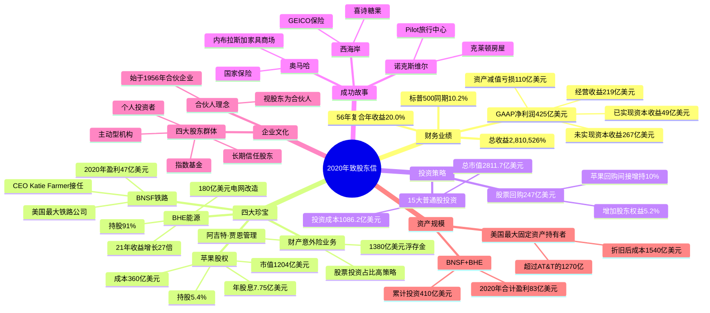

# 2020年致股东信 - 思维导图

> 来源：伯克希尔·哈撒韦公司2020年致股东信  
> 日期：2021年2月27日  
> 作者：沃伦·E·巴菲特

---

## 一、Mermaid思维导图

---

## 二、结构概要表格

| 模块 | 核心内容 | 关键数据 |
|------|----------|----------|
| **财务业绩** | 2020年GAAP净利润425亿美元；56年复合年收益20.0%，标普500同期10.2%；总收益2,810,526% vs 23,454% | 经营收益219亿、资本收益49亿、未实现收益267亿、减值110亿 |
| **四大珍宝** | 财产/意外险业务、BNSF铁路、苹果5.4%股权、BHE能源91%股权 | 浮存金1380亿、苹果市值1204亿、成本360亿、BHE 21年增长27倍 |
| **投资策略** | 股票回购247亿美元增加股东权益5.2%；苹果回购使伯克希尔的间接持股增加10% | 15大普通股投资市值2811.7亿、成本1086.2亿、未实现收益1725.5亿 |
| **成功故事** | 喜诗糖果、GEICO、国家保险、NFM、克莱顿房屋、Pilot旅行中心 | GEICO 350亿收入、NFM 3家最大门店、克莱顿+Pilot 4.7万员工 |
| **企业文化** | 始于1956年合伙企业，视股东为合伙人；四大股东群体 | 伯克希尔成为标普500成分股，指数基金被动持有 |
| **资产规模** | 美国最大固定资产持有者，折旧后成本1540亿美元 | BNSF+BHE 2020年盈利83亿；BNSF累计投资410亿 |
| **股东大会** | 2020年线上召开；2021年5月1日洛杉矶举行，查理·芒格回归 | Yahoo直播、CNBC Becky Quick主持、Becky提问环节 |

---

## 三、关键人物

### 伯克希尔管理层

| 人物 | 职位/角色 | 信中提及要点 |
|------|-----------|--------------|
| [[沃伦·巴菲特]] | 伯克希尔董事长、CEO | 90岁；1965年收购伯克希尔；1956年创立合伙企业；强调"合伙人"理念；负责撰写股东信 |
| [[查理·芒格]] | 伯克希尔副董事长 | 97岁；巴菲特长期搭档；1983年与蓝章合并；2021年股东大会将回归舞台；信奉"永远不要押注美国" |
| [[阿吉特·贾恩]] | 保险业务负责人 | 1986年加入伯克希尔；管理1380亿美元浮存金；保险舰队资本全球第一；独特管理风格 |
| [[格雷格·阿贝尔]] | 伯克希尔副董事长 | 2020年股东大会与巴菲特同台；负责非保险业务；将出席2021年洛杉矶股东大会 |
| [[马克·汉堡]] | 首席财务官 | 领导总部团队重组2020年股东大会；与Melissa Shapiro合作 |
| [[黛比·博萨内克]] | 巴菲特助理 | 47年前17岁时加入伯克希尔；整理股东大会幻灯片 |
| [[贝基·奎克]] | CNBC主持人 | 在新泽西家中主持2020/2021年股东大会问答环节；筛选股东问题 |

### 子公司CEO

| 人物 | 公司 | 信中提及要点 |
|------|------|--------------|
| [[卡尔·艾斯]] | BNSF铁路 | 2020年底退休；与Katie Farmer在货运量下降7%时仍将利润率提高2.9个百分点 |
| [[凯蒂·法默]] | BNSF铁路 | 接任BNSF CEO；Carl Ice的副手；2020年表现卓越 |
| [[玛丽·喜诗]] | 喜诗糖果 | 一个世纪前创办；用特殊配方改良传统产品；创立友好销售员+古朴店铺模式 |
| [[利奥·古德温]] | GEICO | 1936年与妻子莉莉安创办；坚信汽车保险可直接低价销售；初始资本10万美元 |
| [[莉莉安·古德温]] | GEICO | 与丈夫共同创办GEICO；GEICO 84年历史的共同创始人 |
| [[杰克·林格瓦特]] | 国家保险 | 1940年创办；奥马哈中央高中毕业生；12.5万美元初始资本；诚实精明 quirky；1967年卖给伯克希尔 |
| [[B女士/罗斯·布鲁姆金]] | 内布拉斯加家具商场 | 1915年俄罗斯移民；1936年2500美元创办家具店；工作到103岁；家人团聚唱《上帝保佑美国》 |
| [[路易·布鲁姆金]] | 内布拉斯加家具商场 | B女士独子；诺曼底登陆日作战；紫心勋章；1945年回国助母亲创业；第三代第四代仍在经营 |
| [[吉姆·克莱顿]] | 克莱顿房屋 | 1956年创办；田纳西大学毕业生；多次创业后成功；将儿子凯文引入公司 |
| [[凯文·克莱顿]] | 克莱顿房屋 | 吉姆·克莱顿之子；鼓励哈斯拉姆家族将Pilot股份出售给伯克希尔 |
| [[大吉姆·哈斯拉姆]] | Pilot旅行中心 | 1958年6000美元购买服务站创办；90岁；田纳西大学毕业生；写书讲述与伯克希尔的交易 |

### 其他重要人物

| 人物 | 身份 | 信中提及要点 |
|------|------|--------------|
| [[斯坦·特鲁森]] | 奥马哈眼科医生 | 百岁老人；1959年与十位医生组建Emdee合伙企业；持有伯克希尔股票至今；巴菲特私人朋友 |
| [[菲尔·费舍]] | 投资大师 | 1958年《普通股与不普通的利润》作者；餐厅比喻公开公司 |
| [[梅·韦斯特]] | 影星 | 引用名言"好东西太多可以……太棒了"形容回购 |
| [[罗纳德·里根]] | 美国前总统 | 引用名言"据说努力工作不会杀死任何人，但我说为何要冒险呢" |
| [[欧文·柏林]] | 作曲家 | 《上帝保佑美国》作者；B女士家庭聚会必唱歌曲 |
| [[安德鲁·卡内基]] | 钢铁大王 | 留存收益推动企业发展的历史案例 |
| [[约翰·洛克菲勒]] | 石油大王 | 留存收益推动企业发展的历史案例 |

---

## 四、关键公司

### 伯克希尔四大珍宝

| 公司 | 持股/关系 | 核心数据 | 信中要点 |
|------|-----------|----------|----------|
| [[伯克希尔·哈撒韦保险集团]] | 100%控股 | 1380亿美元浮存金；36万员工 | 53年核心业务；阿吉特·贾恩1986年加入；股票投资占比高策略；资本全球第一 |
| [[BNSF铁路]] | 100%控股 | 2020年盈利47亿；23,000英里轨道；28个州 | 美国最大铁路公司；2010年收购；累计投资410亿美元；支付股息418亿美元；Carl Ice退休，Katie Farmer接任 |
| [[苹果公司]] | 5.4%股权 | 市值1204亿美元；成本360亿美元；年股息7.75亿美元 | 2016年末开始购买；2018年持有10亿股；出售小部分获利110亿美元；回购使持股从5.2%增至5.4% |
| [[伯克希尔·哈撒韦能源(BHE)]] | 91%控股 | 2020年盈利34亿美元；21年增长27倍 | 不寻常公用事业企业；2000年收购；不支付股息；180亿美元电网改造项目；2006-2030年实施 |

### 前15大普通股投资（2020年12月31日）

| 排名 | 公司 | 持股数 | 持股比例 | 成本(百万) | 市值(百万) | 未实现收益 |
|------|------|--------|----------|------------|------------|------------|
| 1 | [[苹果公司\|Apple Inc.]] | 907,559,761 | 5.4% | $31,089 | $120,424 | $89,335 |
| 2 | [[美国银行\|Bank of America]] | 1,032,852,006 | 11.9% | $14,631 | $31,306 | $16,675 |
| 3 | [[可口可乐\|The Coca-Cola Company]] | 400,000,000 | 9.3% | $1,299 | $21,936 | $20,637 |
| 4 | [[美国运通\|American Express]] | 151,610,700 | 18.8% | $1,287 | $18,331 | $17,044 |
| 5 | [[穆迪公司\|Moody's Corporation]] | 24,669,778 | 13.2% | $248 | $7,160 | $6,912 |
| 6 | [[美国合众银行\|U.S. Bancorp]] | 148,176,166 | 9.8% | $5,638 | $6,904 | $1,266 |
| 7 | [[比亚迪\|BYD Co. Ltd.]] | 225,000,000 | 8.2% | $232 | $5,897 | $5,665 |
| 8 | [[特许通讯\|Charter Communications]] | 5,213,461 | 2.7% | $904 | $3,449 | $2,545 |
| 9 | [[雪佛龙\|Chevron Corporation]] | 48,498,965 | 2.5% | $4,024 | $4,096 | $72 |
| 10 | [[威瑞森\|Verizon Communications]] | 146,716,496 | 3.5% | $8,691 | $8,620 | ($71) |
| 11 | [[艾伯维\|AbbVie Inc.]] | 25,533,082 | 1.4% | $2,333 | $2,736 | $403 |
| 12 | [[伊藤忠商事\|Itochu Corporation]] | 81,304,200 | 5.1% | $1,862 | $2,336 | $474 |
| 13 | [[纽约梅隆银行\|Bank of New York Mellon]] | 66,835,615 | 7.5% | $2,918 | $2,837 | ($81) |
| 14 | [[默克制药\|Merck & Co.]] | 28,697,435 | 1.1% | $2,390 | $2,347 | ($43) |
| 15 | [[通用汽车\|General Motors]] | 52,975,000 | 3.7% | $1,616 | $2,206 | $590 |
| - | 其他 | - | - | $29,458 | $40,585 | $11,127 |
| **合计** | - | - | - | **$108,620** | **$281,170** | **$172,550** |

### 其他投资

| 公司 | 持股 | 市值 | 说明 |
|------|------|------|------|
| [[卡夫亨氏\|Kraft Heinz]] | 325,442,152股 | 113亿美元(市值)/133亿美元(GAAP) | 使用权益法会计；伯克希尔是控制权集团成员 |
| [[西方石油\|Occidental Petroleum]] | 优先股+认股权证 | 90亿美元(当前估值) | 投资100亿美元；组合估值90亿美元 |

### 成功故事中的公司

| 公司 | 地点 | 创办年份 | 创始人 | 信中数据 |
|------|------|----------|--------|----------|
| [[喜诗糖果\|See's Candy]] | 洛杉矶/西海岸 | 1921年前后 | 玛丽·喜诗 | 百年历史；传统配方；友好销售员+古朴店铺模式 |
| [[GEICO]] | 华盛顿特区 | 1936年 | 利奥和莉莉安·古德温 | 初始资本10万美元；1937年首年收入23.8万美元；2020年收入350亿美元 |
| [[国家保险\|National Indemnity]] | 奥马哈 | 1940年 | 杰克·林格瓦特 | 初始资本12.5万美元；1967年被伯克希尔收购；承保巨型风险 |
| [[内布拉斯加家具商场\|NFM]] | 奥马哈 | 1936年 | B女士 | 初始2500美元；1983年价值6000万美元；2020年3家店创销售纪录 |
| [[克莱顿房屋\|Clayton Homes]] | 诺克斯维尔 | 1956年 | 吉姆·克莱顿 | 100%持有；年度税前收益超10亿美元 |
| [[Pilot旅行中心\|Pilot Travel Centers]] | 诺克斯维尔 | 1958年 | 大吉姆·哈斯拉姆 | 38%持股(2023年增至80%)；年度税前收益超10亿美元；4.7万员工(两家合计) |

### 竞争对手/参照公司

| 公司 | 提及原因 | 数据对比 |
|------|----------|----------|
| [[AT&T]] | 美国第二大固定资产持有者 | 物业厂房设备1270亿美元(伯克希尔1540亿) |
| [[标普500成分股公司]] | 伯克希尔投资参照/成分股 | 1965-2020年总收益23,454%；复合年收益10.2% |

---

## 五、时代背景

### 宏观经济环境（2020年）

| 领域 | 具体情况 | 信中反映 |
|------|----------|----------|
| **COVID-19疫情** | 全球大流行；经济停摆；市场剧烈波动 | NFM门店关闭超六周；2020年"对许多企业来说是艰难的一年"；股东大会改为线上 |
| **利率环境** | 历史最低利率；10年期美债收益率0.93% | 较1981年9月15.8%下跌94%；德国和日本负利率；固定收益投资者面临黯淡未来 |
| **债券市场** | 债券收益率极低；风险贷款抬头 | 伯克希尔保险浮存金投资股票而非债券；警告风险贷款危险(储蓄贷款业崩溃教训) |
| **股票市场** | 2020年剧烈波动；科技股领涨 | 标普500 2020年收益18.4%；伯克希尔仅2.4%；苹果等成长股大涨 |
| **美国经济** | 短暂衰退后复苏；财政刺激 | 巴菲特强调"永远不要押注美国"；BNSF货运量下降7%但利润提升 |

### 行业趋势

| 行业 | 趋势 | 伯克希尔应对 |
|------|------|--------------|
| **保险业** | 竞争加剧；投资收益压缩；监管严格 | 维持1380亿浮存金；股票投资占比高策略；阿吉特·贾恩独特管理 |
| **铁路运输** | 货运量下滑；效率提升需求；安全要求 | BNSF货运量降7%但利润率提升2.9%；持续投资410亿美元 |
| **公用事业** | 可再生能源转型；电网改造需求 | BHE 180亿美元西部电网改造；2006-2030年项目；拥抱清洁能源 |
| **科技投资** | 苹果等科技巨头崛起 | 重仓苹果(5.4%)；从2016年开始买入；享受股息和回购红利 |
| **制造业/零售** | 电商冲击；集中度提升 | 强调喜诗、NFM等传统企业的持久竞争力；收购优秀管理层公司 |

### 投资市场特征

| 特征 | 描述 | 巴菲特观点 |
|------|------|------------|
| **指数基金崛起** | 被动投资规模庞大且不断增长 | 指数基金是伯克希尔股东四大群体之一；标普500成分股身份带来被动买盘 |
| **主动管理分化** | 高频交易、算法交易、宏观判断 | 伯克希尔乐意服务有长期视角的主动型机构；不迎合短期交易者 |
| **散户参与度高** | 个人投资者直接入市；社交媒体影响 | 珍视100多万个人投资者；视为"合伙人"；不迎合华尔街分析师 |
| **回购文化** | 美国CEO股价上涨时更积极回购 | 伯克希尔做法相反；247亿美元回购；苹果回购间接增持伯克希尔持股 |

### 历史对比

| 时期 | 对比内容 | 启示 |
|------|----------|------|
| **1981年 vs 2020年** | 10年期美债收益率15.8% → 0.93% | 固定收益投资者面临黯淡未来；股票相对吸引力提升 |
| **1965-2020年** | 伯克希尔总收益2,810,526% vs 标普500 23,454% | 长期投资复利威力；20%复合年收益 vs 10.2% |
| **卡内基/洛克菲勒时代 vs 现代** | 留存收益推动企业发展 | 方法历久弥新；被投资企业留存收益为伯克希尔创造巨大价值 |
| **30年前储蓄贷款业** | 忽视风险贷款原则导致自我毁灭 | 警告当前保险公司转向风险债券的危险 |

### 社会与政治背景

| 方面 | 内容 | 信中观点 |
|------|------|----------|
| **美国制度** | 宪法理想；联邦制；司法独立 | BHE电网项目基于对美国政治、经济和司法体系的信任；需要跨州协调 |
| **创业精神** | 中美洲奇迹；各地人才济济 | 奥马哈、诺克斯维尔等成功案例；不靠资本或 wealthy parents 也能成功 |
| **代际传承** | 家族企业；第二代接班 | 布鲁姆金家族、克莱顿家族、哈斯拉姆家族；成功代代相传 |
| **移民贡献** | B女士俄罗斯移民；美国梦 | 1915年到西雅图；不识字不会英语；1936年创办NFM |

---

## 六、核心金句摘录

> "经营收益才是我们最看重的指标——即使在经营收益并非GAAP总额中最大项的时期亦是如此。"

> "拥有一家优秀企业的不控股股权，比经营一家边缘企业百分之百的股权更有利可图，也更有乐趣，且省心得多。"

> "与跳水比赛的评分制度不同的是，商业活动中不会因为你完成了'高难度'动作而获得额外分数。"

> "永远不要押注美国。"

> "我们已经有了想要的投资者，并不认为替换他们会带来整体上的升级。"

> "我们的做法恰恰相反（指回购股票）。美国CEO们在股价上涨时比股价下跌时更积极地投入公司资金用于回购，这一记录令人尴尬。"

> "好东西太多可以……太棒了。" —— 梅·韦斯特（关于回购）

---

*思维导图创建完成 | 基于2020年致股东信翻译版*
