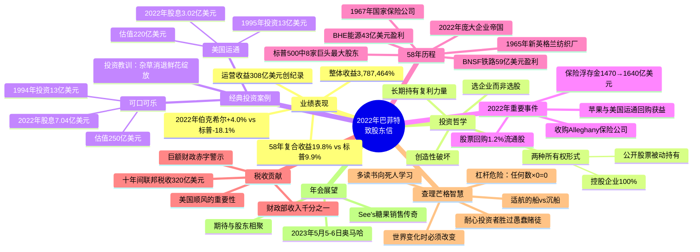

# 2022年巴菲特致股东信 - 思维导图

## Mermaid 思维导图

---

## 结构概要表格

| 模块 | 核心内容 | 关键数据 |
|------|----------|----------|
| 业绩对比 | 58年伯克希尔vs标普500复合收益 | 19.8% vs 9.9% |
| 2022年表现 | 伯克希尔逆势上涨，标普大幅下跌 | +4.0% vs -18.1% |
| 整体收益 | 1964-2022年累计收益 | 3,787,464% |
| 运营收益 | 按GAAP调整后的运营利润 | 308亿美元（创纪录）|
| 可口可乐投资 | 1994年投资，股息增长近10倍 | 成本13亿→估值250亿 |
| 美国运通投资 | 1995年投资，股息增长7倍 | 成本13亿→估值220亿 |
| Alleghany收购 | 财产险保险公司收购 | 浮存金增长至1640亿 |
| 股票回购 | 回购1.2%流通股 | 增加股东权益 |
| BNSF铁路 | 全资子公司盈利 | 59亿美元 |
| BHE能源 | 持股92%的能源公司盈利 | 43亿美元 |
| 联邦税收 | 2012-2021年贡献 | 320亿美元 |
| 财政赤字 | 十年间收支缺口 | 支出43.9万亿vs收入32.3万亿 |

---

## 关键人物

- [[沃伦·巴菲特]] - 伯克希尔·哈撒韦董事长，写信人，92岁
- [[查理·芒格]] - 巴菲特长期合作伙伴，伯克希尔副董事长，99岁
- [[乔·布兰登]] - Alleghany保险公司CEO，曾与巴菲特共事
- [[亨利·福特]] - 被引用，T型车时代代表
- [[本·格雷厄姆]] - 被引用，"投票机vs称重机"名言
- [[熊彼特]] - 提及"创造性破坏"理论

---

## 关键公司

### 伯克希尔全资或控股子公司
- [[伯克希尔·哈撒韦]] - 母公司，投资控股公司
- [[BNSF铁路]] - 全资子公司，北美最大铁路之一
- [[伯克希尔·哈撒韦能源]] (BHE) - 持股92%，能源公司
- [[国家保险公司]] (National Indemnity) - 1967年收购，保险业务起点
- [[Alleghany]] - 2022年收购的财产险保险公司
- [[See's糖果]] - 旗下糖果品牌，101年历史

### 重仓上市公司（伯克希尔为最大股东）
- [[可口可乐]] - 4亿股，1994年完成收购
- [[美国运通]] - 重要投资对象，1995年完成收购
- [[苹果]] - 重要投资对象，通过回购增加持股比例
- [[美国银行]] - 标普500成分股，重仓持有
- [[雪佛龙]] - 能源板块重仓
- [[惠普]] - 科技板块投资
- [[穆迪]] - 金融服务投资
- [[西方石油]] - 能源板块投资
- [[派拉蒙全球]] - 媒体娱乐投资

### 历史提及公司
- [[所罗门]] - 历史投资，险些灾难
- [[美国航空]] (US Airways) - 历史投资，险些灾难

---

## 时代背景

### 宏观经济环境
- **2022年股市表现**：标普500指数下跌18.1%，为2008年以来最差年度表现之一
- **通胀压力**：全球面临高通胀环境，美联储激进加息
- **利率环境**：利率快速上升影响股市估值
- **伯克希尔优势**：财务实力使保险子公司能采用竞争对手无法做到的投资策略

### 财政与税收背景
- **巨额财政赤字**：截至2021年的十年间，美国财政部支出43.9万亿美元，收入仅32.3万亿美元
- **税收构成**：个人所得税48%、社保34.5%、企业所得税仅8.5%
- **企业税负**：伯克希尔十年贡献320亿美元联邦税，占总额千分之一
- **财政可持续性质疑**：巴菲特警示"巨大且根深蒂固的财政赤字是有后果的"

### 投资市场特征
- **市场有效性谬误**：股票经常以"真正愚蠢的价格"交易，无论高低
- **市场短期波动**：媒体定期报道GAAP收益的季度波动，但具有误导性
- **长期主义回归**：在动荡市场中，伯克希尔的长期持有策略展现优势
- **回购争议**：巴菲特为股票回购辩护，强调增值回购使所有股东受益

### 伯克希尔战略定位
- **穿越周期能力**：持有大量现金和美国国债，避免资金紧张
- **保险浮存金优势**：从1470亿增至1640亿美元，长期零成本资金
- **经济对齐度**：十家控股和非控股巨头使伯克希尔与美国未来广泛对齐
- **美国信心**："从未见过做空美国长期来看是明智的时刻"
