# 2025年巴菲特致股东信 - 思维导图分析

---

## 一、Mermaid思维导图

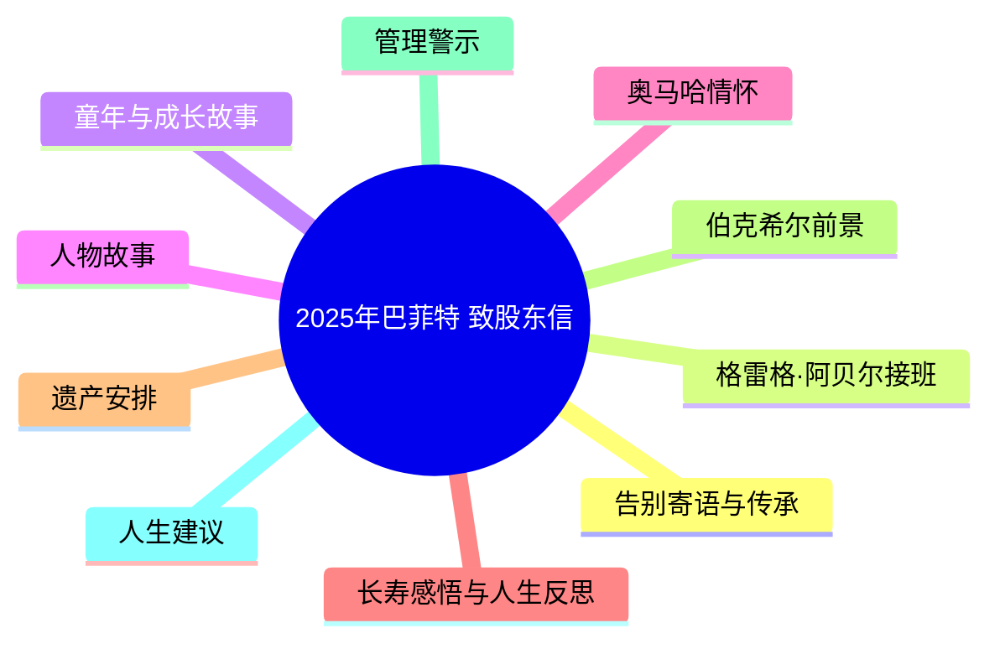
```mermaid
mindmap
  root((2025年巴菲特 致股东信))
    告别寄语与传承
    格雷格·阿贝尔接班
    童年与成长故事
    人物故事
    奥马哈情怀
    长寿感悟与人生反思
    遗产安排
    伯克希尔前景
    管理警示
    人生建议
```

告别寄语与传承

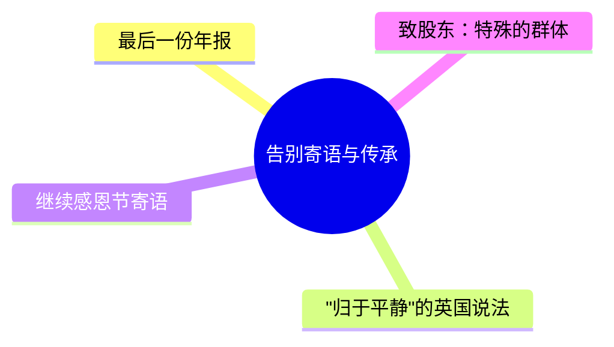
```mermaid
mindmap
  root((告别寄语与传承))
    最后一份年报
    "归于平静"的英国说法
    继续感恩节寄语
    致股东：特殊的群体
```

格雷格·阿贝尔接班

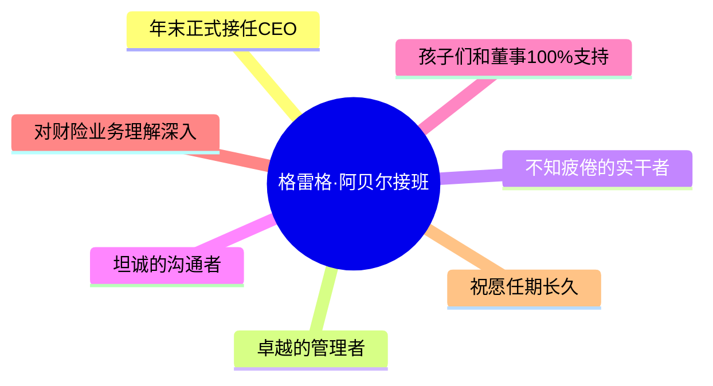
```mermaid
mindmap
  root((格雷格·阿贝尔接班))
    年末正式接任CEO
    卓越的管理者
    不知疲倦的实干者
    坦诚的沟通者
    孩子们和董事100%支持
    对财险业务理解深入
    祝愿任期长久
```

童年与成长故事

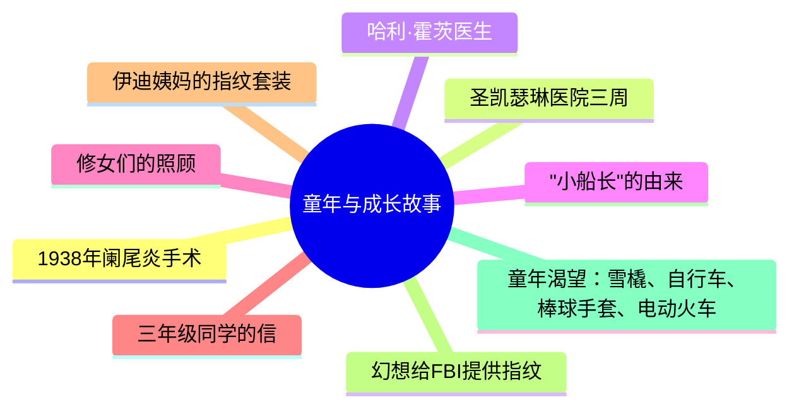
```mermaid
mindmap
  root((童年与成长故事))
    1938年阑尾炎手术
    圣凯瑟琳医院三周
    哈利·霍茨医生
    "小船长"的由来
    修女们的照顾
    三年级同学的信
    伊迪姨妈的指纹套装
    幻想给FBI提供指纹
    童年渴望：雪橇、自行车、棒球手套、电动火车
```

人物故事

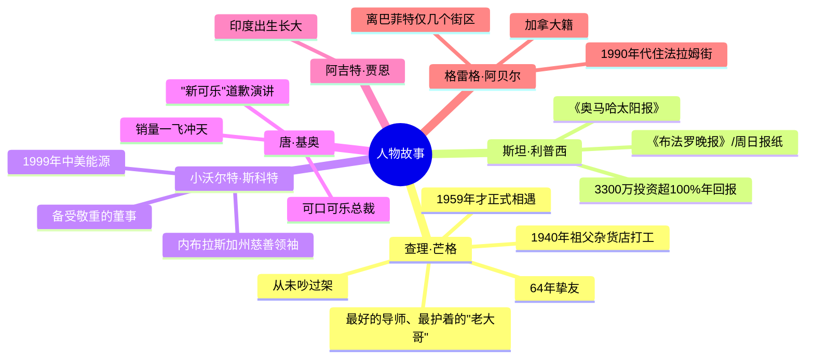
```mermaid
mindmap
  root((人物故事))
    查理·芒格
      64年挚友
      1940年祖父杂货店打工
      1959年才正式相遇
      最好的导师、最护着的"老大哥"
      从未吵过架
    斯坦·利普西
      《奥马哈太阳报》
      《布法罗晚报》/周日报纸
      3300万投资超100%年回报
    小沃尔特·斯科特
      1999年中美能源
      备受敬重的董事
      内布拉斯加州慈善领袖
    唐·基奥
      可口可乐总裁
      "新可乐"道歉演讲
      销量一飞冲天
    阿吉特·贾恩
      印度出生长大
    格雷格·阿贝尔
      加拿大籍
      1990年代住法拉姆街
      离巴菲特仅几个街区
```

奥马哈情怀

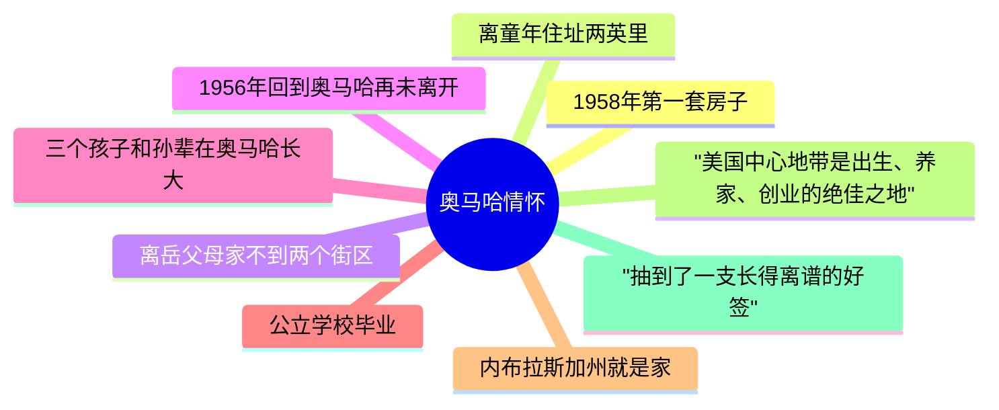
```mermaid
mindmap
  root((奥马哈情怀))
    1958年第一套房子
    离童年住址两英里
    离岳父母家不到两个街区
    1956年回到奥马哈再未离开
    三个孩子和孙辈在奥马哈长大
    公立学校毕业
    内布拉斯加州就是家
    "美国中心地带是出生、养家、创业的绝佳之地"
    "抽到了一支长得离谱的好签"
```

长寿感悟与人生反思

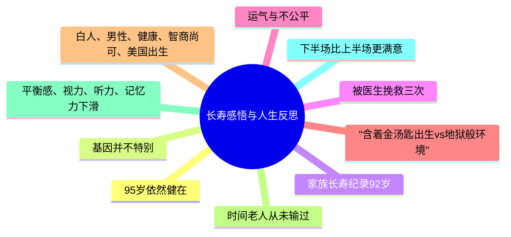
```mermaid
mindmap
  root((长寿感悟与人生反思))
    95岁依然健在
    基因并不特别
    家族长寿纪录92岁
    被医生挽救三次
    运气与不公平
    "含着金汤匙出生vs地狱般环境"
    白人、男性、健康、智商尚可、美国出生
    时间老人从未输过
    平衡感、视力、听力、记忆力下滑
    下半场比上半场更满意
```

遗产安排

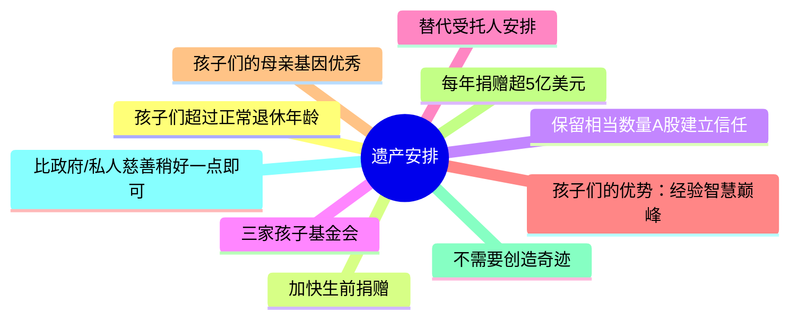
```mermaid
mindmap
  root((遗产安排))
    孩子们超过正常退休年龄
    加快生前捐赠
    保留相当数量A股建立信任
    三家孩子基金会
    替代受托人安排
    孩子们的优势：经验智慧巅峰
    孩子们的母亲基因优秀
    每年捐赠超5亿美元
    不需要创造奇迹
    比政府/私人慈善稍好一点即可
```

伯克希尔前景

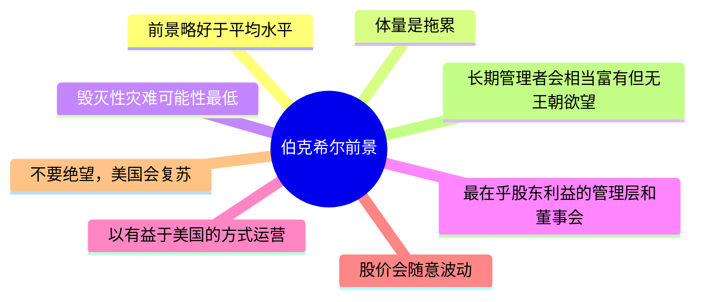
```mermaid
mindmap
  root((伯克希尔前景))
    前景略好于平均水平
    体量是拖累
    毁灭性灾难可能性最低
    最在乎股东利益的管理层和董事会
    以有益于美国的方式运营
    股价会随意波动
    不要绝望，美国会复苏
    长期管理者会相当富有但无王朝欲望
```

管理警示

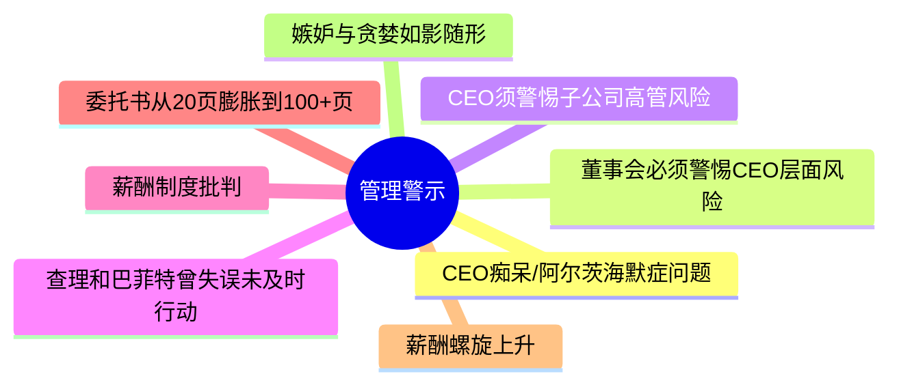
```mermaid
mindmap
  root((管理警示))
    CEO痴呆/阿尔茨海默症问题
    董事会必须警惕CEO层面风险
    CEO须警惕子公司高管风险
    查理和巴菲特曾失误未及时行动
    薪酬制度批判
    委托书从20页膨胀到100+页
    薪酬螺旋上升
    嫉妒与贪婪如影随形
```

人生建议

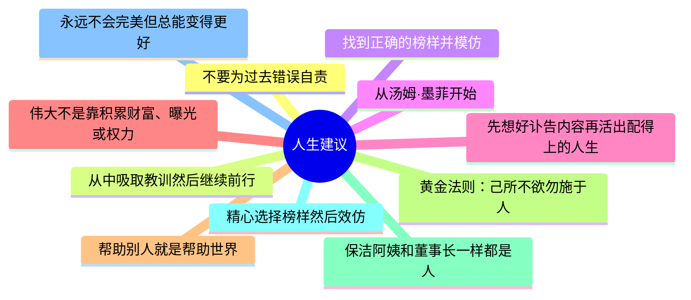
```mermaid
mindmap
  root((人生建议))
    不要为过去错误自责
    从中吸取教训然后继续前行
    找到正确的榜样并模仿
    从汤姆·墨菲开始
    先想好讣告内容再活出配得上的人生
    伟大不是靠积累财富、曝光或权力
    帮助别人就是帮助世界
    黄金法则：己所不欲勿施于人
    保洁阿姨和董事长一样都是人
    精心选择榜样然后效仿
    永远不会完美但总能变得更好
```

