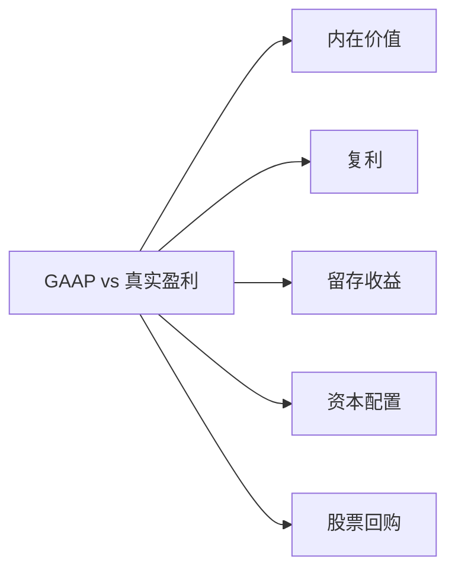

# GAAP vs 真实盈利（所有者收益）

> "真正重要的是每股所有者收益——而不是GAAP收益。" —— [[沃伦·巴菲特]]

巴菲特每年在股东信中都会对比GAAP会计盈利与真实的经济盈利。他用"所有者收益"(owner earnings)这个概念来衡量企业为股东创造的真实价值。这个主题贯穿了从合伙企业时代(1957-1970)到伯克希尔时代(1971-至今)的全部70年。

---

## 核心出处

| 年份 | 重点内容 |
|:---|:---|
| **[[/01_letters/1983年/核心总结]]** | 首次系统阐述所有者收益公式 |
| **[[/01_letters/1986年/核心总结]]** | GAAP与所有者收益的完整定义 |
| **[[/01_letters/1993年/核心总结]]** | 为什么GAAP数字具有误导性 |
| **[[/01_letters/2000年/核心总结]]** | 留存收益的复利效应 |
| **[[/01_letters/2019年/核心总结]]** | 留存收益的力量——3000字专节 |
| **[[/01_letters/2022年/核心总结]]** | GAAP季度波动对比表 |

---

## 一、什么是GAAP盈利 vs 所有者收益

### GAAP：会计规则的游戏

巴菲特在1988年信中直言不讳地批评GAAP的局限：

> "尽管公认会计准则GAAP有缺点，我也不想设计更好的规则，但是现有规则的局限，不代表管理者不用告诉你，CEO也有义务告诉股东债权人关键信息，任何子公司经理，给母公司CEO交报表，要是只给你GAAP barebones数字，漏了关键信息，母公司CEO肯定生气，所以为什么CEO，他老板就是股东，为什么不告诉股东对他们关键有用的信息呢？"

> "你需要报告的数据，不管GAAP非GAAP extra-GAAP，都要帮你回答三个关键问题：(1) 这家公司大概值多少钱？(2) 未来能不能履行义务？(3) 经理现在干得怎么样，给定拿到的这手牌。大多数情况下，GAAP没办法回答一个或多个问题，我们尝试补充信息，帮你回答。"

1986年，巴菲特更直接地说：

> "此外，[[Scott_Fetzer]]收购按照GAAP要求，购买价格还要做其他 major 调整，当然GAAP数字就是合并报表用的，但我们认为，对投资者和经理不一定最有用，所以各个运营单位我们报的盈利，不包含购买价格调整，相当于，就是我们没买这家企业，它本来会报告的盈利。"

### 所有者收益：真正属于股东的钱

1983年，巴菲特首次系统阐述了他的所有者收益公式：

> "GAAP会计要求在合并报表时确认我们被投资公司留存的所有经营收益，即使这些收益从未分配给我们。"

> "实际上，代表了我们真正可以自由支配的留存收益——我们可以在留存它们或分配给股东之间做出选择。"

---

## 二、留存收益：被忽视的财富引擎

### 史密斯的教训

2019年信开篇，巴菲特用1924年经济学家埃德加·劳伦斯·史密斯的故事开篇：

> "1924年，一位名不见经传的经济学家兼财务顾问埃德加·劳伦斯·史密斯撰写了《普通股作为长期投资》一书，这本薄薄的书改变了投资世界。起初，他打算论证股票在通胀时期表现会优于债券，而债券在通缩时期会提供更高的回报。这似乎足够合理。但史密斯却大吃一惊。"

> "他的书以一段忏悔开始：这些研究是一份失败的记录——事实是，事实未能支撑先入为主的理论。幸运的是，对投资者来说，这次失败促使史密斯更深入地思考应该如何评估股票。"

> "尽管投资者醒悟得很慢，但留存和再投资收益的数学原理现在已被充分理解。今天，学童们都能学到凯恩斯所说的新颖观点：将储蓄与复利结合，会创造奇迹。"

### 伯克希尔的留存收益实践

> "在[[伯克希尔哈撒韦]]，查理和我长期以来一直专注于有利地利用留存收益。有时这项工作很容易——在其他时候，则相当困难，特别是当我们开始处理巨额且不断增长的资金时。"

> "在对留存资金的配置中，我们首先寻求投资于我们已经拥有的众多多元化业务。在过去十年中，[[伯克希尔哈撒韦]]的折旧费用累计达650亿美元，而公司在财产、厂房和设备方面的内部投资总计达1210亿美元。"

---

## 三、为什么GAAP具有误导性

1993年，巴菲特详细解释了他透视收益的逻辑：

> "按照我们的计算方法，透视收益包括：(1)上一部分报告的经营收益，加上(2)主要被投资公司的留存经营收益（根据GAAP会计，这些不反映在我们的利润中），减去(3)如果这些被投资公司的留存收益分配给我们，[[伯克希尔哈撒韦]]将要支付的税款估算。"

> "我们这里所说的经营收益不包括资本利得、特殊会计项目和重大重组费用。"

他随后举例说明GAAP如何低估了真实收益：

> "1986年我们以每股172.50美元购买了300万股[[大都会]]/[[首都城市ABC]]股票，去年年底以每股630美元出售了其中的三分之一。在支付35%的资本利得税后，我们从出售中实现了2.97亿美元的利润。相比之下，在我们持有这些股票的八年中，归属于它们的Cap Cities留存收益——按照我们的透视方法以较低的14%税率假设征税——仅为1.52亿美元。换言之，我们支付的税单远大于我们向您展示的透视收益所假设的税额。"

---

## 四、2022年的GAAP季度波动

2022年，巴菲特用一份季度对比表生动展示了GAAP的荒谬性：

| 2022年季度 | GAAP收益（十亿美元） | 运营收益（十亿美元） |
|:---|:---|:---|
| 第一季度 | 7.0 | 5.5 |
| 第二季度 | 9.3 | (43.8) |
| 第三季度 | 7.8 | (2.7) |
| 第四季度 | 6.7 | 18.2 |

> "无论按季度还是年度来看，GAAP收益都100%具有误导性。诚然，资本收益在过去几十年对[[伯克希尔哈撒韦]]非常重要，我们预计在未来几十年也将很重要。但按季度来衡量GAAP收益——有时甚至按年度——就像根据天气来评价你的一天。" —— 2022年

---

## 主题关联

---

## 相关阅读

- [[内在价值]] - 真实盈利是内在价值的基础
- [[复利]] - 留存收益如何通过复利创造财富
- [[资本配置]] - 管理层如何配置留存收益
- [[股票回购]] - 回购与留存收益的关系

---

*本页面整理自[[沃伦·巴菲特]]致股东信原文（1957-2024年），[[慢慢变富的卡尔]]编辑整理*
