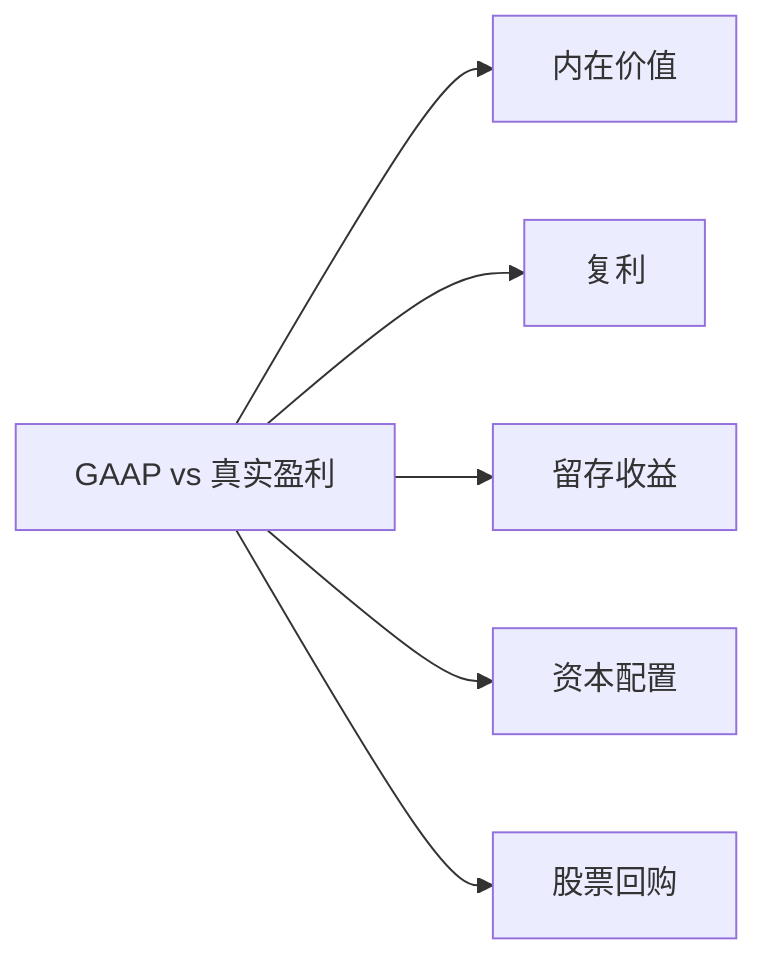

# GAAP vs 真实盈利（透视盈利与所有者收益）

> "真正重要的是每股所有者收益——而不是GAAP收益。" —— [[沃伦·巴菲特]]

巴菲特每年在股东信中都会对比GAAP会计盈利与真实的经济盈利。他用"所有者收益"(owner earnings)这个概念来衡量企业为股东创造的真实价值。这个主题贯穿了从合伙企业时代(1957-1970)到伯克希尔时代(1971-至今)的全部70年。

---

## 核心出处

| 年份 | 重点内容 |
|:---|:---|
| **[核心总结](/01_letters/1983年/核心总结)** | 首次系统阐述所有者收益公式 |
| **[核心总结](/01_letters/1986年/核心总结)** | GAAP与所有者收益的完整定义 |
| **[核心总结](/01_letters/1988年/核心总结)** | GAAP会计局限的尖锐批评 |
| **[核心总结](/01_letters/1993年/核心总结)** | 透视收益的计算方法 |
| **[核心总结](/01_letters/1999年/核心总结)** | 收购会计争议（权益结合法vs购买法） |
| **[核心总结](/01_letters/2019年/核心总结)** | 新GAAP规则导致的利润波动 |
| **[核心总结](/01_letters/2022年/核心总结)** | GAAP季度波动对比表 |

---

## 一、什么是GAAP盈利 vs 所有者收益

### GAAP：会计规则的游戏

巴菲特在1988年信中直言不讳地批评GAAP的局限：

> "尽管公认会计准则GAAP有缺点，我也不想设计更好的规则，但是现有规则的局限，不代表管理者不用告诉你，CEO也有义务告诉股东债权人关键信息。任何子公司经理，给母公司CEO交报表，要是只给你GAAP barebones数字，漏了关键信息，母公司CEO肯定生气，所以为什么CEO，他老板就是股东，为什么不告诉股东对他们关键有用的信息呢？"

> "你需要报告的数据，不管GAAP非GAAP extra-GAAP，都要帮你回答三个关键问题：(1) 这家公司大概值多少钱？(2) 未来能不能履行义务？(3) 经理现在干得怎么样，给定拿到的这手牌。大多数情况下，GAAP没办法回答一个或多个问题，我们尝试补充信息，帮你回答。"

1986年，巴菲特更直接地说：

> "此外，[[Scott_Fetzer]]收购按照GAAP要求，购买价格还要做其他 major 调整，当然GAAP数字就是合并报表用的，但我们认为，对投资者和经理不一定最有用，所以各个运营单位我们报的盈利，不包含购买价格调整，相当于，就是我们没买这家企业，它本来会报告的盈利。"

### 所有者收益：真正属于股东的钱

1983年，巴菲特首次系统阐述了他的所有者收益公式：

> "GAAP会计要求在合并报表时确认我们被投资公司留存的所有经营收益，即使这些收益从未分配给我们。"

> "实际上，代表了我们真正可以自由支配的留存收益——我们可以在留存它们或分配给股东之间做出选择。"

---

## 二、按十年分块：GAAP盈利论述演进

### 1980年代：所有者收益概念诞生

**1985年**：固定价格股权激励的深层不公平：

> "固定价格股权激励天然不公平——留存盈利自动推高公司价值，经理不干活也能坐享其成，这是拿原有股东的价值在奖励管理层。"

**1986年**：Scott Fetzer收购案例中，巴菲特明确表示GAAP调整对投资者无用：

> "GAAP数字就是合并报表用的，但我们认为，对投资者和经理不一定最有用。"

**1988年**：提出"拿笔偷大钱比拿枪抢安全多了"的经典批评，同时揭示GAAP合并报表的局限：

> "GAAP要求合并所有子公司报表，但合并之后，投资者什么都看不出来——各类业务的真实情况完全被淹没在汇总数字里。因此，我们主动为投资者分四块来报告。"

> "很多管理者本来就故意用GAAP骗你，'你想要多少，会计师就能给你出多少'，很多造假就是合法利用GAAP，投资者一定要小心。"

**1989年**：内在价值vs账面价值的清晰区分：

> "内在价值 = 未来所有现金流的折现现值。过去：账面价值高于内在价值（纺织业务拖累）；现在：内在价值远高于账面价值。"

### 1990年代：透视收益与税务视角

**1990年**：透视盈利的精确定义：

> "透视盈利 = 报告营业利润 + 被投企业留存盈利 - 假设这些留存盈利分配时应缴纳的税款。"

巴菲特在这一年系统阐述了一个关键洞见：GAAP合并报表把所有子公司的留存盈利都吞掉了，投资者根本无法分辨各自贡献了多少价值。

**1991年**：留存盈利与股息的本质区别：

> "GAAP只记录收到的股息，但留存盈利同样在创造价值——只不过这部分价值没有体现在你的账面收益里。"

他以可口可乐为例：即使不派发股息，留存盈利用于再投资同样为股东创造了巨额财富，只是GAAP的报表上看不到。

**1993年**：透视收益的系统定义与实际案例：

> "按照我们的计算方法，透视收益包括：(1)上一部分报告的经营收益，加上(2)主要被投资公司的留存经营收益（根据GAAP会计，这些不反映在我们的利润中），减去(3)如果这些被投资公司的留存收益分配给我们，[[伯克希尔哈撒韦]]将要支付的税款估算。"

巴菲特举例说明GAAP如何低估真实收益：持有Cap Cities八年，透视收益假设税额1.52亿，但实际出售缴税远高于此。

**1999年**：收购会计方法争议，管理层如何操纵会计规则：

> "管理层偏爱权益结合法（pooling），目的是避免商誉摊销——这是会计规则被人为操纵的典型案例，不是为了真实反映经济现实。"

### 2000年代：GAAP与经济现实的鸿沟

**2002年**：GAAP账面盈利与真实经济盈利的深刻差距：

> "GAAP的账面盈利，往往和真实经济盈利有巨大差距——前者是会计规则的游戏，后者才是企业真正为股东创造的价值。"

**2003年**：透视盈利的必要性：

> "我们需要透视盈利来理解真正的经济收益。GAAP数字只是起点，不是终点；如果你只看GAAP，你会严重低估那些优秀企业的真实盈利能力。"

**2010年**：三类资产的风险论述：

> "风险不是用beta衡量，真正的风险是导致购买力损失的概率。生产性资产优于货币资产和无生产力资产。"

巴菲特将资产分为三类：
1. **货币计价资产**：债券、存款等，长期看危险
2. **无生产力资产**：黄金等，依赖他人以更高价格购买
3. **生产性资产**：企业、农场、房地产，最佳选择

### 2010年代：留存收益的力量与GAAP新规

**2014年**：内在价值与账面价值的关系：

> "内在价值不是账面价值，账面价值只是内在价值的粗糙代理——两者可能相差巨大，尤其对于那些拥有大量经济商誉的企业。"

**2019年**：账面价值越来越接近内在价值，但并非直线前进：

> "我们业务和债券的内在价值远超账面价值。账面价值越来越接近内在价值，但这个过程并非直线前进，而是取决于留存盈利转化为真实资产的效率。"

引用Edgar Lawrence Smith的经典论述：

> "1924年，一位名不见经传的经济学家兼财务顾问埃德加·劳伦斯·史密斯撰写了《普通股作为长期投资》一书，这本薄薄的书改变了投资世界。"

> "他的书以一段忏悔开始：这些研究是一份失败的记录——事实是，事实未能支撑先入为主的理论。幸运的是，对投资者来说，这次失败促使史密斯更深入地思考应该如何评估股票。"

> "尽管投资者醒悟得很慢，但留存和再投资收益的数学原理现在已被充分理解。今天，学童们都能学到凯恩斯所说的新颖观点：将储蓄与复利结合，会创造奇迹。"

新GAAP规则的影响：

> "2018年新GAAP规则要求计入未实现损益。导致2018年亏损206亿（GAAP利润40亿），2019年盈利537亿（GAAP利润814亿）。强调投资者应关注营业利润而非GAAP利润的剧烈波动。"

**伯克希尔前十大持仓留存收益83亿美元，是股息38亿美元的2倍多。苹果留存收益25亿美元占首位。**

**2020年代：GAAP季度波动的荒谬性**

**2022年**：GAAP季度波动对比表，生动展示GAAP的误导性：

| 2022年季度 | GAAP收益（十亿美元） | 运营收益（十亿美元） |
|:---|:---|:---|
| 第一季度 | 7.0 | 5.5 |
| 第二季度 | 9.3 | (43.8) |
| 第三季度 | 7.8 | (2.7) |
| 第四季度 | 6.7 | 18.2 |

> "无论按季度还是年度来看，GAAP收益都100%具有误导性。诚然，资本收益在过去几十年对[[伯克希尔哈撒韦]]非常重要，我们预计在未来几十年也将很重要。但按季度来衡量GAAP收益——有时甚至按年度——就像根据天气来评价你的一天。"

> "媒体不加批判地将GAAP波动作为头条，完全误导投资者。"

---

## 三、留存收益：被忽视的财富引擎

### 史密斯的教训

2019年信开篇，巴菲特用1924年经济学家埃德加·劳伦斯·史密斯的故事开篇：

> "留存和再投资收益的数学原理现在已被充分理解。今天，学童们都能学到凯恩斯所说的新颖观点：将储蓄与复利结合，会创造奇迹。"

### 伯克希尔的留存收益实践

> "在[[伯克希尔哈撒韦]]，查理和我长期以来一直专注于有利地利用留存收益。有时这项工作很容易——在其他时候，则相当困难，特别是当我们开始处理巨额且不断增长的资金时。"

> "在对留存资金的配置中，我们首先寻求投资于我们已经拥有的众多多元化业务。在过去十年中，[[伯克希尔哈撒韦]]的折旧费用累计达650亿美元，而公司在财产、厂房和设备方面的内部投资总计达1210亿美元。"

---

## 四、为什么GAAP具有误导性

### 1993年透视收益案例

> "1986年我们以每股172.50美元购买了300万股[[大都会]]/[[首都城市ABC]]股票，去年年底以每股630美元出售了其中的三分之一。在支付35%的资本利得税后，我们从出售中实现了2.97亿美元的利润。相比之下，在我们持有这些股票的八年中，归属于它们的Cap Cities留存收益——按照我们的透视方法以较低的14%税率假设征税——仅为1.52亿美元。"

---

## 五、透视盈利公式总结

| 组成部分 | 说明 |
|:---|:---|
| 报告营业利润 | GAAP准则下合并报表中的营业利润 |
| + 被投企业留存盈利 | 主要参股公司的留存收益，GAAP不计入合并报表 |
| - 假设分配税 | 假设留存盈利分配时需缴纳的税款估算 |
| = 透视盈利 | 真实的经济盈利，更准确反映股东价值创造 |

---

## 主题关联

```mermaid
graph LR
    A[GAAP vs 真实盈利] --> B[内在价值]
    A --> C[复利]
    A --> D[留存收益]
    A --> E[资本配置]
    A --> F[股票回购]
```

---

## 相关阅读

- [[内在价值]] - 真实盈利是内在价值的基础
- [[复利]] - 留存收益如何通过复利创造财富
- [[资本配置]] - 管理层如何配置留存收益
- [[股票回购]] - 回购与留存收益的关系

---

*本页面整理自[[沃伦·巴菲特]]致股东信原文（1957-2024年），慢慢变富的卡尔编辑整理*
