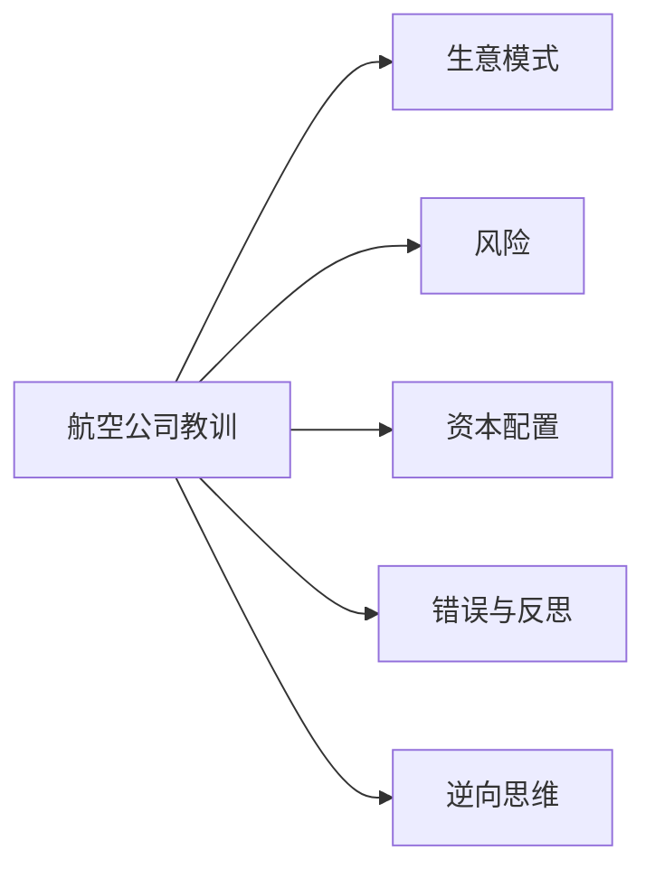

# 航空公司教训

> "最糟糕的企业就是那种增长很快，需要大量资本才能实现增长，然后赚不到什么钱。想想航空公司。" —— [[沃伦·巴菲特]]，2007年

1989年，巴菲特以"我知道航空公司在赚什么钱"的自信买入了[[美国航空]]优先股。1991年，这笔投资差点归零。这是他投资生涯中最重要的错误之一，也是理解"最糟糕生意模式"的最佳教材。

---

## 核心出处

| 年份 | 重点内容 |
|:---|:---|
| **[[/01_letters/1989年/核心总结|1989年]]** | 买入美国航空可转换优先股 |
| **[[/01_letters/1991年/核心总结|1991年]]** | 行业危机，优先股价值大幅减值 |
| **[[/01_letters/1994年/核心总结|1994年]]** | 深刻反思：成本结构的历史问题 |
| **[[/01_letters/1998年/核心总结|1998年]]** | 幸运脱身，高价卖出 |
| **[[/01_letters/2007年/核心总结|2007年]]** | "三种储蓄账户"经典论述 |
| **[[/01_letters/2013年/核心总结|2013年]]** | 再次强调：铁路vs航空的本质差异 |

---

## 一、买入：1989年的决定

1989年夏天，巴菲特卖出了中期免税债券，买入了三家可转换优先股：

> "我们夏天买了六亿六千万[[吉列]]，八年强制赎回，股息八又四分之三，五十块转股，然后三亿五千八百万[[美国航空]]，九年赎回，股息九又四分之一，六十块转股，三亿冠军国际，九年赎回，股息九又四分之一，三十八块转股。"

> "和传统可转优先股不一样，我们买这些不能短期卖，一段时间不能转，所以短期价格波动赚不到钱。我们最终赚钱还是要看企业长期经营结果好不好。我们不知道投行、航空、造纸未来经济怎么样，我们不是无神论，我们是不可知论，我们没有强烈 conviction。"

---

## 二、危机：成本结构的致命缺陷

1991年，美国航空优先股价值大幅低于成本。巴菲特直言：错在我。

> "我们[[美国航空]]优先股价值低于成本，因为航空业全行业亏，破产公司还在运营，所以正常公司竞争不过，因为破产公司不用承担过去成本，能低价卖票，把整个行业价格拉下来。"

> "所以我们[[美国航空]]投资减值了。CEO塞斯努力调整，能不能活下来还不好说。我们已经减值了。不对，不对，错在我。"

---

## 三、反思：为何这笔投资错了

1994年信中，巴菲特进行了深刻的自省：

> "在这次购买之前，我根本没有关注那些成本高昂且极难降低的航空公司将不可避免地会遇到的问题。早些年，这些威胁生命的成本几乎没有造成什么问题。航空公司当时受到监管的保护免受竞争，运营商可以吸收高成本，因为他们可以通过同样高的票价将其转嫁出去。"

> "当放松管制来临时，它并没有立即改变局面：低成本运营商的运力很小，高成本航空公司可以在很大程度上维持其现有的票价结构。在此期间，长期问题很大程度上不可见但缓慢转移，不可持续的成本进一步嵌入。"

> "随着低成本运营商的运力扩张，他们的票价开始迫使老牌高成本航空公司削减自己的票价。最终经济学的基本原理占了上风：在不受监管的大宗商品业务中，公司必须将其成本降低到竞争水平或面临灭绝。这个原则对你的董事长来说应该是显而易见的，但我错过了它。"

---

## 四、幸运脱身：1998年高价卖出

> "我，说出来惭愧，1989年我也参与了这种愚蠢，让[[伯克希尔哈撒韦]]买入了[[美国航空]]优先股。墨水还没干，公司就开始螺旋下降，很快分红就停了。后来我们非常幸运，1998年居然能高价卖掉股份，赚了一笔。"

> "我卖出之后十年，公司破产了两次。"

---

## 五、2007年最经典的总结：三种储蓄账户

> "总结一下，想想三种储蓄账户：

> - 好账户：给你非常高的利率，随着年份增长利率还会上升
> - 不错账户：给你有吸引力的利率，你增加存款也能赚利息
> - 糟糕账户：给你不足的利率，还要求你不断加钱，才能拿到那些令人失望的回报"

> "航空业就是第三种。"

---

## 六、2013年：铁路与航空的本质差异

巴菲特在讨论完[[BNSF铁路]]后，对比了铁路与航空的根本差异：

> "[[BNSF铁路]]承运约15%（按吨英里计算）的所有城际货物。用一加仑柴油运送一吨货物约500英里，承担同样工作的卡车消耗的燃料约为四倍。"

铁路具有定价权，航空没有；铁路资本回报稳定，航空永无止境地需要资本投入。

---

## 主题关联

---

## 相关阅读

- [[风险]] - 如何避免类似的资本配置错误
- [[资本配置]] - 如何评估资本密集型行业
- [[逆向思维]] - 为什么航空公司的"增长"是陷阱
- [[长期主义]] - 为什么要避开没有护城河的公司

---

*本页面整理自[[沃伦·巴菲特]]致股东信原文（1957-2024年），[[慢慢变富的卡尔]]编辑整理*
