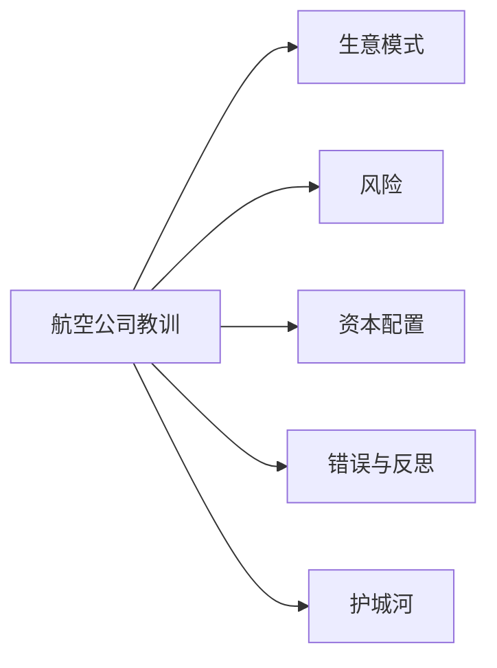

# 航空公司教训

> "最糟糕的企业就是那种增长很快，需要大量资本才能实现增长，然后赚不到什么钱。想想航空公司。" —— [[沃伦·巴菲特]]，2007年

1989年，巴菲特以"我知道航空公司在赚什么钱"的自信买入了[[美国航空]]优先股。1991年，这笔投资差点归零。这是他投资生涯中最重要的错误之一，也是理解"最糟糕生意模式"的最佳教材。

---

## 核心出处

| 年份 | 重点内容 |
|:---|:---|
| **[核心总结](/01_letters/1989年/核心总结)** | 买入美国航空可转换优先股 |
| **[核心总结](/01_letters/1991年/核心总结)** | 行业危机，优先股价值大幅减值 |
| **[核心总结](/01_letters/1994年/核心总结)** | 深刻反思：成本结构的历史问题 |
| **[核心总结](/01_letters/1998年/核心总结)** | 幸运脱身，高价卖出 |
| **[核心总结](/01_letters/2007年/核心总结)** | "三种储蓄账户"经典论述 |
| **[核心总结](/01_letters/2013年/核心总结)** | 再次强调：铁路vs航空的本质差异 |
| **[核心总结](/01_letters/2020年/核心总结)** | 疫情后清仓航空股 |

---

## 一、1989年：买入决策与背景

### 投资细节

1989年夏天，巴菲特卖出了中期免税债券，买入了三家可转换优先股：

> "我们夏天买了六亿六千万[[吉列]]，八年强制赎回，股息八又四分之三，五十块转股，然后三亿五千八百万[[美国航空]]，九年赎回，股息九又四分之一，六十块转股。"

### 巴菲特的自知之明

> "和传统可转优先股不一样，我们买这些不能短期卖，一段时间不能转，所以短期价格波动赚不到钱。我们最终赚钱还是要看企业长期经营结果好不好。我们不知道投行、航空、造纸未来经济怎么样，我们不是无神论，我们是不可知论，我们没有强烈 conviction。"

**核心教训**：承认不确定性的前提下仍然投资，本身就是冒险。

---

## 二、1990-1994年：危机的根源

### 1991年：行业全面亏损

> "我们[[美国航空]]优先股价值低于成本，因为航空业全行业亏，破产公司还在运营，所以正常公司竞争不过，因为破产公司不用承担过去成本，能低价卖票，把整个行业价格拉下来。"

### 1994年：最深刻的反思

> "在这次购买之前，我根本没有关注那些成本高昂且极难降低的航空公司将不可避免地会遇到的问题。早些年，这些威胁生命的成本几乎没有造成什么问题。航空公司当时受到监管的保护免受竞争，运营商可以吸收高成本，因为他们可以通过同样高的票价将其转嫁出去。"

> "当放松管制来临时，它并没有立即改变局面：低成本运营商的运力很小，高成本航空公司可以在很大程度上维持其现有的票价结构。在此期间，长期问题很大程度上不可见但缓慢转移，不可持续的成本进一步嵌入。"

> "随着低成本运营商的运力扩张，他们的票价开始迫使老牌高成本航空公司削减自己的票价。最终经济学的基本原理占了上风：在不受监管的大宗商品业务中，公司必须将其成本降低到竞争水平或面临灭绝。这个原则对你的董事长来说应该是显而易见的，但我错过了它。"

---

## 三、1998年：幸运脱身

> "我，说出来惭愧，1989年我也参与了这种愚蠢，让[[伯克希尔哈撒韦]]买入了[[美国航空]]优先股。墨水还没干，公司就开始螺旋下降，很快分红就停了。后来我们非常幸运，1998年居然能高价卖掉股份，赚了一笔。"

> "我卖出之后十年，公司破产了两次。"

**关键点**：这笔"成功"完全归功于运气，而非判断力的改善。

---

## 四、2007年：最经典的总结

### 三种储蓄账户理论

> "总结一下，想想三种储蓄账户：
> - 好账户：给你非常高的利率，随着年份增长利率还会上升
> - 不错账户：给你有吸引力的利率，你增加存款也能赚利息
> - 糟糕账户：给你不足的利率，还要求你不断加钱，才能拿到那些令人失望的回报"

> "航空业就是第三种。"

### 关于航空业的资本黑洞本质

> "从莱特兄弟时代开始，航空业一直对资本有着永无止境的需求。事实上，如果一个有远见的资本家当时在场的话，他应该在奥维尔起飞的时候就把飞机打下来，那样他的继任者们会省下很多钱。"

---

## 五、2013年：铁路与航空的本质差异

巴菲特在讨论[[BNSF铁路]]时，对比了铁路与航空的根本差异：

> "[[BNSF铁路]]承运约15%（按吨英里计算）的所有城际货物。用一加仑柴油运送一吨货物约500英里，承担同样工作的卡车消耗的燃料约为四倍。"

### 关键差异

| 维度 | 铁路（BNSF） | 航空业 |
|:---|:---|:---|
| 定价权 | 有 | 无 |
| 资本回报 | 稳定、可预期 | 永无止境的资本需求 |
| 竞争格局 | 区域垄断 | 大宗商品竞争 |
| 护城河 | 深厚 | 几乎没有 |

---

## 六、2020年：再次清仓

新冠疫情爆发后，巴菲特在2020年股东大会上宣布伯克希尔已清仓所有美国航空公司股票：

> "航空业是世界变化的一个例子。我不知道美国人现在是否会像以前那样多地飞行。"

**核心逻辑**：当商业模式的基本假设被打破时，果断认错比坚持更明智。

---

## 十年演进总结

### 1980年代：初尝苦果
- 1989年买入[[美国航空]]优先股，自以为理解行业
- 低估了"成本结构不可逆"的致命性

### 1990年代：深刻反思
- 1991-1994年持续减值，最终承认"错在我"
- 1998年幸运脱身，但十年后公司破产两次

### 2000年代：理论升华
- 2007年提出"三种储蓄账户"理论，航空业成为"糟糕企业"的教科书案例
- 明确指出增长快但需要大量资本的企业是最危险的陷阱

### 2010年代：对比深化
- 2013年收购BNSF铁路后，系统对比铁路与航空的本质差异
- 定价权、资本回报稳定性成为核心判断标准

### 2020年代：最终告别
- 2020年疫情后清仓所有航空股
- 60年投资生涯中，对航空业的认知从"不懂"到"懂了不碰"

---

## 核心教训

1. **成本结构的可逆性是关键**：高固定成本、强工会、价格竞争的行业几乎不可能获得合理回报

2. **增长不等于价值**：航空业增长很快，但增长需要大量资本投入，股东最终一无所获

3. **护城河比增长更重要**：没有定价权的行业，增长只会吸引更多竞争，利润率被持续侵蚀

4. **认错要及时**：1998年"幸运脱身"是运气，2020年主动清仓是判断力的进步

5. **声誉不是护城河**：优秀的管理层（如USAir的Seth Schofield）也无法挽救糟糕的行业结构

---

## 主题关联

```mermaid
graph LR
    A[航空公司教训] --> B[生意模式]
    A --> C[风险]
    A --> D[资本配置]
    A --> E[错误与反思]
    A --> F[护城河]
```

---

## 相关阅读

- [[生意模式]] - 如何识别好生意与坏生意
- [[资本配置]] - 如何评估资本密集型行业
- [[错误与反思]] - 从错误中学习的艺术
- [[护城河]] - 为什么定价权比增长更重要

---

*本页面整理自[[沃伦·巴菲特]]致股东信原文（1957-2025年），慢慢变富的卡尔编辑整理*
