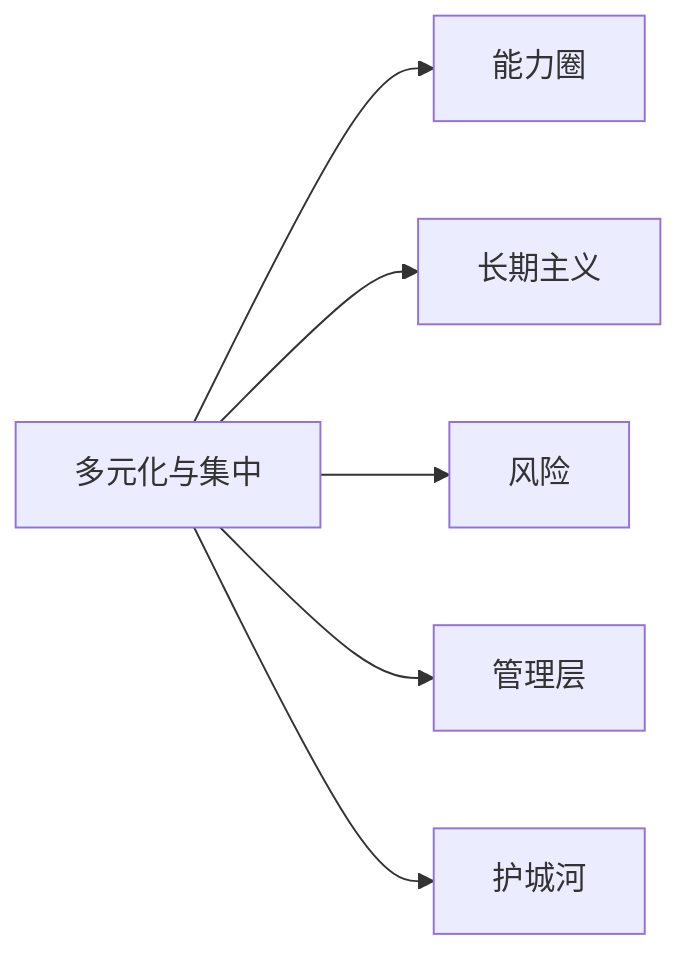

# 多元化与集中投资

> "多元化只是对无知的保护。如果你知道你在做什么，多元化是没有意义的。" —— [[沃伦·巴菲特]]（引用约翰·梅纳德·凯恩斯语）

巴菲特对多元化的看法经历了根本性转变。早年在合伙企业时期，他信奉广泛分散的"捡烟蒂"策略；后期转向高度集中的"最优集中"策略。这种转变本身就是价值投资思想进化的最佳案例。

---

## 核心出处

| 年份 | 重点内容 |
|:---|:---|
| **[[/01_letters/1960年/核心总结|1960年]]** | 早期对多元化的思考 |
| **[[/01_letters/1977年/核心总结|1977年]]** | 伯克希尔时期的持仓集中 |
| **[[/01_letters/1996年/核心总结|1996年]]** | 集中投资的前提条件 |
| **[[/01_letters/2005年/核心总结|2005年]]** | 关于"全部投资"策略 |
| **[[/01_letters/2013年/核心总结|2013年]]** | 集中持股的复利效应 |

---

## 一、从分散到集中：策略的演变

### 合伙企业时期：广泛分散

1960年，巴菲特在合伙企业信中解释了他的分散策略：

> "在合伙企业早期，我们的持仓相当分散，因为可供选择的好机会有限。"

> "随着我们管理的资金规模扩大，我们开始找到更多的集中持仓机会。"

### 伯克希尔时期：质的飞跃

1996年，巴菲特明确表示：

> "在伯克希尔的持仓中，我们高度集中于少数真正优秀的公司。这种集中来自于我们对自己所做之事的确信程度。"

---

## 二、集中投资的前提条件

巴菲特认为，集中投资不是赌博，它需要满足两个前提：

> "第一，你必须真正了解你所投资的公司。你必须能够对其未来五到十年的表现做出合理的估计。"

> "第二，你的估计必须是正确的。如果你有40%的可能性是正确的，但持有一个单一的仓位，那才是真正的赌博。"

> "只有在你的确信程度很高时，集中持仓才是明智的。而这种确信，来自于你对公司深入的了解。"

---

## 三、最优持仓数量

巴菲特曾表示：

> "我认为对于大多数投资者来说，10只股票是合适的上限。但对于真正理解的生意，三到四只股票就够了。"

> "你不是在分散风险，你是在分散无知。"

---

## 四、凯恩斯 vs 费雪 vs 巴菲特

巴菲特同时引用了凯恩斯和费雪的观点：

> "约翰·梅纳德·凯恩斯：多元化只是对无知的保护。如果你知道你在做什么，多元化是没有意义的。"

> "费雪：我把鸡蛋放在少数几个篮子里，然后仔细看好这些篮子。"

> "这正是我和查理的做法：我们只在少数几个地方下重注。"

---

## 五、集中投资的复利效应

2013年，巴菲特解释了集中投资如何加速财富积累：

> "当你持有真正优秀的公司时，时间是你最好的朋友。复利的力量在集中持仓中体现得最为明显。"

> "如果我们把伯克希尔的资本分散到50只普通公司，我们的复合增长率会低很多。正是对少数伟大公司的集中持有，成就了伯克希尔的复利传奇。"

---

## 六、巴菲特当前的持仓

伯克希尔的持仓极度集中：

> "我们持有五六只我非常了解的公司，它们的内在价值会随时间不断增长。这是我们投资组合的全部秘密。"

---

## 主题关联

---

## 相关阅读

- [[能力圈]] - 集中投资的前提是真正了解
- [[长期主义]] - 集中持股的时间价值
- [[风险]] - 集中投资的风险管理

---

*本页面整理自[[沃伦·巴菲特]]致股东信原文（1957-2024年），[[慢慢变富的卡尔]]编辑整理*
