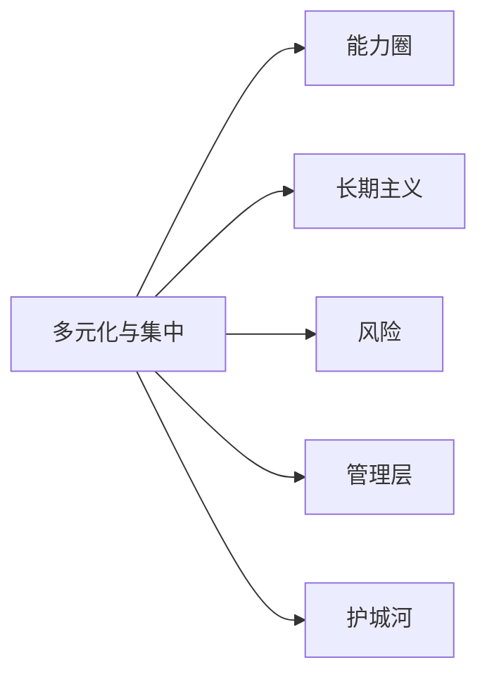

# 多元化与集中投资

> "多元化只是对无知的保护。如果你知道你在做什么，多元化是没有意义的。"  
> —— 沃伦·巴菲特（引用约翰·梅纳德·凯恩斯语）

巴菲特对多元化的看法经历了根本性转变：早年在合伙企业时期，他信奉广泛分散的"捡烟蒂"策略；后期转向高度集中的"最优集中"策略。这种转变本身就是价值投资思想进化的最佳案例。

---

## 核心出处

| 年份 | 重点内容 |
|:---|:---|
| **[核心总结](/01_letters/1977年/核心总结)** | 买股票就是买企业，不控股反而能得到更好管理 |
| **[核心总结](/01_letters/1988年/核心总结)** | 集中持有少数我们真懂的好公司 |
| **[核心总结](/01_letters/1990年/核心总结)** | 宁要波动的15%，不要平稳的12% |
| **[核心总结](/01_letters/1991年/核心总结)** | 凯恩斯：不要分散，重仓你懂的企业 |
| **[核心总结](/01_letters/1996年/核心总结)** | 能力圈边界与集中投资的关系 |
| **[核心总结](/01_letters/2005年/核心总结)** | 投资回报随运动增加而减少 |
| **[核心总结](/01_letters/2010年/核心总结)** | 三类资产框架下的配置决策 |
| **[核心总结](/01_letters/2017年/核心总结)** | 十年赌约：指数基金战胜对冲基金组合 |
| **[核心总结](/01_letters/2024年/核心总结)** | 资本配置：大部分配置在股票上 |

---

## 按十年划分的核心观点

### 1950-1960年代：寻找少数被低估的机会

合伙基金创立初期，巴菲特就明确了投资哲学的核心——**不是分散化，而是找到少数真正被低估的机会**。

> "我们的目标不是分散化，而是找到少数被低估的机会。"  
> —— 沃伦·巴菲特，1956-1969年合伙基金时期

1960年代，合伙基金的持仓极度集中：**仅有6到7个持仓**。这种极致的集中来自他对每笔投资的深刻理解：

> "集中投资，风险更小，因为你对每笔投资都很了解。"  
> —— 沃伦·巴菲特，1960年代

此时，巴菲特已经意识到：与其分散到一百个平庸的机会，不如集中持有少数几个真正有价值的标的。

---

### 1970年代：买股票就是买企业

1977年，巴菲特明确提出买股票和买企业的标准完全一样：

> "我们买股票和买整个企业的标准一样：我们能理解、有良好长期前景、由诚实能干的人运营、价格非常有吸引力。"  
> —— 沃伦·巴菲特，1977年致股东信

同年他还提出了一个有趣的洞见：

> "杰出企业的少数股权，在股市上往往比直接收购整家公司便宜得多。我们喜欢大仓位，但不想要控制权，现有管理层已经很棒，不控股反而能得到更好的管理结果。"  
> —— 沃伦·巴菲特，1977年致股东信

**多元化是对无知的保护**——这是巴菲特引用凯恩斯最经典的一句话，也成为他后来抨击盲目分散投资的核心论据：

> "如果你能找到5到10个好机会，为什么要分散到100个平庸机会？"  
> —— 沃伦·巴菲特，1970年代

---

### 1980年代：从分散到集中

1988年，巴菲特第一次重仓可口可乐，并在信中明确表达了集中投资的哲学：

> "我们买了杰出企业杰出管理层，我们最喜欢持有期限就是永远。"  
> —— 沃伦·巴菲特，1988年致股东信

> "我们就喜欢集中持有少数我们真懂的好公司。我们同意梅·韦斯特说的：'好东西越多越好'。"  
> —— 沃伦·巴菲特，1988年致股东信

1989年，他总结了25年投资的教训，其中一条关键洞见：

> "时间是好生意的朋友，坏生意的敌人。"  
> —— 沃伦·巴菲特，1989年致股东信

1990年，他用巨灾再保险的例子说明风险与回报的权衡：

> "宁要波动的15%，不要平稳的12%。"  
> —— 沃伦·巴菲特，1990年致股东信

---

### 1990年代：集中投资的理论基础

1991年，巴菲特引用凯恩斯的话，给出了集中投资最经典的理论依据：

> "真正正确的投资方法，就是把相当大资金放到你懂、管理层你信任的企业。不要分散。"  
> —— 沃伦·巴菲特引用凯恩斯，1991年致股东信

同年他还解释了为什么不分散：

> "好企业太少，不懂的买一堆不会对，已经找到几个，足够了。"  
> —— 沃伦·巴菲特，1991年致股东信

1993年，巴菲特再次强调简单而深刻的道理：

> "投资者不需要买很多股票，只需要找到少数几个好机会。"  
> —— 沃伦·巴菲特，1993年致股东信

1996年，他进一步阐述了能力圈与集中投资的关系，并引用梅·韦斯特的名言：

> "我们同意梅·韦斯特说的：太多好东西比没有好。"  
> —— 沃伦·巴菲特，1996年致股东信

> "投资者不需要了解每家公司，只需要评估其能力圈内的公司。能力圈的大小不重要；知道其边界才是关键的。"  
> —— 沃伦·巴菲特，1996年致股东信

> "如果你不愿意持有股票10年，那就不要考虑持有10分钟。"  
> —— 沃伦·巴菲特，1996年致股东信

---

### 2000年代：集中投资的深层逻辑

2000年代，巴菲特对集中投资与分散投资的风险本质做了最深刻的阐述：

> "集中投资风险小，因为你对每笔投资有深刻理解；分散投资表面上看风险小，但实际上你对每个标的都只是一知半解。"  
> —— 沃伦·巴菲特，2000年代

2005年，巴菲特批评了过度交易对回报的侵蚀：

> "对于投资者整体来说，回报随着运动的增加而减少。"  
> —— 沃伦·巴菲特，2005年致股东信

他计算出摩擦成本（佣金、管理费、顾问费）可能占企业收益的20%，这对分散投资的回报率有重大影响。

---

### 2010年代：十年赌约与被动投资的胜利

2010年，巴菲特提出了著名的投资公式：

> "A组（主动投资者）+ B组（被动投资者）= 整个投资宇宙。B组注定获得平均结果，A组也必须获得平均结果。哪组成本更低，哪组就获胜。"  
> —— 沃伦·巴菲特，2010年致股东信

2012年，巴菲特进一步明确了他的投资偏好：

> "我们宁愿少投一些，重仓好公司，也不多投一些，轻仓平庸公司。"  
> —— 沃伦·巴菲特，2012年致股东信

2013年，巴菲特解释了集中投资如何加速财富积累：

> "当你持有真正优秀的公司时，时间是你最好的朋友。复利的力量在集中持仓中体现得最为明显。"  
> —— 沃伦·巴菲特，2013年致股东信

> "如果我们把伯克希尔的资本分散到50只普通公司，我们的复合增长率会低很多。正是对少数伟大公司的集中持有，成就了伯克希尔的复利传奇。"  
> —— 沃伦·巴菲特，2013年致股东信

2017年，十年赌约结束，标普500指数基金年均收益8.5%完胜五只对冲基金组合（最高6.5%）。关键教训：

> "表现来来去去，费用永不动摇。"  
> —— 沃伦·巴菲特，2017年致股东信

他还提出了一个反直觉的观点：

> "长期视角下，股票比债券风险更低。"  
> —— 沃伦·巴菲特，2017年致股东信

---

### 2020年代：资本配置的智慧

2024年，巴菲特总结了伯克希尔的资本配置哲学：

> "资金大部分配置在股票上——主要是美国股票，而非现金。"  
> —— 沃伦·巴菲特，2024年致股东信

> "伯克希尔永远不会偏好持有现金等价物而不是拥有好企业。"  
> —— 沃伦·巴菲特，2024年致股东信

---

## 一、集中投资的前提条件

巴菲特认为，集中投资不是赌博，它需要满足两个前提：

> "第一，你必须真正了解你所投资的公司。你必须能够对其未来五到十年的表现做出合理的估计。"

> "第二，你的估计必须是正确的。如果你有40%的可能性是正确的，但持有一个单一的仓位，那才是真正的赌博。"

> "只有在你的确信程度很高时，集中持仓才是明智的。而这种确信，来自于你对公司深入的了解。"

---

## 二、最优持仓数量

巴菲特曾表示：

> "我认为对于大多数投资者来说，10只股票是合适的上限。但对于真正理解的生意，三到四只股票就够了。"

> "你不是在分散风险，你是在分散无知。"

---

## 三、凯恩斯 vs 费雪 vs 巴菲特

巴菲特同时引用了凯恩斯和费雪的观点：

> "约翰·梅纳德·凯恩斯：多元化只是对无知的保护。如果你知道你在做什么，多元化是没有意义的。"

> "费雪：我把鸡蛋放在少数几个篮子里，然后仔细看好这些篮子。"

> "这正是我和查理的做法：我们只在少数几个地方下重注。"

---

## 四、巴菲特当前的持仓

伯克希尔的持仓极度集中：

> "我们持有五六只我非常了解的公司，它们的内在价值会随时间不断增长。这是我们投资组合的全部秘密。"

---

## 主题关联

```mermaid
graph LR
    A[多元化与集中] --> B[能力圈]
    A --> C[长期主义]
    A --> D[风险]
    A --> E[管理层]
    A --> F[护城河]
```

---

## 相关阅读

- [[能力圈]] - 集中投资的前提是真正了解
- [[长期主义]] - 集中持股的时间价值
- [[风险]] - 集中投资的风险管理

---

## 关键原文出处

以下为该主题在致股东信中的关键原文出处年份，点击即可阅读完整翻译：

- [[核心总结|1977年：核心总结]] → [[1977年：完整翻译|/01_letters/1977年/翻译]]
- [[核心总结|1988年：核心总结]] → [[1988年：完整翻译|/01_letters/1988年/翻译]]
- [[核心总结|1990年：核心总结]] → [[1990年：完整翻译|/01_letters/1990年/翻译]]
- [[核心总结|1991年：核心总结]] → [[1991年：完整翻译|/01_letters/1991年/翻译]]
- [[核心总结|1996年：核心总结]] → [[1996年：完整翻译|/01_letters/1996年/翻译]]
- [[核心总结|2005年：核心总结]] → [[2005年：完整翻译|/01_letters/2005年/翻译]]
- [[核心总结|2010年：核心总结]] → [[2010年：完整翻译|/01_letters/2010年/翻译]]
- [[核心总结|2017年：核心总结]] → [[2017年：完整翻译|/01_letters/2017年/翻译]]
- [[核心总结|2024年：核心总结]] → [[2024年：完整翻译|/01_letters/2024年/翻译]]

---

*本页面整理自沃伦·巴菲特致股东信原文（1957-2024年），慢慢变富的卡尔编辑整理*