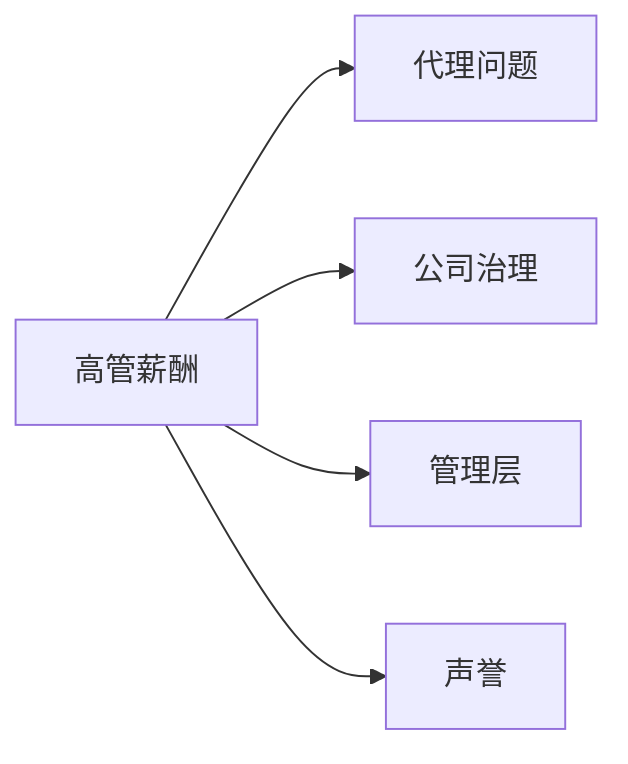

# 高管薪酬与激励

> "大多数CEO薪酬方案的设计，是为了在任何情况下都给CEO支付高薪。" —— [[沃伦·巴菲特]]

高管薪酬是现代公司治理中最具争议的议题之一。巴菲特在1985、1992、1998、2002、2003、2008、2016年的股东信中反复深入讨论期权激励的利弊。他是伯克希尔薪酬制度的总设计师，也是华尔街"标准"薪酬实践最激烈的批评者。

---

## 核心出处

| 年份 | 重点内容 |
|:---|:---|
| **[[/01_letters/1985年/核心总结]]** | 首次详细讨论期权激励问题 |
| **[[/01_letters/1992年/核心总结]]** | 期权成本的问题 |
| **[[/01_letters/1998年/核心总结]]** | 期权的激励扭曲问题 |
| **[[/01_letters/2002年/核心总结]]** | 期权会计问题 |
| **[[/01_letters/2003年/核心总结]]** | 批评高薪顾问公司 |
| **[[/01_letters/2008年/核心总结]]** | 经济危机中的薪酬问题 |
| **[[/01_letters/2016年/核心总结]]** | 关于伯克希尔的薪酬原则 |

---

## 一、期权激励的问题

巴菲特在1985年信中首次系统分析期权激励的缺陷：

> "在典型的期权计划中，CEO可以在股价下跌时稳坐钓鱼台——他们的奖金与股价表现无关。如果他们把公司搞砸了，期权仍然有效，可以等到市场好转时行权。这种激励是向下的，不是向上的。"

> "真正的问题是：CEO的薪酬应该与他们的表现挂钩。不幸的是，大多数期权计划只是假装做到了这一点。"

---

## 二、为什么期权成本被忽视

1992年，巴菲特批评了期权会计规则：

> "大多数公司发行股票期权时不将任何成本计入收益表。这意味着，即使期权最终价值数十亿美元，它们也不会减少报告的每股收益。"

> "这是一种会计上的自我欺骗。公司在员工工资上精打细算，但通过期权支付数十亿美元时，却不计入成本。"

---

## 三、激励如何扭曲行为

巴菲特1998年的分析更为深刻：

> "期权激励不仅不能把管理者的利益与股东利益对齐，有时甚至会产生反效果。当管理者知道他们的财富与股价挂钩时，他们会做出短期决策来推高股价——即使这损害了公司的长期价值。"

> "典型的股票期权安排不会定期增加期权价格以补偿留存收益正在积累公司财富的事实。实际上，十年期期权、低股息支付率和复利的组合可以为一位只是在其工作中原地踏步的经理人提供丰厚的收益。"

> "愤世嫉俗者甚至可能注意到，当对业主的支付被压低时，持有期权的经理人的利润增加。"

---

## 四、经济危机中的薪酬问题

2008年金融危机后，巴菲特批评了那些导致危机的薪酬制度：

> "这次危机的根本原因之一，是太多华尔街高管的薪酬与短期收益挂钩，而与长期风险无关。他们被激励去冒险——赢了是自己的，亏了是股东和纳税人的。"

> "薪酬方案应该让管理者像所有者一样思考和行动。当管理者真正拥有公司的一部分时，他们做出的决策会有所不同。"

---

## 五、伯克希尔的薪酬原则

伯克希尔的薪酬制度与华尔街截然不同：

> "在[[伯克希尔哈撒韦]]，我们不给CEO发放股票期权。我们给的是伯克希尔的股份——真正的所有权。"

> "我们的高管薪酬不是为了与市场竞争。我们寻找的是那些以工作本身为动力的人。那些为了钱而工作的人，通常不会成为我们想要的管理者。"

---

## 六、代理问题的延伸

巴菲特将期权激励问题与更广泛的代理问题联系起来：

> "薪酬顾问公司知道他们的客户是谁——是聘请他们的CEO，而不是股东。这种利益冲突是系统性缺陷。"

> "最终，解决薪酬问题的最好办法是：董事会真正独立，真正为股东服务。但这在大多数公司还没有发生。"

---

## 主题关联

---

## 相关阅读

- [[公司治理]] - 董事会与代理问题
- [[管理层]] - 优秀管理者的特征
- [[声誉]] - 诚信与激励机制

---

*本页面整理自[[沃伦·巴菲特]]致股东信原文（1957-2024年），[[慢慢变富的卡尔]]编辑整理*
