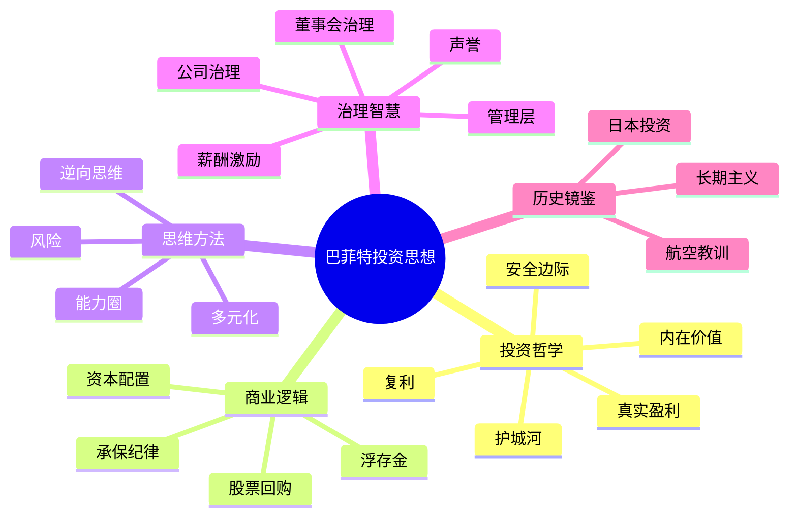

# 主题索引

按主题分类阅读巴菲特致股东信的核心思想，提炼70年投资智慧的精华。

> 本索引基于1956-2024年全部70年股东信的词频分析与内容扫描，识别出21个真实贯穿股东信的核心主题。

---

## 投资哲学

投资哲学是巴菲特思想体系的根基。五个概念构成了价值投资的完整框架：**内在价值**告诉你买什么，**护城河**帮你识别好生意，**安全边际**保护你不亏钱，**复利**让时间为你工作，**GAAP vs 真实盈利**揭示会计数字背后的真相。

| 主题 | 核心要义 | 必读年份 |
|:---|:---|:---|
| [内在价值 Intrinsic Value](/02_concepts/intrinsic-value) | 企业真正值多少钱 | 1994, 2000, 2007, 2008 |
| [护城河 Moat](/02_concepts/moat) | 竞争优势的宽度与持久度 | 1993, 1999, 2007, 2014 |
| [安全边际 Margin of Safety](/02_concepts/safety-margin) | 用折扣价格买好资产 | 1997, 2007, 2008, 2020 |
| [复利 Compounding](/02_concepts/compounding) | 时间是伟大事业的朋友 | 1965, 1993, 2013, 2023 |
| [GAAP vs 真实盈利](/02_concepts/accounting-earnings) | 为什么会计盈利不等于真实盈利 | 1983, 1986, 1993, 2019 |

## 商业逻辑

伯克希尔的商业模式独步全球。理解**保险浮存金**的秘密、**承保纪律**的意义、**资本配置**的艺术，以及**股票回购**的哲学，才能真正看懂巴菲特在做什么。

| 主题 | 核心要义 | 必读年份 |
|:---|:---|:---|
| [保险浮存金 Insurance Float](/02_concepts/insurance-float) | 伯克希尔的秘密引擎 | 1967, 2005, 2006, 2010 |
| [承保纪律 Underwriting Discipline](/02_concepts/underwriting-discipline) | 不做价格战，守住底线 | 2001, 2004, 2017 |
| [资本配置 Capital Allocation](/02_concepts/capital-allocation) | 把每一分钱用在刀刃上 | 1983, 2012, 2020 |
| [股票回购 Share Buybacks](/02_concepts/share-buybacks) | 被低估的资本配置工具 | 1984, 1999, 2011, 2012 |

## 思维方法

投资是一场思维方式的较量。知道自己懂什么、保持独立思考、理解真正的风险——这些是巴菲特区别于普通投资者的核心能力。

| 主题 | 核心要义 | 必读年份 |
|:---|:---|:---|
| [能力圈 Circle of Competence](/02_concepts/circle-of-competence) | 知道边界比知道多少更重要 | 1996, 1999, 2000, 2017 |
| [逆向思维 Contrarian Thinking](/02_concepts/contrarian) | 别人恐惧时贪婪 | 1987, 2008, 2009, 2020 |
| [多元化与集中](/02_concepts/diversification) | 分散是对无知的保护 | 1960, 1996, 2007, 2013 |
| [风险与回报 Risk & Return](/02_concepts/risk) | 永久损失才是风险 | 1993, 2003, 2007, 2008 |

## 治理智慧

伯克希尔的成功背后是一套独特的治理哲学。选择**德才兼备的管理者**、设计合理的**激励制度**、建立有效的**董事会结构**——治理是巴菲特投资体系中最被忽视但最关键的环节。

| 主题 | 核心要义 | 必读年份 |
|:---|:---|:---|
| [管理层选择 Management](/02_concepts/management) | 找到对的船长 | 1983, 1995, 2005, 2015 |
| [高管薪酬 Executive Compensation](/02_concepts/executive-compensation) | 设计合理的激励，避免股东财富流失 | 1983, 1992, 2003, 2014 |
| [董事会与公司治理 Corporate Governance](/02_concepts/corporate-governance) | 被低估的核心议题 | 1992, 2003, 2008, 2014 |
| [声誉 Reputation](/02_concepts/reputation) | 建立需20年，毁掉只需5分钟 | 1991, 2014, 2020 |

## 历史镜鉴

巴菲特犯过很多错误，也见证过无数历史。这些教训与案例，是理解巴菲特投资思想最生动的教材。

| 主题 | 核心要义 | 必读年份 |
|:---|:---|:---|
| [航空公司教训 Airline Mistakes](/02_concepts/airline-lessons) | 最糟糕的生意模式 | 1989, 1991, 1994, 2007 |
| [日本五大投资 Japan Holdings](/02_concepts/japan-investments) | 2019-2024年最大非美投资 | 2020, 2021, 2023, 2024 |
| [长期主义 Long-term Thinking](/02_concepts/long-term) | 不想持十年就别持十分钟 | 1996, 2001, 2013, 2020 |

---

## 主题关联图

---

## 70年主题词频分析

以下是根据70年股东信词频分析得出的主题分布（括号内为该年份出现次数峰值）：

| 主题 | 高频年份 | 核心讨论期 |
|:---|:---|:---|
| 管理层 CEO | 2014年(91次) | 全程高频，贯穿70年 |
| 收购 | 2014年(79次) | 1980s至今 |
| 董事会治理 | 2002年(95次) | 2000s至今爆发 |
| 保险浮存金 | 2011年(59次) | 1970s至今 |
| 回购 | 2011年(44次) | 2010s爆发，态度180度转变 |
| GAAP会计 | 1988年(17次) | 全程持续 |
| 航空公司 | 1994年(8次) | 1989-2007集中论述 |
| 日本投资 | 2023年(12次) | 2019-2024年新兴 |

---

> 💡 **学习建议**
>
> 1. **按顺序阅读**：建议从"投资哲学"五个主题开始，建立完整的价值投资框架
> 2. **结合原文**：每个主题页面都标注了重点年份，建议结合对应年份的股东信阅读
> 3. **交叉验证**：主题之间存在内在联系，如护城河决定复利质量，安全边际保护复利不受中断
> 4. **从错误中学习**：航空教训一章是理解巴菲特投资逻辑最生动的入口
> 5. **关注治理**：巴菲特晚年越来越强调治理议题，这在2020s变得更加重要
