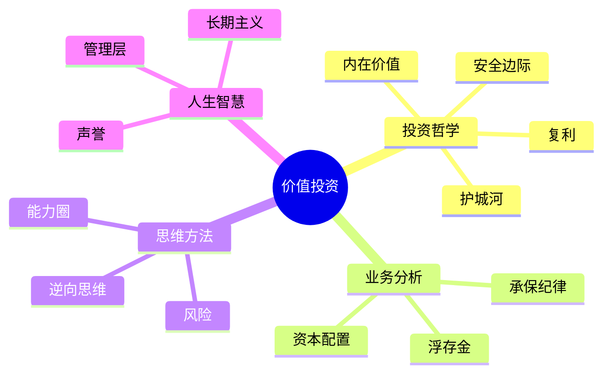

# 主题索引

按主题分类阅读巴菲特致股东信的核心思想，提炼70年投资智慧的精华。

---

## 投资哲学

投资哲学是巴菲特思想体系的根基。这四个概念构成了价值投资的完整框架：**内在价值**告诉你买什么，**护城河**帮你识别好生意，**安全边际**保护你不亏钱，**复利**让时间为你工作。

| 主题 | 核心要义 | 必读年份 |
|:---|:---|:---|
| [内在价值 Intrinsic Value](/02_concepts/intrinsic-value) | 企业真正值多少钱 | 1994, 2000, 2007, 2008 |
| [护城河 Moat](/02_concepts/moat) | 竞争优势的宽度与持久度 | 1993, 1999, 2007, 2014 |
| [安全边际 Margin of Safety](/02_concepts/safety-margin) | 用折扣价格买好资产 | 1997, 2007, 2008, 2020 |
| [复利 Compounding](/02_concepts/compounding) | 时间是伟大事业的朋友 | 1965, 1993, 2013, 2023 |

## 业务分析

伯克希尔不是一家普通公司，而是一个复杂的业务帝国。理解保险浮存金、承保纪律和资本配置，才能看懂伯克希尔独特的商业模式。

| 主题 | 核心要义 | 必读年份 |
|:---|:---|:---|
| [保险浮存金 Insurance Float](/02_concepts/insurance-float) | 伯克希尔的秘密引擎 | 1967, 2005, 2006, 2010 |
| [承保纪律 Underwriting Discipline](/02_concepts/underwriting-discipline) | 不做价格战，守住底线 | 2001, 2004, 2017 |
| [资本配置 Capital Allocation](/02_concepts/capital-allocation) | 把每一分钱用在刀刃上 | 1983, 2012, 2020 |

## 思维方法

投资是一场思维方式的较量。知道自己懂什么、保持独立思考、理解真正的风险——这些是巴菲特区别于普通投资者的核心能力。

| 主题 | 核心要义 | 必读年份 |
|:---|:---|:---|
| [能力圈 Circle of Competence](/02_concepts/circle-of-competence) | 知道边界比知道多少更重要 | 1996, 1999, 2000, 2017 |
| [逆向思维 Contrarian Thinking](/02_concepts/contrarian) | 别人恐惧时贪婪 | 1987, 2008, 2009, 2020 |
| [风险与回报 Risk & Return](/02_concepts/risk) | 永久损失才是风险 | 1993, 2003, 2007, 2008 |

## 人生智慧

投资最终是关于人的事业。选择德才兼备的管理者、坚守诚信、用长期视角看待世界——这些人生智慧贯穿于巴菲特70年的投资生涯。

| 主题 | 核心要义 | 必读年份 |
|:---|:---|:---|
| [声誉 Reputation](/02_concepts/reputation) | 建立需20年，毁掉只需5分钟 | 1991, 2014, 2020 |
| [管理层选择 Management](/02_concepts/management) | 找到对的船长 | 1983, 1995, 2005, 2015 |
| [长期主义 Long-term Thinking](/02_concepts/long-term) | 不想持十年就别持十分钟 | 1996, 2001, 2013, 2020 |

---

## 主题关联图

---

> 💡 **学习建议**
>
> 1. **按顺序阅读**：建议从"投资哲学"四个主题开始，建立完整的价值投资框架
> 2. **结合原文**：每个主题页面都标注了重点年份，建议结合对应年份的股东信阅读
> 3. **交叉验证**：主题之间存在内在联系，如护城河决定复利质量，安全边际保护复利不受中断
> 4. **长期反复**：这些主题值得在不同市场环境下反复阅读，每次都会有新的体会
