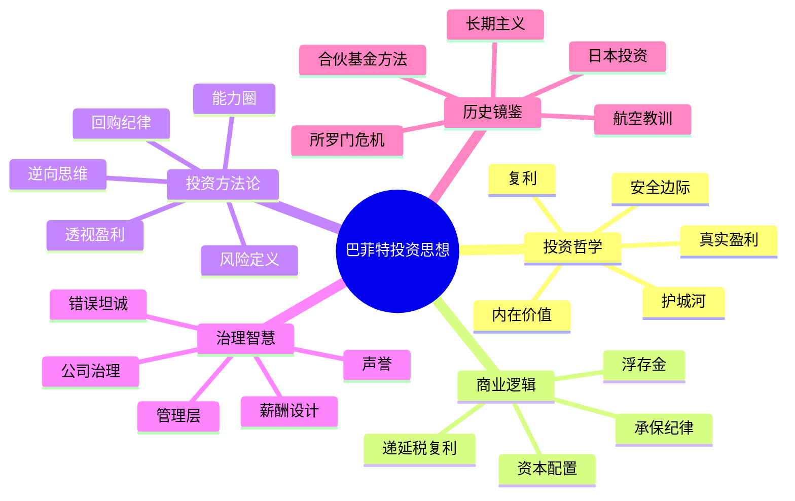

# 主题索引

按主题分类阅读巴菲特致股东信的核心思想，提炼70年投资智慧的精华。

> 本索引基于1956-2025年全部70年股东信**全文翻译**重新归纳。区别于传统索引，本版本覆盖了合伙基金时期（1956-1969）的投资方法论，并新增了在全文翻译中挖掘出的重要主题：递延税复利、透视盈利、通胀绦虫、所罗门危机等。

---

## 投资哲学（5个核心）

投资哲学是巴菲特思想体系的根基，五个概念构成了价值投资的完整框架。

| 主题 | 核心要义 | 首次出现 | 必读年份 |
|:---|:---|:---|:---|
| [内在价值 Intrinsic Value](/02_concepts/intrinsic-value) | 企业真正值多少钱，是唯一评估标准 | 1962 | 1994, 2007, 2010, 2019 |
| [护城河 Moat](/02_concepts/moat) | 竞争优势的宽度与持久度 | 1991 | 1993, 1999, 2007, 2014 |
| [安全边际 Margin of Safety](/02_concepts/safety-margin) | 用折扣价格买好资产 | 1962 | 1993, 1996, 2007, 2008 |
| [复利 Compounding](/02_concepts/compounding) | 时间是伟大事业的朋友 | 1963 | 1965, 1993, 2013, 2023, 2024 |
| [真实盈利 vs GAAP盈利](/02_concepts/accounting-earnings) | 为什么会计盈利不等于真实盈利 | 1980 | 1980, 1983, 2002, 2014, 2019 |

## 商业逻辑（4个核心）

理解保险浮存金的秘密、承保纪律的意义、资本配置的艺术、递延税复利的优势，才能真正看懂伯克希尔在做什么。

| 主题 | 核心要义 | 首次出现 | 必读年份 |
|:---|:---|:---|:---|
| [保险浮存金 Insurance Float](/02_concepts/insurance-float) | 伯克希尔的秘密引擎，先收后付模式 | 1967 | 1967, 2005, 2006, 2017 |
| [承保纪律 Underwriting Discipline](/02_concepts/underwriting-discipline) | 不做价格战，守住底线 | 1974 | 2001, 2004, 2017 |
| [资本配置 Capital Allocation](/02_concepts/capital-allocation) | 把每一分钱用在刀刃上，CEO的核心职责 | 1986 | 1986, 2012, 2016, 2020 |
| [递延税复利 Deferred Tax Compounding](/02_concepts/deferred-tax) | 未实现利得递延纳税，复利的隐形翅膀 | 1989 | 1989, 2000, 2019 |

## 投资方法论（5个核心）

知道自己懂什么、保持独立思考、理解真正的风险、掌握透视盈利、用好回购工具——这些是巴菲特区别于普通投资者的核心能力。

| 主题 | 核心要义 | 首次出现 | 必读年份 |
|:---|:---|:---|:---|
| [能力圈 Circle of Competence](/02_concepts/circle-of-competence) | 知道边界比知道多少更重要 | 1962 | 1996, 1999, 2017, 2020 |
| [逆向思维 Contrarian](/02_concepts/contrarian) | 别人恐惧时贪婪，别人贪婪时恐惧 | 1964 | 1987, 2008, 2009, 2020 |
| [风险 Risk](/02_concepts/risk) | 永久损失才是风险，而非波动 | 1979 | 1993, 2003, 2007, 2008 |
| [透视盈利 Look-Through Earnings](/02_concepts/look-through-earnings) | 留存收益比股息再投资更合算 | 1980 | 1980, 1990, 2004 |
| [股票回购 Share Buybacks](/02_concepts/share-buybacks) | 只在股价低于内在价值时回购 | 1984 | 1984, 1999, 2011, 2016, 2021 |

## 治理智慧（4个核心）

伯克希尔的成功背后是一套独特的治理哲学。选择德才兼备的管理者、设计合理的激励制度、坦诚认错、珍惜声誉——治理是巴菲特投资体系中最被忽视但最关键的环节。

| 主题 | 核心要义 | 首次出现 | 必读年份 |
|:---|:---|:---|:---|
| [管理层选择 Management](/02_concepts/management) | 找到对的船长，给他们充分空间 | 1971 | 1983, 1995, 2005, 2008, 2015 |
| [高管薪酬 Executive Compensation](/02_concepts/executive-compensation) | 设计合理的激励，避免股东财富流失 | 1977 | 1981, 1991, 2001, 2024 |
| [错误坦诚 Mistakes](/02_concepts/mistakes) | 公开认错是智慧，不是软弱 | 1991 | 1991, 1994, 1997, 2008 |
| [声誉 Reputation](/02_concepts/reputation) | 建立需20年，毁掉只需5分钟 | 1991 | 1991, 2014, 2020 |
| [公司治理 Corporate Governance](/02_concepts/corporate-governance) | 董事会结构与股东权益保护 | 1985 | 1985, 2002, 2014 |

## 历史镜鉴（4个核心）

巴菲特犯过很多错误，也见证过无数历史。这些教训与案例，是理解巴菲特投资思想最生动的教材。

| 主题 | 核心要义 | 首次出现 | 必读年份 |
|:---|:---|:---|:---|
| [航空公司教训 Airline Mistakes](/02_concepts/airline-lessons) | 最糟糕的生意模式，反面教材 | 1989 | 1989, 1991, 1994, 2007 |
| [所罗门兄弟危机 Salomon Crisis](/02_concepts/salomon-crisis) | 正直与勇气，1991年临危受命 | 1991 | 1991, 1992 |
| [日本五大投资 Japan Holdings](/02_concepts/japan-investments) | 2019-2024年最大非美投资 | 2019 | 2020, 2021, 2023, 2024 |
| [长期主义 Long-term](/02_concepts/long-term) | 不想持十年就别持十分钟 | 1966 | 1996, 2001, 2013, 2020, 2022 |

## 合伙基金时期（1956-1969）特别专题

巴菲特的**合伙基金时期**（1956-1969）是其投资方法论形成的关键阶段，14年的许多原则贯穿了他随后的整个投资生涯。

| 主题 | 核心要义 | 必读年份 |
|:---|:---|:---|
| [三大投资类别体系 Partnership Method](/02_concepts/partnership-method) | 低估普通股/套利/控股/相对低估的完整体系 | 1962, 1964, 1969 |
| [多元化与集中 Diversification](/02_concepts/diversification) | 分散是对无知的保护，合伙基金仅6-7个持仓 | 1962 | 1993, 1996, 2007, 2012 |

---

## 25个主题一览

| # | 主题 | 英文名 | 分类 | 核心年份 |
|:---|:---|:---|:---|:---|
| 1 | 内在价值 | Intrinsic Value | 投资哲学 | 1994, 2007, 2019 |
| 2 | 护城河 | Moat | 投资哲学 | 1993, 1999, 2007 |
| 3 | 安全边际 | Safety Margin | 投资哲学 | 1993, 1996, 2007 |
| 4 | 复利 | Compounding | 投资哲学 | 1965, 1993, 2023 |
| 5 | 真实盈利 | GAAP vs Real | 投资哲学 | 1980, 2002, 2019 |
| 6 | 保险浮存金 | Insurance Float | 商业逻辑 | 1967, 2005, 2017 |
| 7 | 承保纪律 | Underwriting | 商业逻辑 | 2001, 2004, 2017 |
| 8 | 资本配置 | Capital Allocation | 商业逻辑 | 1986, 2012, 2020 |
| 9 | 递延税复利 | Deferred Tax | 商业逻辑 | 1989, 2000, 2019 |
| 10 | 能力圈 | Circle of Competence | 投资方法论 | 1996, 1999, 2017 |
| 11 | 逆向思维 | Contrarian | 投资方法论 | 1987, 2008, 2020 |
| 12 | 风险 | Risk | 投资方法论 | 1993, 2007, 2008 |
| 13 | 透视盈利 | Look-Through | 投资方法论 | 1980, 1990, 2004 |
| 14 | 股票回购 | Share Buybacks | 投资方法论 | 1999, 2016, 2021 |
| 15 | 管理层选择 | Management | 治理智慧 | 1983, 2005, 2015 |
| 16 | 高管薪酬 | Exec Compensation | 治理智慧 | 1981, 1991, 2024 |
| 17 | 错误坦诚 | Mistakes | 治理智慧 | 1991, 1994, 2008 |
| 18 | 声誉 | Reputation | 治理智慧 | 1991, 2014, 2020 |
| 19 | 公司治理 | Corporate Gov | 治理智慧 | 1985, 2002, 2014 |
| 20 | 航空公司教训 | Airline Mistakes | 历史镜鉴 | 1989, 1991, 2007 |
| 21 | 所罗门危机 | Salomon Crisis | 历史镜鉴 | 1991, 1992 |
| 22 | 日本投资 | Japan Holdings | 历史镜鉴 | 2020, 2021, 2024 |
| 23 | 长期主义 | Long-term | 历史镜鉴 | 1996, 2013, 2020 |
| 24 | 合伙基金方法 | Partnership Method | 合伙基金 | 1962, 1964, 1969 |
| 25 | 多元化与集中 | Diversification | 合伙基金 | 1993, 1996, 2012 |

---

## 主题关联图

```mermaid
mindmap
  root((巴菲特投资思想))
    投资哲学
      内在价值
      护城河
      安全边际
      复利
      真实盈利
    商业逻辑
      浮存金
      承保纪律
      资本配置
      递延税复利
    投资方法论
      能力圈
      逆向思维
      透视盈利
      回购纪律
      风险定义
    治理智慧
      管理层
      薪酬设计
      错误坦诚
      声誉
      公司治理
    历史镜鉴
      航空教训
      所罗门危机
      日本投资
      长期主义
      合伙基金方法
```

---

## 70年主题词频分析（全文翻译统计）

| 主题 | 最高峰年份 | 核心讨论期 | 全程频率 |
|:---|:---|:---|:---|
| 管理层 CEO | 2014年 | 全程高频 | ★★★★★ |
| 内在价值 | 2007年 | 1990s至今 | ★★★★★ |
| 护城河/竞争优势 | 1993年 | 1991至今 | ★★★★★ |
| 保险浮存金 | 2011年 | 1967至今 | ★★★★★ |
| 收购 | 2014年 | 1980s至今 | ★★★★☆ |
| 回购 | 2018年 | 2010s爆发 | ★★★★☆ |
| 董事会治理 | 2002年 | 2000s爆发 | ★★★★☆ |
| 多元化/集中 | 2007年 | 全程 | ★★★☆☆ |
| 航空公司 | 1994年 | 1989-2007集中 | ★★★☆☆ |
| 日本投资 | 2023年 | 2019-2024 | ★★★☆☆ |

---

> 💡 **学习建议**
>
> 1. **从合伙基金开始**（1956-1969）：理解巴菲特方法的原始逻辑，三大投资类别体系是理解其后期方法的基础
> 2. **按顺序阅读**：建议从"投资哲学"五个主题开始，建立完整的价值投资框架
> 3. **结合原文**：每个主题都标注了重点年份，建议结合对应年份的股东信全文翻译阅读
> 4. **关注治理**：巴菲特晚年越来越强调治理议题，这在2020s变得更加重要
> 5. **从错误中学习**："错误坦诚"专题是理解巴菲特投资逻辑最生动的入口