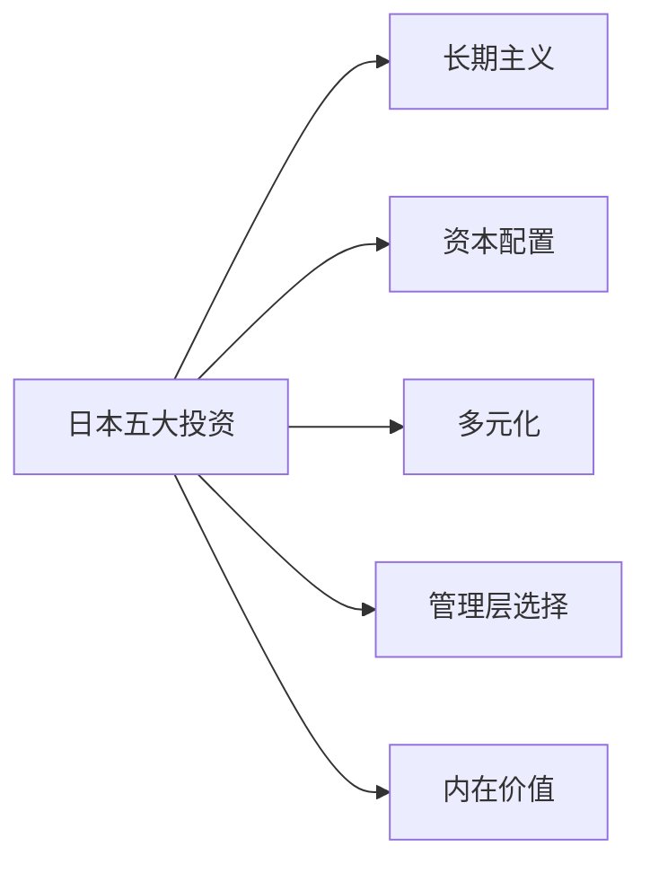

# 日本五大综合企业投资

> "我们简单地看了看他们的财务记录，对其股票的低价感到惊讶。随着岁月流逝，我们对这些公司的钦佩持续增长。" —— [[沃伦·巴菲特]]，2024年

2019年7月，巴菲特开始买入日本五大综合贸易公司股票。2020-2024年间，他持续加仓，累计成本1.6万亿日元，市值最高达2.9万亿日元。这是伯克希尔有史以来最大规模的非美国投资，也是巴菲特晚年最重要的战略决策之一。

---

## 核心出处

| 年份 | 重点内容 |
|:---|:---|
| **[[/01_letters/2020年/核心总结]]** | 首次披露五大日本公司持仓 |
| **[[/01_letters/2021年/核心总结]]** | 格雷格·阿贝尔访日后增持 |
| **[[/01_letters/2023年/核心总结]]** | 全面增持，五家公司均达约9% |
| **[[/01_letters/2024年/核心总结]]** | 接近9.9%上限，年股息8.12亿美元 |

---

## 一、为什么是日本五大综合企业

巴菲特在2023年信中详细解释了投资逻辑：

> "[[伯克希尔哈撒韦]]继续持有五家非常大的日本公司的被动长期权益，每家公司都以类似于[[伯克希尔哈撒韦]]自身运营的高度多元化方式运营。"

> "五家按字母顺序是：[[伊藤忠]]、丸红、三菱、三井和[[住友]]。每家大型企业又拥有各种业务的权益，许多基于日本，但也有在世界各地运营的业务。"

> "[[伯克希尔哈撒韦]]在2019年7月首次购买了这五家公司的股票。我们简单地看了看他们的财务记录，对其股票的低价感到惊讶。随着岁月流逝，我们对这些公司的钦佩持续增长。"

2024年，巴菲特再次解释：

> "这五家公司都在适当时候增加股息，在有意义时回购股票，而且他们的高管薪酬方案远不如美国同行那么激进。"

---

## 二、五大公司的共同特点

2023年信中，巴菲特对比了日本五大与美国公司的差异：

> "在某些重要方面，所有五家公司——[[伊藤忠]]、丸红、三菱、三井和[[住友]]——都遵循比美国通常实践更为股东友好的政策。"

> "自从我们开始购买日本股票以来，五家公司都以有吸引力的价格减少了流通股数量。"

> "同时，所有五家公司管理层的自身薪酬激励远不如美国典型那样激进。"

> "还要注意，五家公司都只将约三分之一收益作为股息分配——远低于美国公司的平均比例。这意味着，与典型的美国公司相比，这五家公司保留的收益更多，可用于再投资。"

---

## 三、持仓规模与回报

| 年份 | 总成本 | 持股比例 | 备注 |
|:---|:---|:---|:---|
| 2019年7月 | 约6,000亿日元 | 约5% | 首次建仓 |
| 2021年 | 约1.3万亿日元 | 各约8.8% | 格雷格访日后增持 |
| 2023年 | — | 各约9% | 全面增持 |
| 2024年 | 1.6万亿日元 | 各约9% | 接近9.9%上限 |

> "我们为五家公司的总成本为1.6万亿日元，年底市值为2.9万亿日元。然而，日元近年来走弱，我们以美元计算的年底未实现收益为61%或80亿美元。" —— 2023年

---

## 四、融资策略：日元债券

巴菲特用日元债券为日本投资融资，这是他投资框架的独特体现：

> "格雷格和我都不相信我们能够预测主要货币的市场价格。我们也不相信我们能雇用具有这种能力的人。因此，[[伯克希尔哈撒韦]]用1.3万亿日元的债券收益为大部分日本仓位融资。这笔债务在日本非常受欢迎，我相信[[伯克希尔哈撒韦]]比任何其他美国公司都拥有更多的日元计价债务。"

2024年，巴菲特解释了日元融资的数学：

> "我们使用日元融资，因为我们不想要汇率风险敞口。我们借日元买日元资产，这样汇率波动就不会影响我们。现在每年从五家日本公司收到的股息约8.12亿美元，而日元债券的利息成本约1.35亿美元。净收益6.77亿美元，覆盖了债券成本。"

---

## 五、与伯克希尔的相似性

巴菲特在2024年信中总结了五家公司与伯克希尔的相似之处：

> "这些公司以与[[伯克希尔哈撒韦]]自身运营的高度多元化方式成功运营。他们都具有永久持股的心态——就像我们一样。"

> "我对格雷格及其最终继任者说：他们将在未来几十年持有这个日本头寸，[[伯克希尔哈撒韦]]将在未来找到其他与这五家公司富有成效地合作的方式。"

---

## 主题关联

---

## 相关阅读

- [[多元化]] - 为什么投资要适度分散
- [[长期主义]] - 什么是真正的长期投资
- [[管理层]] - 优秀管理层的特征

---

*本页面整理自[[沃伦·巴菲特]]致股东信原文（2019-2024年），[[慢慢变富的卡尔]]编辑整理*
