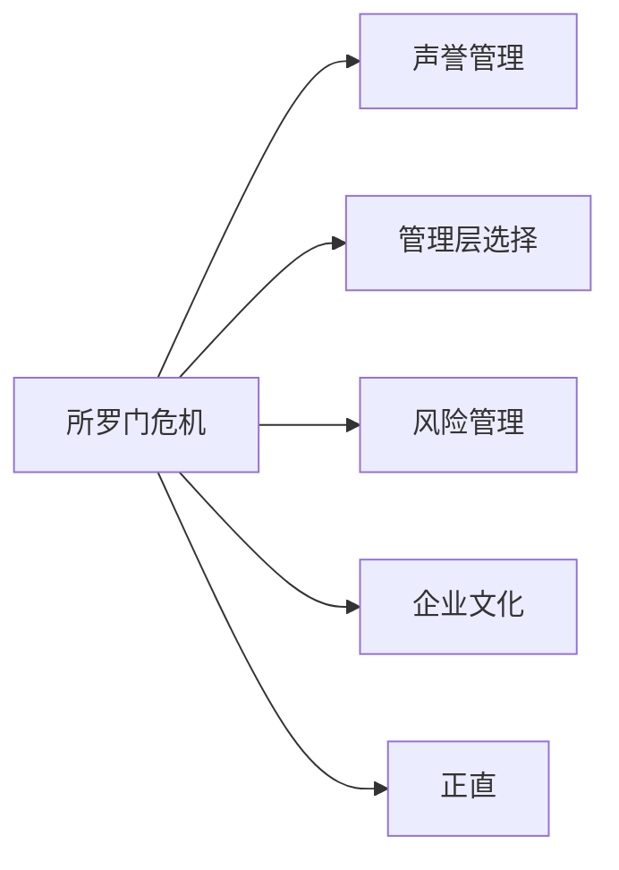

# 所罗门兄弟危机 Salomon Crisis

> 1991年，伯克希尔投资7亿美元的所罗门兄弟濒临崩溃。巴菲特临危受命，担任临时董事长。这是他投资生涯中最不寻常的10个月，也是理解"正直与声誉"价值的最佳案例。

---

## 核心出处

| 年份 | 重点内容 |
|:---|:---|
| **[核心总结](/01_letters/1991年/核心总结)** | 危机全程与处理方式 |
| **[核心总结](/01_letters/1992年/核心总结)** | 危机解除，所罗门重建 |

---

## 一、危机的本质

所罗门兄弟（Salomon Inc.）是美国最大的投资银行之一，1991年陷入了严重的法律和信任危机：

**核心问题**：所罗门兄弟的交易员（莫泽尔）长期操纵美国国债拍卖，违反了联邦法律。这不仅是犯罪行为，更威胁到公司的生存执照。

巴菲特的判断：
> "所罗门的危机不是财务危机，而是正直危机。"

---

## 二、为什么巴菲特选择介入

巴菲特在1991年信中解释了为什么他愿意出面：

> "所罗门有12,000名员工，他们不应该因为少数人的错误而失去生计。更重要的是，所罗门的客户和债券持有人有权期待这家公司继续运营下去。"

他接任临时董事长时，明确了三个条件：
1. 全面披露所有问题，不隐瞒
2. 修复合规体系，确保不再发生
3. 重建正直文化

---

## 三、核心原则："正直、勇气是救公司最重要的东西"

巴菲特在1991年信中写道：

> "正直、勇气是救公司最重要的东西。"

这句话后来成为伯克希尔文化的核心原则。

他进一步解释：
- 正直意味着完全透明，不欺骗任何人（客户、监管机构、股东）
- 勇气意味着面对问题不退缩，不为了短期利益掩盖长期风险
- 两者缺一不可：没有正直的勇气是鲁莽，没有勇气的正直是无能

---

## 四、危机处理的方法论

巴菲特处理所罗门危机的方式，是他管理哲学的集中体现：

**第一步：完全透明**
- 主动向美联储和财政部披露所有问题
- 不试图掩盖或最小化
- "好消息可以等，坏消息必须立刻说"

**第二步：修复问题根源**
- 不是简单地炒掉肇事者，而是重建整个合规体系
- 认识到这是系统性问题，而非个人问题

**第三步：保护无辜者**
- 12,000名员工中绝大多数是无辜的
- 他们的生计和声誉不应被少数人的错误毁掉

---

## 五、1992年的最终结果

1992年，所罗门危机正式解除。巴菲特写道：

> "1992年，我们的所罗门优先股已经被回购。加上我们出售的股份，总共收回了约1.18亿美元，我们的投资成本约为7,000万美元。"

更重要的是，所罗门的声誉得到了恢复：
> "在公司声誉改善程度排名中（311家公司），所罗门排名第二。"

---

## 六、对投资哲学的影响

所罗门危机强化了巴菲特对"声誉"价值的看法：

1. **声誉是商业的命脉**：一次丑闻可以摧毁数十年建立的信任
2. **正直是最好的保险**：预防问题比处理问题更便宜
3. **短期利益永远不值得牺牲长期声誉**：所罗门的交易员为了短期奖金，毁掉了公司和自己
4. **正直+勇气 = 可信赖**：只有正直没有勇气是软弱的，只有勇气没有正直是危险的

---

## 七、十年演进与长期影响

### 1980年代：投资布局
- 1987年，伯克希尔投资7亿美元购买所罗门兄弟可转换优先股
- 年股息9%，期待分享华尔街繁荣

### 1991年：危机爆发
- 国债拍卖操纵案曝光，所罗门面临破产清算风险
- 巴菲特临危受命，担任临时董事长10个月
- 核心原则确立："正直、勇气是救公司最重要的东西"

### 1992年：危机解除
- 所罗门声誉恢复，在311家公司中排名第二
- 伯克希尔收回约1.18亿美元，投资成本约7,000万美元
- 德里克·莫恩、鲍勃·德纳姆等关键人物得到认可

### 1990年代后期至2000年代：文化传承
- 所罗门的教训被写入伯克希尔的企业文化
- "在招聘时，我们看重三种品质：正直、聪明、活力。如果他们没有第一种，后两种会毁了你。"成为经典语录

### 2010年代以后：持续影响
- 2015年致股东信中，巴菲特再次强调：
> "建立声誉需要20年，毁掉它只需要5分钟。"
- 所罗门危机成为商学院和企业培训的经典案例

---

## 八、关键人物

巴菲特在1992年信中特别感谢了以下人员：

- **德里克·莫恩（Deryck Maughan）**：危机期间承担重任
- **鲍勃·德纳姆（Bob Denham）**：法律与合规重建
- **唐·霍华德（Don Howard）**：运营稳定
- **约翰·麦克法兰（John Macfarlane）**：财务安排
- **罗恩·奥尔森（Ron Olson）**：法律顾问

这些人成为巴菲特日后"信任清单"的典范——正直、能力、危机中的稳定性。

---

## 九、教训总结

### 1. 声誉的价值
> "建立声誉需要20年，毁掉它只需要5分钟。"

所罗门兄弟用数十年建立的市场地位，因少数人的不诚实行为差点毁于一旦。

### 2. 正直是不可谈判的
巴菲特在招聘时的经典标准：
> "我们看重三种品质：正直、聪明、活力。如果他们没有第一种，后两种会毁了你。"

### 3. 危机中的透明度
"好消息可以等，坏消息必须立刻说"——这是巴菲特从所罗门危机中总结的核心管理原则。

### 4. 保护无辜者
12,000名员工的生计不应因少数人的错误而毁灭——这是巴菲特的道德担当。

### 5. 长期视角
短期收益（如莫泽尔的交易利润）永远不值得牺牲长期声誉和可持续性。

---

## 主题关联

---

## 相关阅读

- [[声誉]] — 建立需20年，毁掉只需5分钟
- [[管理层选择]] — 正直的管理层是优质企业的标配
- [[风险]] — 声誉风险的代价往往是致命的
- [[企业文化]] — 正直、勇气与长期主义

---

## 关键原文出处

以下为该主题在致股东信中的关键原文出处年份，点击即可阅读完整翻译：

- [[核心总结|1991年：核心总结]] → [[1991年：完整翻译|/01_letters/1991年/翻译]]
- [[核心总结|1992年：核心总结]] → [[1992年：完整翻译|/01_letters/1992年/翻译]]

---

*本页面整理自[[沃伦·巴菲特]]致股东信原文（1987-2025年），慢慢变富的卡尔编辑整理*
