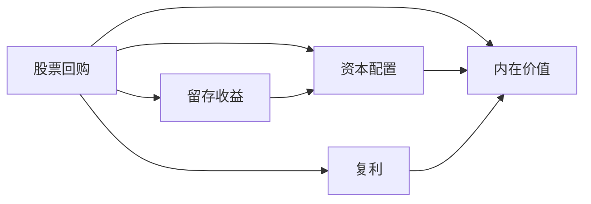

# 股票回购

> "当一家公司以低于内在价值的价格回购股票时，所有股东都会受益。" —— [[沃伦·巴菲特]]

巴菲特对股票回购的态度经历了从"坚决反对"到"高度拥抱"的重大转变。这一转变本身就是理解他投资思想演变的最佳窗口。回购是现代公司资本配置中最有力的工具之一，但很少有人像巴菲特那样深刻理解其含义。

在资本配置的世界里，回购往往被误解。有人视之为"圈钱"的反面，有人将其妖魔化为管理层操纵股价的工具。巴菲特用了几十年的时间，用大量案例和原话，为我们厘清了回购的真正逻辑：**只有在股价低于内在价值时，回购才是对股东有利的行为。** 这一原则看似简单，却让无数公司在错误的时机大量回购，损害了剩余股东的利益。

---

## 核心出处

| 年份 | 重点内容 |
|:---|:---|
| **[[/01_letters/1984年/核心总结]]** | 早期对回购的谨慎态度 |
| **[[/01_letters/1999年/核心总结]]** | 明确回购的前提条件 |
| **[[/01_letters/2000年/核心总结]]** | 回购与留存收益的税收对比 |
| **[[/01_letters/2011年/核心总结]]** | 伯克希尔首次大规模回购 |
| **[[/01_letters/2012年/核心总结]]** | 明确回购的三个条件 |
| **[[/01_letters/2019年/核心总结]]** | 苹果回购与股东利益 |

---

## 一、早期：审慎的回购观

巴菲特并非从一开始就拥抱回购。事实上，在早期很长的时间里，他对回购持高度谨慎态度，原因只有一个：**当股价高于内在价值时回购，等于在用公司资金补贴退出的股东，损害的是留在公司的股东。**

1984年的致股东信中，巴菲特明确表达了他的立场：

> "我们很享受这些比例赎回低税务成本，也做了几笔，但我们认为，**当优秀企业股价远低于内在价值的时候，回购对不卖的股东至少同样有利。** 我们支持回购，但只支持因为价格和价值错配做的回购。"

他还给出了两个重要原因来说明为什么低价回购对留存的股东有利：

> "**明显原因**：基本算术，内在价值每股远低于市价大额回购，立刻就能大幅提升每股价值。公司收购项目几乎从来做不到一块钱投入拿两块钱现值，回购做得到，太多案例，收购一块钱投入一块都拿不到。"

> "**另一个好处不那么好精确衡量，但长期一样重要**：当企业股价远低于内在价值，管理层回购，说明它站在股东这边，不是扩张管理版图，不伤害股东利益。看到这点，股东和潜在股东都会对未来回报预期更高，股价就会更接近内在价值。"

这两段话道出了回购的全部精髓：**低价回购是让利于留存股东的行为，是管理层向市场发出的最强烈的价值信号。** 相反，如果管理层在股价高估时发新股或者用现金回购，都是在损害现有股东的利益。

1999年，巴菲特再次强调了回购的前提条件：

> "只有在股票以显著低于保守估计的内在价值交易时，回购才是合理的。当市场先生变得乐观时回购股票，是一个错误。"

这与格雷厄姆的教诲一脉相承：**市场先生情绪高涨时卖股，情绪低落时买股——无论是管理层还是个人投资者，遵循的都是同一套逻辑。**

---

## 二、转折：2011年的大规模回购

巴菲特对回购态度的转折点出现在2011年。这一年，伯克希尔正式开始了自己的大规模股票回购操作。

2011年9月，伯克希尔宣布将以不超过账面价值110%的价格回购股票。虽然只执行了几天便因价格超出上限而暂停（回购了6700万美元），但这标志着巴菲特正式将回购纳入伯克希尔的资本配置工具箱。

同年致股东信中，巴菲特全面阐述了他的回购哲学：

> "查理和我赞成在两种条件满足时进行回购：**第一，公司有足够的资金来满足其业务的运营和流动性需求；第二，其股票以公司内在商业价值的实质性折扣出售，保守计算。**"

他同时严厉批评了市场上许多不负责任的回购行为：

> "我们目睹了许多未能通过我们第二项测试的回购。当然，有时违规行为——甚至是严重的违规行为——是无辜的；许多CEO从未停止相信他们的股票很便宜。**在这种情况下，持续股东会受到伤害。资本配置的第一定律——无论资金是用于收购还是股票回购——是在一个价格聪明的行为在另一个价格是愚蠢的。**"

巴菲特还特别指出了回购与管理层心理之间的微妙关系：

> "美国CEO们在股价上涨时比股价下跌时更积极地投入公司资金用于回购，这一记录令人尴尬。**我们的做法恰恰相反。**"

这句话的含义极为深刻：大多数CEO在股价高时愿意回购，是因为股价高意味着市场情绪乐观，回购显得"有面子"；而股价低时回购则需要极大的勇气和独立性，因为内部人和外部投资者往往会质疑管理层"为什么要买贵的"。但巴菲特的选择永远是：**在别人贪婪时恐惧，在别人恐惧时贪婪。**

他用了一句精妙的比喻：

> "如果一家公司以显著低于内在价值的价格回购股票，**这就像在桶里射鱼，在桶被排空、鱼停止扑腾之后。**"

这正是2011年伯克希尔的心情：股价低于内在价值，回购就是捡钱。

---

## 三、明确标准：三个条件

2012年，巴菲特进一步明确了回购的标准，将抽象的原则细化为可操作的条件。

> "我们只在以下条件下回购股票：(1)我们有足够的现金，(2)股价显著低于内在价值，(3)我们有更好的用途吗？"

> "当这三个条件都满足时，回购是对股东财富的增值。"

这三个条件看似简单，却道出了资本配置决策的全部核心：

**第一，流动性充裕。** 回购不能以牺牲公司正常运营和应对危机的能力为代价。巴菲特明确表示，当伯克希尔的现金等价物低于200亿美元时，不会进行任何股票回购。充足的流动性是伯克希尔"无可置疑的财务实力"的核心保障。

**第二，股价显著低估。** 这不仅是原则，更是纪律。伯克希尔的回购上限是账面价值的110%，意味着只有在股价低于账面价值时才考虑回购。这种保守的标准确保了回购总是以对留存股东有利的价格进行。

**第三，没有更好的资本用途。** 这是最难的一条。管理层必须诚实地问自己：这些钱投资于业务扩展、收购、偿还债务，是否比回购股票能创造更高的回报？只有在没有更好出路时，回购才是合理的。

巴菲特在2012年还特别强调了一个观点：回购决策不应该基于市场时机或宏观经济预测，而应该基于对个别公司长期价值的判断。这与他的整体投资哲学完全一致：**不要试图预测市场，要专注于企业本身的价值。**

---

## 四、回购 vs 股息

巴菲特一生不爱派股息，原因在于：**股息是强制的税收，回购是自愿的价值创造。**

2000年致股东信中，巴菲特详细阐述了税收因素对回购和股息的影响：

> "将这种情况与我们拥有有价证券投资的情况相比。如果我们拥有税后赚取1000万美元的企业10%的股份，我们100万美元的收益份额需缴纳额外的州和联邦税：(1) 如果分配给我们，约14万美元（我们对大多数股息的税率为14%）；或(2) 如果这100万美元被保留并随后以资本利得的形式被我们获得，不少于35万美元……**当我们通过股票投资拥有企业的一部分时，政府是我们的"合伙人"两次，但当我们拥有至少80%时，只是一次。**"

这段话的深意在于：当公司选择回购而非派息时，股东可以在自己认为合适的时机卖出股票，从而在税务上拥有更大的灵活性。而股息一旦发出，政府就立即"介入"，无论股东是否愿意。

巴菲特对回购与股息的核心观点可以归纳为：

> "**股息是确定的——你必须接受。但回购是可选的——公司只在股价有吸引力时才回购。**"

> "**我们宁愿用现金回购股票，也不愿支付股息。因为股息是强制的——政府会从中抽税——而回购是自愿的，只有当它们增加股东价值时才进行。**"

这两个观点构成了理解巴菲特资本配置哲学的关键：**最优的资本配置不是简单地将利润还给股东，而是在最有利的价格将资本配置到最有价值的地方。** 当股价低于内在价值时，回购是最优选择；当股价高于内在价值时，收购或保留现金是更理性的选择。

---

## 五、伯克希尔的回购历史

伯克希尔的回购历史可分为三个阶段：

| 阶段 | 时间 | 回购规模 | 背景 |
|:---|:---|:---|:---|
| 空白期 | 1965-2010 | 无 | 现金用于收购扩张 |
| 试探期 | 2011-2018 | 约50亿美元 | 股价长期低于账面价值 |
| 大规模期 | 2019-2022 | 超过600亿美元 | 估值合理偏低，持续回购 |

2019年，巴菲特终于开始在回购上"放开手脚"：

> "2019年，伯克希尔价格/价值方程有时适度有利，我们花费了50亿美元回购了约1%的公司股份。"

2020年和2021年，巴菲特在回购上的投入进一步加大。2020年：

> "去年，我们通过回购相当于80,998股'A'股的方式展示了伯克希尔对各类资产的热情，花费247亿美元。此举使你们在伯克希尔所有企业中的所有权增加了5.2%，而无需你们掏一分钱。"

2021年更是创纪录：

> "过去两年中，我们以517亿美元的总成本回购了2019年末流通股的9%。这笔支出使我们的持续持股股东拥有的伯克希尔全部业务权益增加约10%。"

伯克希尔的回购之所以规模巨大还持续有益，关键在于**巴菲特严格遵循了"只在股价低于内在价值时回购"的原则**。他在2022年致股东信中再次强调：

> "我需要强调的是，伯克希尔的回购必须有合理的价值支撑才有意义。**我们不想为其他公司的股票支付过高的价格，如果我们回购伯克希尔股票时支付过高的价格，那将是对价值的破坏。**"

---

## 六、苹果回购：股东利益最大化的经典案例

苹果公司的回购是巴菲特最常引用的回购成功案例，也是他理解回购力量的启蒙。

2019年致股东信中，巴菲特详细拆解了苹果回购如何为伯克希尔创造价值：

> "伯克希尔对苹果公司的投资清楚地说明了回购的力量。我们于2016年末开始购买苹果公司股票，到2018年7月初，已持有略多于10亿股苹果公司股票。当我们在2018年中期完成购买时，伯克希尔一般账户持有苹果公司5.2%的股权。"

> "尽管进行了上述出售——瞧！——伯克希尔现在持有苹果公司5.4%的股权。**这一增加对我们毫无成本，原因是苹果公司持续回购其股票，从而大幅减少了其在外流通股数。**"

> "因为在这两年半期间我们也回购了伯克希尔股票，**你们现在间接拥有的苹果公司资产和未来收益比2018年7月时多出了10%。**"

这段描述揭示了回购最精妙的地方：**当苹果回购股票时，伯克希尔无需花费一分钱，持股比例就自动提升。** 而当伯克希尔自己回购时，留存股东的所有者权益也同样增加。这是真正的"一鱼两吃"。

巴菲特对苹果回购的态度还延伸到了对管理层诚信的判断：

> "苹果公司持续回购其股票，这表明公司管理层对股东利益的高度重视。**当一家公司以低于内在价值的价格回购股票时，所有股东都会受益。剩余股东的所有权比例增加，同时每股内在价值也在增加。**"

这段话将回购的逻辑完整性推向了极致：**回购不是零和游戏，而是所有股东都受益的正和游戏。** 卖出的股东拿到了高于市场价的现金，留存的股东享受了每股内在价值的提升，管理层展现了股东导向的价值观——这是一个多方共赢的资本配置行为。

---

## 主题关联

---

## 相关阅读

- [[资本配置]] - 回购是资本配置的重要工具
- [[内在价值]] - 回购的前提是低估
- [[GAAP vs 真实盈利]] - 回购对真实盈利的影响
- [[复利]] - 回购如何通过减少流通股数加速复利效应

---

*本页面整理自[[沃伦·巴菲特]]致股东信原文（1957-2024年），[[慢慢变富的卡尔]]编辑整理*
