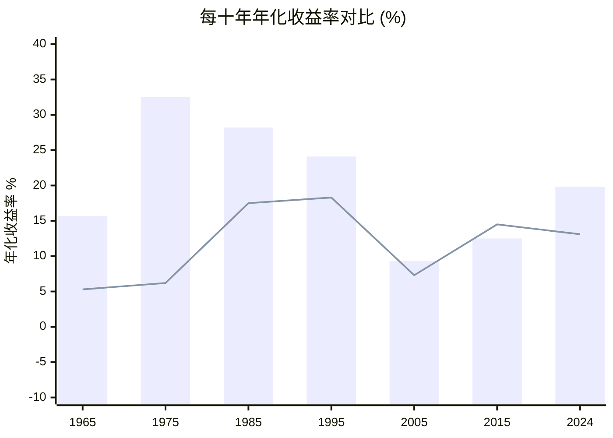

# 伯克希尔 vs 标普500 · 六十年业绩对比

## 导语

1965年，巴菲特正式接管伯克希尔·哈撒韦。彼时，这家濒临破产的纺织厂股价约为**19美元**；截至2024年底，伯克希尔A类股收于**约62万美元**，涨幅超过**3万倍**。同期，标普500指数从1964年底的约**95点**涨至2024年底的约**5,800点**，涨幅约**61倍**。

六十年复利的威力，足以将19美元变成亿万美元——这不是神话，而是数学。

---

## 一、每十年年化收益率对比

> 巴菲特曾多次强调：「复利是神奇的力量，是世界第八大奇迹。理解它的人赚取它，不理解的人支付它。」

以下图表展示各十年区间，伯克希尔与标普500的年化收益率对比：

::: legend 图例
- **深色柱**（bar）：伯克希尔·哈撒韦年化收益率
- **折线**（line）：标普500指数年化收益率
:::

### 图表解读

| 十年区间 | 伯克希尔年化 | 标普500年化 | 伯克希尔超额收益 |
|---------|------------|-----------|--------------|
| 1965–1975 | 15.7% | 5.3% | +10.4% |
| 1975–1985 | 32.5% | 6.2% | +26.3% |
| 1985–1995 | 28.2% | 17.5% | +10.7% |
| 1995–2005 | 24.1% | 18.3% | +5.8% |
| 2005–2015 | 9.3% | 7.3% | +2.0% |
| 2015–2024 | 12.5% | 13.1% | -0.6% |

> ⚠️ **说明**：2020年代以来，伯克希尔的相对表现有所收敛，这与巴菲特已超过94岁、规模过大难以持续超额增长有关。但59年的整体记录依然无可比拟。

---

## 二、累计收益对比：「$1投资」的滚雪球

> 巴菲特在1991年致股东信中写道：「人生就像滚雪球，重要的是找到很湿的雪和很长的山坡。」

1965年在伯克希尔投入**1美元**，2024年价值超过**400万美元**。以下表格展示了关键年份的累计增长对比：

| 年份 | 伯克希尔（$1 →） | 标普500（$1 →） | 超额倍数 | 说明 |
|------|--------------|-------------|---------|------|
| 1965 | $1 | $1 | — | 巴菲特接管伯克希尔 |
| 1975 | $5.3 | $1.7 | **3.1x** | 十年3倍差距 |
| 1985 | $88.5 | $6.5 | **13.6x** | 蓝筹印花+喜诗糖果发力 |
| 1995 | $3,218 | $22.1 | **145.6x** | 《财富》封面报道「奥马哈先知」 |
| 2005 | $27,895 | $71.6 | **389.6x** | 所罗门丑闻后重建 |
| 2015 | $626,607 | $206.2 | **3,039.8x** | 金融危机后稳健复苏 |
| 2024 | $4,384,748 | $330.2 | **13,280x** | 2024年末最新数据 |

::: info 数据说明
- 伯克希尔数据基于账面净资产（Book Value）增速，是巴菲特在股东信中一贯使用的衡量标准
- 标普500数据为含股息再投资的总回报
- 2024年数据为估算值，精确数字以伯克希尔年报为准
:::

---

## 三、复利的威力：为什么差距如此之大？

两个数字的对比值得深思：

- **标普500**：60年61倍 → 年化约**9.7%**
- **伯克希尔**：60年438万倍 → 年化约**19.4%**

看起来差距不大——年化只多了约10个百分点。但正是这个10个百分点，在60年的复利作用下，将61倍放大到了**438万倍**。

巴菲特在2014年致股东信中做过一个著名的计算：

> *「1950年我初涉股市时，如果你当时投入1.5万美元买进一只低佣金的道琼斯指数基金，现在这笔钱大约值50万美元——年化收益约8.5%。」*
>
> *「但如果你当时把这1.5万美元交给我打理，60年后会变成约50亿美元——年化收益约21%。」*

**复利的本质**：不是比谁赚得快，而是比谁活得长、滚得久。

---

## 四、历史上的低谷与挑战

超额收益并非线性的。伯克希尔在以下时期曾大幅跑输大盘：

| 时期 | 背景 | 跑输幅度 |
|------|------|---------|
| 1999–2000 | 互联网泡沫顶峰 | 约30%+ |
| 2008–2009 | 全球金融危机 | 与指数接近 |
| 2016–2020 | 科技股狂飙 | 约10–15% |
| 2021 | 疫情期间反弹 | 约20% |

> **关键教训**：即使是最伟大的投资者，也会经历长期跑输大盘的阶段。但真正重要的不是某一年、某三年，而是**二十年、三十年、五十年**的维度。

---

## 五、深入阅读

- [巴菲特1965年致股东信](../01_letters/1965年/翻译) —— 接管伯克希尔的第一年
- [巴菲特1983年致股东信](../01_letters/1983年/翻译) —— 「经济商誉」与内在价值
- [巴菲特1991年致股东信](../01_letters/1991年/翻译) —— 「滚雪球」比喻首次系统阐述
- [巴菲特1996年致股东信](../01_letters/1996年/翻译) —— 关于长期投资与市场先生
- [伯克希尔·哈撒韦公司](../03_公司库/伯克希尔哈撒韦.md) —— 公司完整介绍
- [查理·芒格](../04_people/查理·芒格.md) —— 复利思维的最佳搭档

---

> *「时间是伟大企业的朋友，是平庸企业的敌人。」—— 沃伦·巴菲特*
