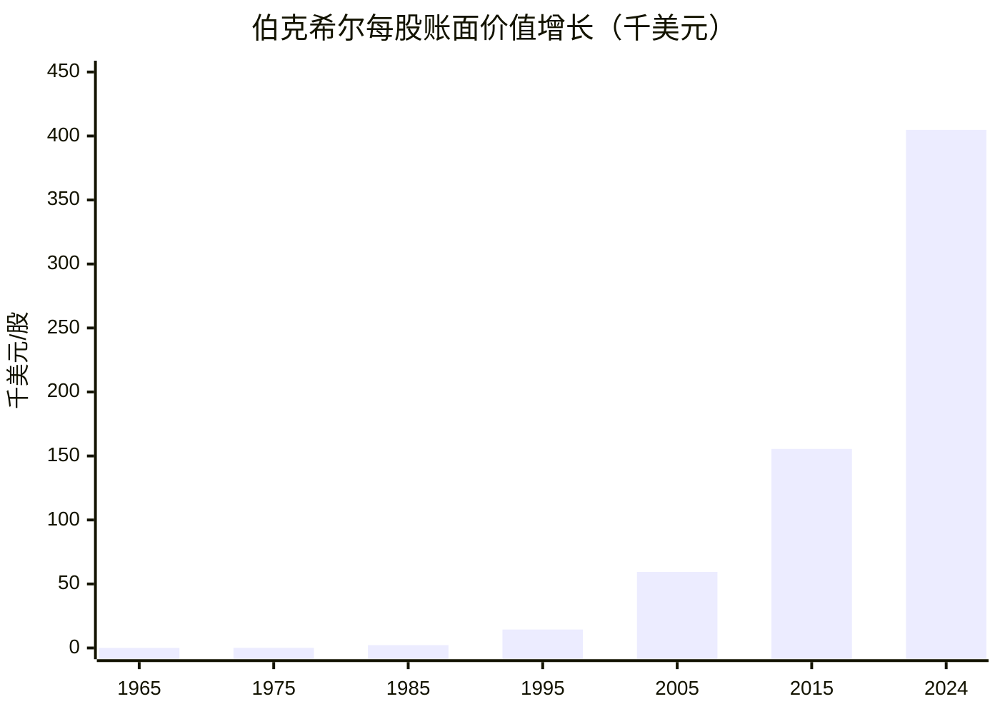

# 伯克希尔账面价值 · 从1900万到万亿帝国

1965年巴菲特接管伯克希尔时，每股账面价值约19美元。六十载光阴，这家原本濒临破产的纺织厂，成长为由保险帝国与投资组合双轮驱动的万亿巨擘。截至2024年，伯克希尔A股（B shares）每股账面价值已突破**404,800美元**——约是接手时的21,300倍。

::: tip 数据说明
除特别注明外，本页数据均来源于伯克希尔·哈撒韦年报及公开市场资料，部分历史数据为合理估算。
:::

## 账面价值增长图

以下图表展示伯克希尔每股账面价值（换算为千美元）在关键年份的变迁，清晰呈现指数级增长轨迹：

> **注意：** 2024年数据（404.8千美元/股，即 $404,800/股）为估算值，实际数值以伯克希尔年报官方披露为准。

## 关键里程碑

| 时间 | 事件 | 账面价值/股 |
|:----:|------|-----------:|
| 1965 | 巴菲特接管伯克希尔 | $19 |
| 1969 | 解散巴菲特合伙基金 | $43 |
| 1979 | 突破 $500 | $511 |
| 1988 | 突破 $3,000 | $2,974 |
| 1998 | 突破 $40,000 | $42,272 |
| 2007 | 突破 $100,000 | $109,415 |
| 2016 | 突破 $170,000 | $172,108 |
| 2024 | 突破 $400,000 | $404,800 |

## 增长密码

1965年至2024年，伯克希尔账面价值的**年均复合增长率（CAGR）约为 19.8%**，同期标普500指数（含分红）的年化回报约为 **10.4%**。这意味着：

- 伯克希尔的增速几乎是市场的两倍
- 约每4年账面价值翻一番
- 如果1965年投资 $19,000（当时伯克希尔的整体估值约1,900万美元），持有至2024年，其价值将超过4亿美元

巴菲特将这一超额回报归因于三点：**（1）美国经济的顺风效应；（2）以合理价格买入优质企业的能力；（3）管理层保留盈利、持续复利再投资的机制。**

## 关于账面价值的局限

巴菲特本人多次强调，账面价值并非衡量伯克希尔内在价值的完美指标。他在2018年致股东信中明确指出：

> *"账面价值是股票的 proxy（近似指标），而非内在价值的精确衡量……内在价值取决于公司在剩余存续期内能够产生的现金流。"*

自2018年起，伯克希尔年报开始同时披露**营业利润（Operating Earnings）** 作为更准确的分析指标，不再将账面价值增速作为管理层薪酬的唯一考核基准。账面价值的局限性主要体现在：

1. **账面价值受会计规则影响**：历史成本记账的部分资产（如持有的股票组合）可能大幅偏离当前市场价值
2. **无法反映品牌价值与组织资本**：伯克希尔的保险浮存金优势、企业文化与优秀子公司的价值难以量化
3. **股权结构差异**：B股的存在使每股数据需做调整，历史数据的一致性受影响

尽管如此，在缺乏更权威的统一估值框架前，账面价值仍是观察伯克希尔半个世纪成长轨迹最具参考性的单一指标。

## 深入阅读

- [巴菲特致股东信（1965-2024）](https://www.berkshirehathaway.com/letters/letters.html) — 伯克希尔官方完整收录
- [伯克希尔市值变化：从纺织厂到万亿帝国](./market-cap-growth.md) — 市值维度的增长轨迹
- [与标普500业绩对比](./sp500-performance.md) — 复利奇迹的另一种验证

---

*本页面数据基于公开资料整理，部分历史年份数据为合理估算。如有疏漏，欢迎指正。*
