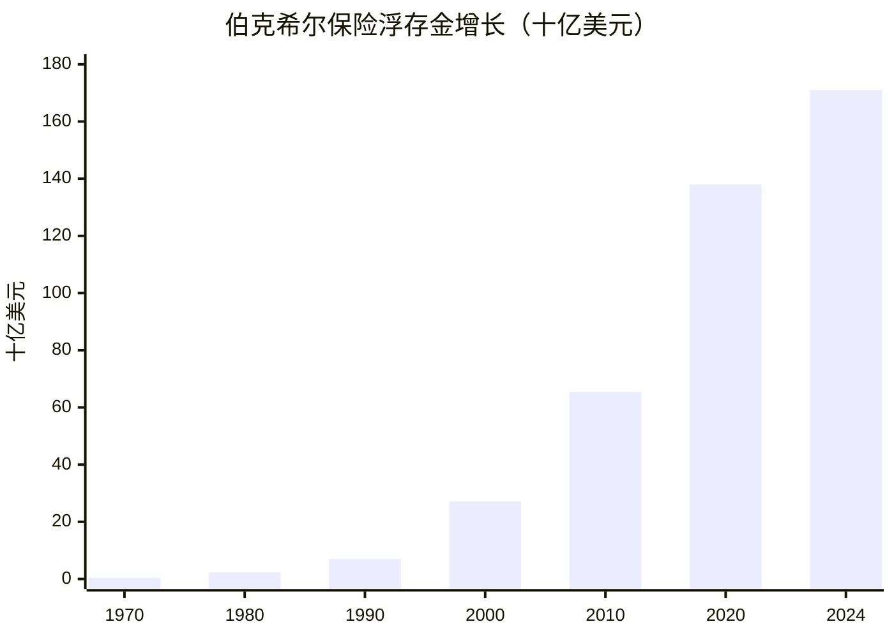

# 保险浮存金 · 伯克希尔的资金基石

保险浮存金是伯克希尔商业模式的核心——预收保费与赔付之间的时间差，形成了可用于投资的长期资金池。

## 浮存金增长趋势

## 浮存金来源

| 保险子公司 | 浮存金估算 | 收购年份 |
|-----------|-----------|---------|
| GEICO | ~380亿 | 1996 |
| General Re | ~220亿 | 1998 |
| BHR | ~150亿 | 自建 |
| 其他 | ~90亿 | 多次收购 |

## 浮存金成本趋势

| 年代 | 平均成本 |
|------|---------|
| 1970s | 负值（承保盈利） |
| 1980s | 0-2% |
| 1990s | ~0% |
| 2000s | 1-2% |
| 2010s | ~0% |
| 2020s | 0-1% |

## 巴菲特论浮存金

巴菲特对保险浮存金的本质有着深刻的洞察。他曾这样描述：

> "如果保费超过费用和损失的总和，保险业务就能以盈利方式产生浮存金。这种盈利的保险业务带来的浮存金，对于股东而言，比免费的资金还要好——它是付费让你使用它。"

> "我们保险业务的价值，在于它能够持续产生大量低成本甚至负成本的浮存金。这让我们能够以极低的资金成本进行大规模投资，这是伯克希尔长期成功的基石。"

浮存金的神奇之处在于：保险公司先收取保费，但赔付可能发生在多年之后。在这段时间里，这些资金可以用于投资。如果承保盈利（保费收入超过赔付和费用），那么这笔"借款"甚至是负成本的——保险公司实际上是付费让别人把钱借给自己使用。

## 深入阅读

- [[保险浮存金]] - 详细了解保险浮存金的运作机制与投资价值
