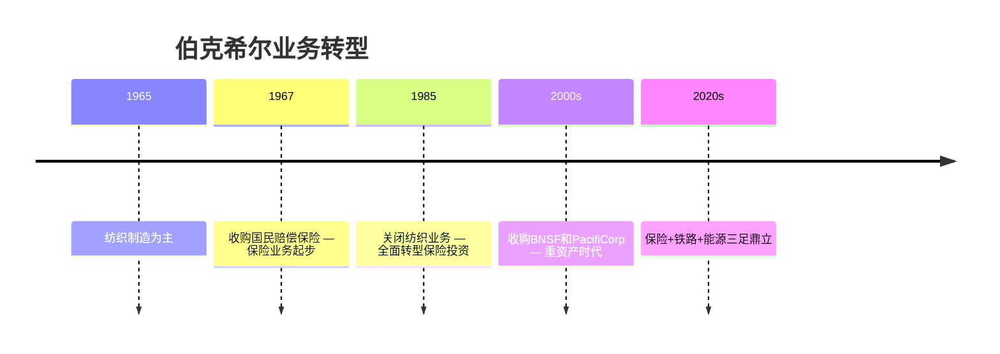

# 收入结构 · 从纺织厂到多元化帝国

> 伯克希尔的收入结构经历了彻底转型——从单一的纺织制造，到今天覆盖保险、铁路、能源、零售、制造的多元化帝国。

## 2024年收入结构

::: diagram 2024年伯克希尔收入结构
```mermaid
xychart-beta
    title "2024年伯克希尔收入结构（十亿美元）"
    x-axis [保险, 铁路BNSF, 能源BHE, 制造服务, 零售, 其他]
    y-axis "十亿美元" 0 --> 80
    bar [85, 23, 25, 38, 22, 15]
```
:::

## 业务转型历程

::: diagram 伯克希尔业务转型时间线

:::

## 利润来源演变

| 年份 | 最大利润来源 | 第二来源 |
|------|------------|---------|
| 1965 | 纺织制造 | — |
| 1975 | 保险承保 | 纺织制造 |
| 1985 | 保险+投资 | — |
| 1995 | 保险投资收益 | 制造/零售 |
| 2005 | 保险投资收益 | 公用事业 |
| 2015 | 铁路+能源 | 保险投资 |
| 2024 | 投资收益 | 保险+铁路 |

## 关键数据

- **2024年总营收**：约 **3,700亿美元**
- **员工规模**：约 **40万人**
- **核心特征**：保险浮存金驱动投资，形成独特的"保险+股权投资"双轮盈利模式

## 深入阅读

- [伯克希尔哈撒韦官方网站](https://www.berkshirehathaway.com)
- [历年致股东信](/06_visualization/shareholder-letters)
- [投资组合概览](/06_visualization/investment-portfolio)
