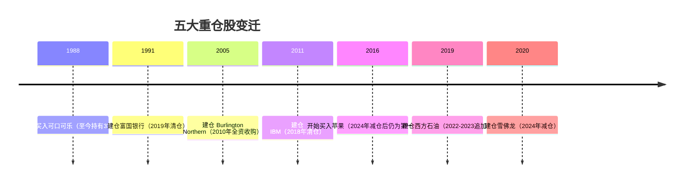

# 主要持仓 · 五大重仓股的变迁

> 巴菲特的投资组合集中度策略——"把鸡蛋放在少数几个你非常了解的篮子里"。

<!-- more -->

## 当前五大持仓（2024年末市值占比）

::: tip 数据来源
以下数据基于伯克希尔·哈撒韦 2024 年 Q4 13-F 报告，比例为估算值，仅供参考。
:::

```mermaid
xychart-beta
    title "2024年末五大持仓占比 (%)"
    x-axis [苹果, 美国运通, 可口可乐, 雪佛龙, 美国银行]
    y-axis "占比 %" 0 --> 50
    bar [28.4, 15.1, 9.8, 6.2, 5.3]
```

::: details 苹果为何占比近三成？
伯克希尔自 2016 年开始建仓苹果，彼时仅耗资约 65 亿美元；至 2024 年底持仓市值已超 1500 亿美元，是伯克希尔历史上最成功的单笔投资之一。2024 年起巴菲特开始有序减仓，但苹果仍稳居第一大持仓。
:::

## 五大重仓股变迁时间线



## 巴菲特经典投资列表

| 公司 | 买入年份 | 持有至今 | 投资回报倍数 | 关键决策 |
|------|---------|---------|------------|---------|
| 可口可乐 | 1988 | ✅ 37年 | ~20x | 13亿→250亿 |
| 美国运通 | 1994（二次） | ✅ 30年 | ~25x | 色拉油丑闻后抄底 |
| 苹果 | 2016 | ✅ 8年 | ~5x | 2024年开始减仓 |
| BNSF铁路 | 2009 | ✅ 全资收购 | — | 440亿全资收购 |
| 华盛顿邮报 | 1973 | ❌ 2014年出售 | ~100x | 1100万→11亿 |

::: info 说明
"持有至今"标注 ✅ 表示截至 2024 年底仍在持仓；❌ 表示已完全退出。"—" 表示因全资收购或特殊性质无法以倍数衡量。
:::

## 持仓特征解读

### 低换手率——耐心是美德

巴菲特持有可口可乐超过 **37 年**，美国运通超过 **30 年**。与共同基金平均 1~2 年的换手率相比，伯克希尔的股票投资组合换手率常年低于 **10%**。低换手率意味着：

- 减少交易摩擦成本（佣金、税费、滑点）
- 让优质企业的复利效应最大化
- 避免因短期波动做出错误决策

### 高集中度——少即是多

伯克希尔前十大持仓通常占总股票组合的 **70%~80%** 以上。这种高集中度策略要求：

- 对标的商业模式有深刻理解
- 对管理层高度信任
- 承受市值短期大幅波动的心理韧性

巴菲特名言："**多元化是无知者的保护伞。**"（Diversification is a protection against ignorance.）

### 消费品牌偏好——护城河的天然载体

从可口可乐、美国运通，到近年的苹果，巴菲特始终偏爱具有以下特征的企业：

- **定价权**（能持续提价而不失去客户）
- **强品牌认知**（消费者愿意为品牌溢价买单）
- **稳定的现金流**（不受经济周期剧烈冲击）

这与格雷厄姆"捡烟蒂"的深度价值策略有本质区别——巴菲特后来进化为愿意为优质护城河支付合理价格。

## 深入阅读

- [伯克希尔 2024 年 Q4 13-F 报告（SEC 官网）](https://www.sec.gov/cgi-bin/browse-edgar?action=getcompany&CIK=0001067983&type=13F)
- [巴菲特 2024 年致股东信（中英文对照）](https://www.berkshirehathaway.com/letters/2024ltr.pdf)
- [历届伯克希尔股东大会视频 & 要点](https://buffett.cnbc.com/annual-meeting/)
- [ Munger Talks 芒格经典语录 & 投资思想](https://www.munger.org/)

---

> ⬆️ 返回 [可视化总览](/06_visualization/)
