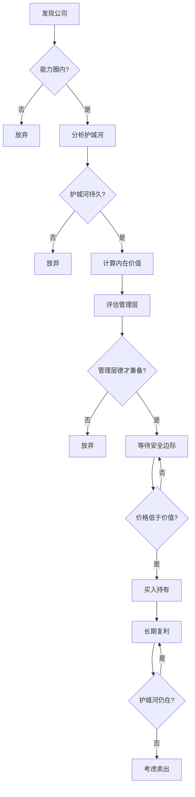

# 概念关系图

## 动态知识图谱

<KnowledgeGraph />

> 💡 **使用说明**
> - **拖拽节点**：按住节点可自由拖动位置
> - **缩放画布**：鼠标滚轮缩放，拖拽空白处平移
> - **点击节点**：显示概念详情和链接
> - **分类筛选**：点击顶部图例切换显示/隐藏
> - **核心三角**：点击"核心三角"按钮聚焦核心概念

---

## 概念关系矩阵

| 源概念 | 关系类型 | 目标概念 | 说明 |
|:---|:---|:---|:---|
| 护城河 | → 确定 | 内在价值 | 竞争优势决定企业价值 |
| 安全边际 | → 保护 | 内在价值 | 用折扣价买好资产 |
| 内在价值 | → 前提 | 股票回购 | 低于内在价值才回购 |
| 复利 | → 需要 | 长期主义 | 时间是复利的朋友 |
| 保险浮存金 | → 依赖 | 承保纪律 | 承保盈利才有低成本浮存金 |
| 资本配置 | → 运用 | 保险浮存金 | 浮存金是资本配置的资金来源 |
| 递延税复利 | → 放大 | 复利 | 未实现利得递延纳税放大收益 |
| 能力圈 | → 限定 | 内在价值 | 只投资看得懂的公司 |
| 逆向思维 | → 提供 | 安全边际 | 市场恐慌时才有折扣 |
| 风险 | → 定义 | 安全边际 | 安全边际是对抗风险的缓冲 |
| 透视盈利 | → 揭示 | 真实盈利 | 留存收益的真实价值 |
| 管理层选择 | → 维护 | 护城河 | 优秀管理层保持竞争优势 |
| 高管薪酬 | → 激励 | 管理层选择 | 合理薪酬吸引优秀管理者 |
| 错误坦诚 | → 降低 | 风险 | 承认错误避免更大损失 |
| 声誉 | → 源于 | 错误坦诚 | 坦诚建立信任 |
| 公司治理 | → 保障 | 管理层选择 | 治理结构确保选对人 |
| 航空公司教训 | → 验证 | 护城河 | 没有护城河的行业要避开 |
| 所罗门危机 | → 考验 | 声誉 | 危机时刻声誉最重要 |
| 日本投资 | → 展示 | 能力圈 | 简单商业模式才投 |

---

## 投资决策关键路径

---

## 学习路径建议

**入门路径：** 内在价值 → 护城河 → 安全边际 → 能力圈

**进阶路径：** 保险浮存金 → 承保纪律 → 资本配置 → 透视盈利

**高阶路径：** 管理层选择 → 公司治理 → 声誉 → 错误坦诚

**实战路径：** 逆向思维 → 风险 → 长期主义 → 复利

---

> 💡 **图谱使用建议**
> 
> 1. 从核心三角（内在价值-护城河-安全边际）开始理解
> 2. 逐步添加方法论概念，形成完整框架
> 3. 用历史案例验证概念关联
> 4. 最终形成自己的投资决策路径
