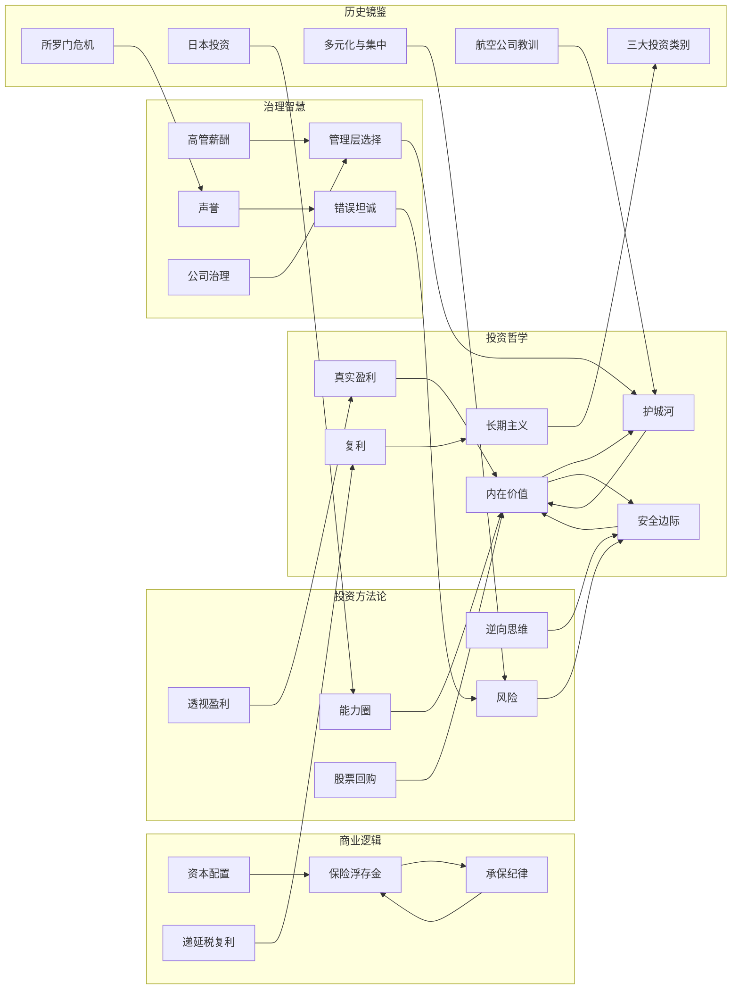
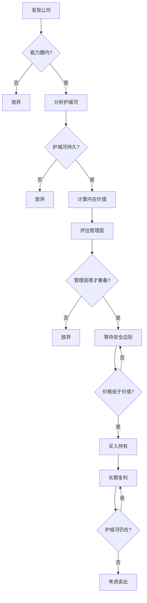
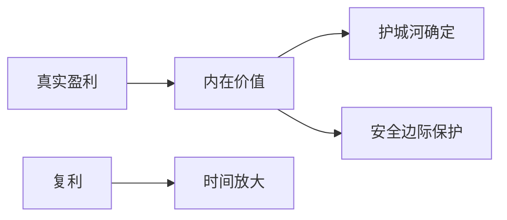
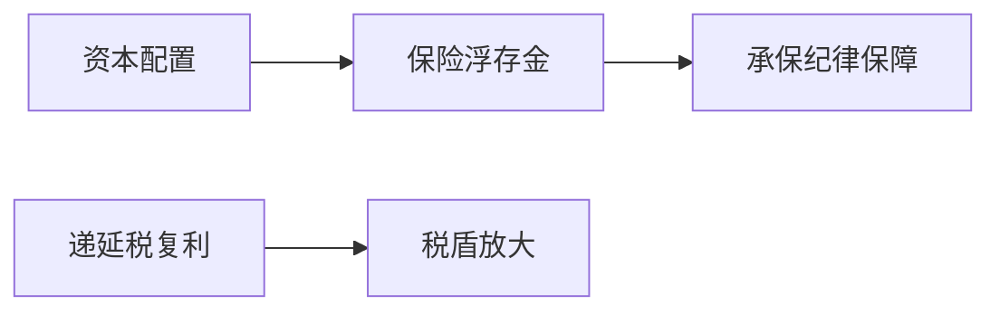
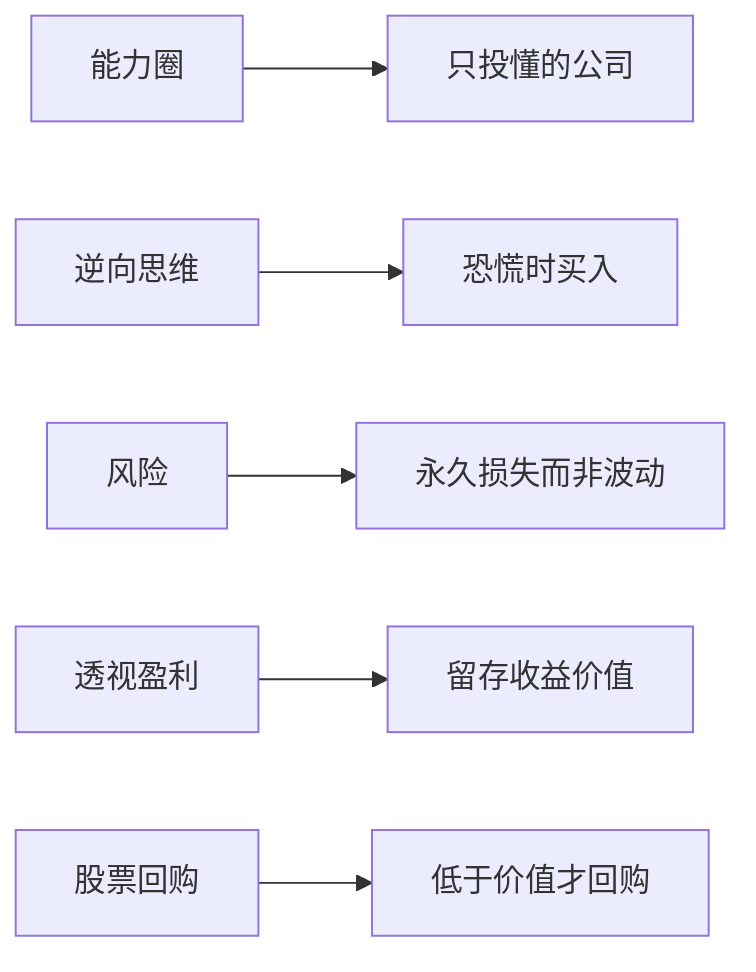
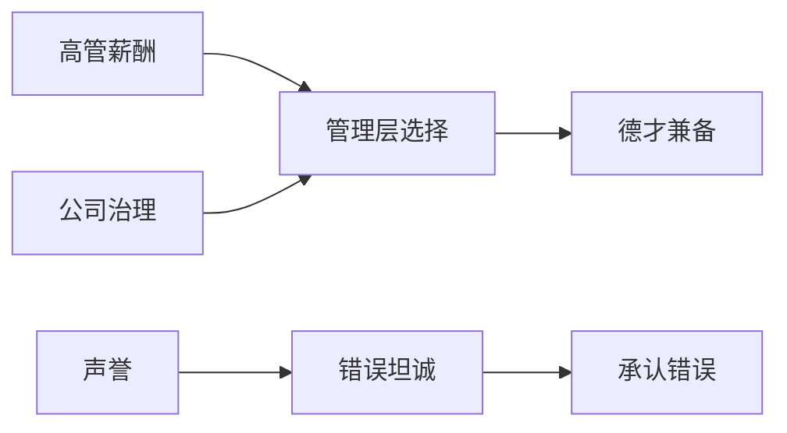
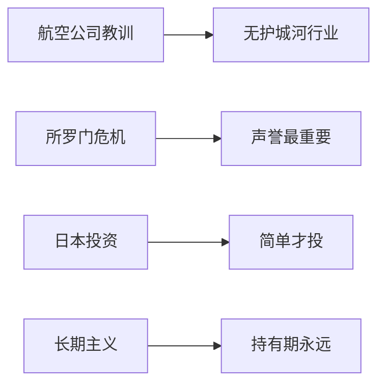
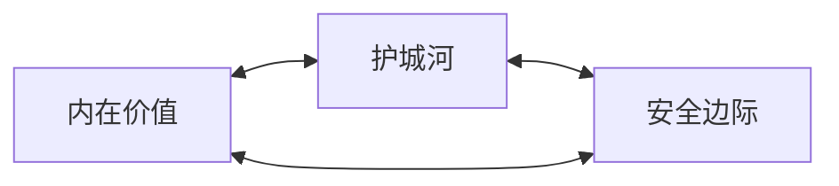

# 概念关系图

## 核心概念关系总览

---

## 概念关系矩阵

| 源概念 | 关系类型 | 目标概念 | 说明 |
|:---|:---|:---|:---|
| 护城河 | → 确定 | 内在价值 | 竞争优势决定企业价值 |
| 安全边际 | → 保护 | 内在价值 | 用折扣价买好资产 |
| 内在价值 | → 前提 | 股票回购 | 低于内在价值才回购 |
| 复利 | → 需要 | 长期主义 | 时间是复利的朋友 |
| 保险浮存金 | → 依赖 | 承保纪律 | 承保盈利才有低成本浮存金 |
| 资本配置 | → 运用 | 保险浮存金 | 浮存金是资本配置的资金来源 |
| 递延税复利 | → 放大 | 复利 | 未实现利得递延纳税放大收益 |
| 能力圈 | → 限定 | 内在价值 | 只投资看得懂的公司 |
| 逆向思维 | → 提供 | 安全边际 | 市场恐慌时才有折扣 |
| 风险 | → 定义 | 安全边际 | 安全边际是对抗风险的缓冲 |
| 透视盈利 | → 揭示 | 真实盈利 | 留存收益的真实价值 |
| 管理层选择 | → 维护 | 护城河 | 优秀管理层保持竞争优势 |
| 高管薪酬 | → 激励 | 管理层选择 | 合理薪酬吸引优秀管理者 |
| 错误坦诚 | → 降低 | 风险 | 承认错误避免更大损失 |
| 声誉 | → 源于 | 错误坦诚 | 坦诚建立信任 |
| 公司治理 | → 保障 | 管理层选择 | 治理结构确保选对人 |
| 航空公司教训 | → 验证 | 护城河 | 没有护城河的行业要避开 |
| 所罗门危机 | → 考验 | 声誉 | 危机时刻声誉最重要 |
| 日本投资 | → 展示 | 能力圈 | 简单商业模式才投 |
| 三大投资类别 | → 方法 | 长期主义 | 不同类别不同持有期 |

---

## 投资决策关键路径

---

## 分层关系图

### 第一层：价值评估（投资哲学）

### 第二层：商业理解（商业逻辑）

### 第三层：实践方法（投资方法论）

### 第四层：治理保障（治理智慧）

### 第五层：历史验证（历史镜鉴）

---

## 概念强弱关联分析

### 强关联（核心三角）

这三个概念构成巴菲特投资思想的核心三角，缺一不可。

### 中关联（方法论支撑）

- 能力圈 → 限定投资范围 → 护城河分析才有意义
- 逆向思维 → 创造买入机会 → 安全边际才能实现
- 风险定义 → 明确目标 → 安全边际才有方向

### 弱关联（历史验证）

- 航空公司教训 → 反面验证 → 护城河重要性
- 所罗门危机 → 极端测试 → 声誉价值
- 日本投资 → 当代实践 → 能力圈原则

---

## 学习路径建议

**入门路径：** 内在价值 → 护城河 → 安全边际 → 能力圈

**进阶路径：** 保险浮存金 → 承保纪律 → 资本配置 → 透视盈利

**高阶路径：** 管理层选择 → 公司治理 → 声誉 → 错误坦诚

**实战路径：** 逆向思维 → 风险 → 长期主义 → 复利

---

> 💡 **图谱使用建议**
> 
> 1. 从核心三角（内在价值-护城河-安全边际）开始理解
> 2. 逐步添加方法论概念，形成完整框架
> 3. 用历史案例验证概念关联
> 4. 最终形成自己的投资决策路径
