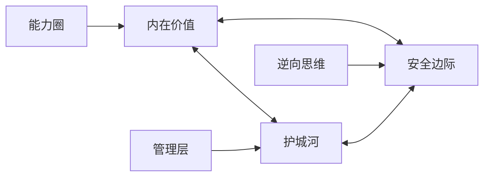
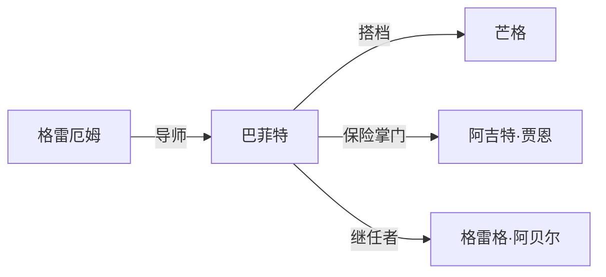
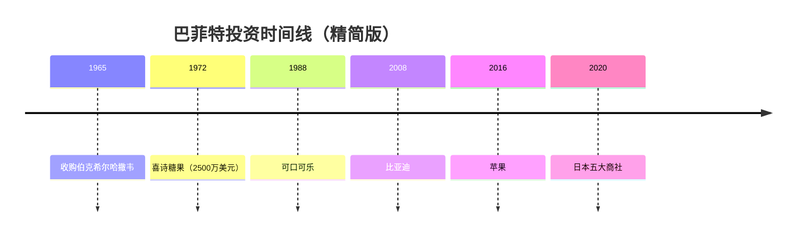

# 知识图谱

> 知识图谱是巴菲特知识库的核心模块之一，用可视化方式展示投资思想、人物关系、投资时间线的全景图。

---

## 模块概览

| 图谱类型 | 核心内容 | 文件 |
|:---|:---|:---|
| 概念关系图 | 25个核心概念的关联关系 | [concept-relations.md](/08_knowledge-graph/concept-relations) |
| 人物关系网络 | 77位关键人物的关系图谱 | [person-network.md](/08_knowledge-graph/person-network) |
| 投资时间线 | 1951-2025年重大投资事件 | [investment-timeline.md](/08_knowledge-graph/investment-timeline) |

---

## 快速导航

### 📊 概念关系图

核心概念三角：**内在价值 → 护城河 → 安全边际**

👉 [查看完整概念关系图](/08_knowledge-graph/concept-relations)

---

### 👥 人物关系网络

核心圈：**巴菲特 ← 芒格 ← 格雷厄姆**

👉 [查看完整人物网络](/08_knowledge-graph/person-network)

---

### 📅 投资时间线

关键里程碑：**1965伯克希尔 → 1972喜诗糖果 → 1988可口可乐 → 2016苹果 → 2020日本商社**

👉 [查看完整投资时间线](/08_knowledge-graph/investment-timeline)

---

## 图谱使用指南

### 1. 概念关系图使用场景

- **学习路径规划**：从核心三角开始，逐步扩展到方法论、治理智慧
- **投资决策检查**：按"投资决策关键路径"检查自己的投资逻辑
- **概念深度理解**：理解概念之间的因果、支撑、对比关系

### 2. 人物关系网络使用场景

- **理解决策机制**：巴菲特-芒格核心圈如何做出投资决策
- **研究思想传承**：格雷厄姆 → 巴菲特 → 新一代投资经理
- **评估管理层**：看巴菲特如何选择和管理子公司CEO

### 3. 投资时间线使用场景

- **理解投资演变**：从纺织厂到保险帝国到全球投资
- **案例分析**：按时间顺序研究经典投资案例
- **周期认知**：理解巴菲特在不同市场环境下的投资策略

---

## 知识图谱技术说明

本知识图谱模块采用以下技术：

| 技术 | 用途 | 优势 |
|:---|:---|:---|
| Mermaid | 图表渲染 | 原生支持，无需插件 |
| Markdown | 内容存储 | 版本控制友好 |
| wiki-link | 双向链接 | 知识互联 |

### Mermaid图表类型

- `graph LR/TD`：概念关系图、人物网络
- `timeline`：投资时间线
- `flowchart`：投资决策流程
- `mindmap`：知识结构脑图

---

## 后续规划

- [ ] 添加交互式图谱（D3.js/Force Graph）
- [ ] 添加概念引用热力图
- [ ] 添加人物共现分析
- [ ] 添加跨文档引用追踪

---

> 💡 **提示**
> 
> 本知识图谱基于巴菲特知识库的25个主题、77位人物、35家公司、70年股东信内容自动生成。
> 所有图谱均可点击节点跳转到对应的详细页面。
