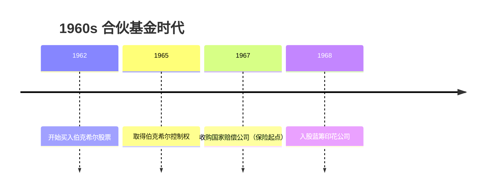
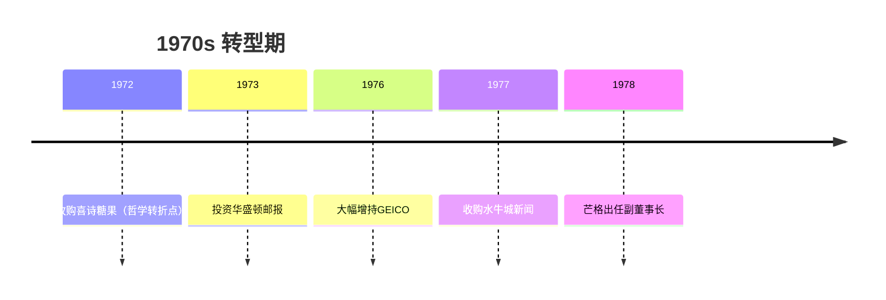
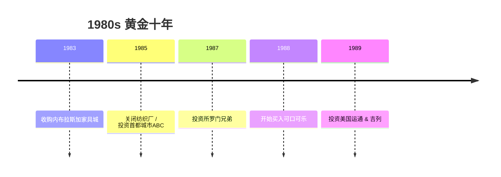
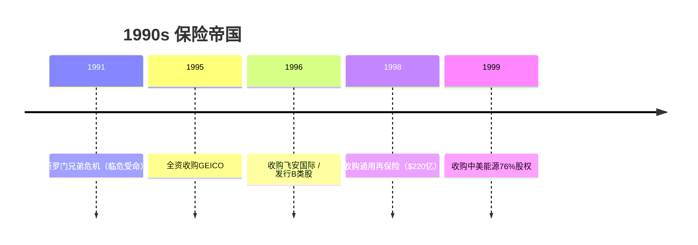
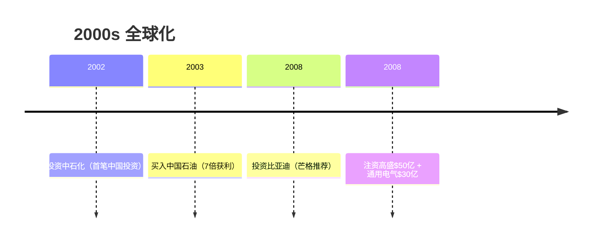
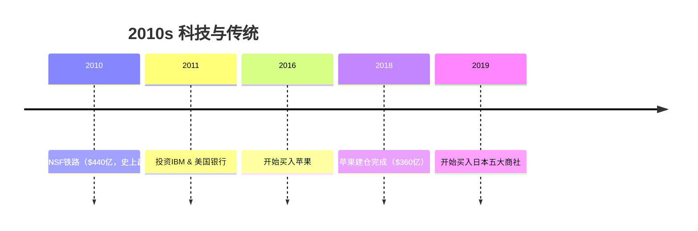
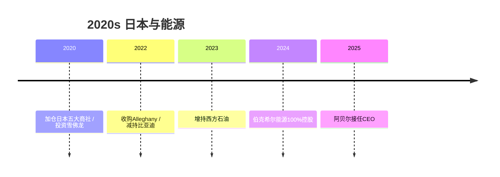
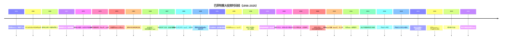

# 投资时间线

> 本图谱基于巴菲特知识库公司档案整理，覆盖巴菲特60余年投资生涯中最重要的收购与持股事件。

## 按年代划分

### 1960s：合伙基金时代

巴菲特以合伙基金为核心，从股票投资走向公司控制，最终确立伯克希尔作为永久载体。

| 年份 | 事件 | 金额/规模 | 意义 |
|------|------|-----------|------|
| 1962 | 开始买入伯克希尔·哈撒韦股票 | — | 雪茄烟蒂投资思路 |
| 1965 | 正式取得伯克希尔·哈撒韦控制权 | 均价$12/股 | 从投资转向控股 |
| 1967 | 收购国家赔偿公司（国民赔偿公司） | $860万 | **开启保险帝国之路** |
| 1968 | 入股蓝筹印花公司 | — | 日后收购喜诗糖果的通道 |

### 1970s：转型期

从雪茄烟蒂投资转向"以合理价格买入优秀企业"的哲学转折，消费品牌和媒体投资成为重点。

| 年份 | 事件 | 金额/规模 | 意义 |
|------|------|-----------|------|
| 1972 | 通过蓝筹印花收购喜诗糖果 | $2,500万 | **投资哲学转折点** |
| 1973 | 投资华盛顿邮报 | $1,063万 | 经典价值投资案例（持40年，100倍回报） |
| 1976 | 大幅增持GEICO至约33% | 约$4,570万 | 保险帝国核心资产 |
| 1977 | 收购水牛城新闻 | $3,300万 | 媒体业务扩张 |
| 1978 | 芒格出任伯克希尔副董事长 | — | **双核时代开启** |
| 1979 | 投资ABC广播公司（前期布局） | — | 媒体特许权布局 |

### 1980s：黄金十年

保险浮存金+品牌消费品的黄金组合形成，伯克希尔完成从纺织到保险+消费的投资帝国转型。

| 年份 | 事件 | 金额/规模 | 意义 |
|------|------|-----------|------|
| 1983 | 收购内布拉斯加家具城 | — | 最传奇零售收购（B夫人） |
| 1983 | 蓝筹印花并入伯克希尔 | — | 整合控股结构，喜诗100%归入 |
| 1985 | 关闭最后一家纺织厂 | — | 彻底告别纺织业务 |
| 1985 | 收购Scott & Fetzer | $3.15亿 | 大型制造业收购 |
| 1985 | 投资首都城市/ABC | $5.175亿 | 媒体投资巅峰 |
| 1987 | 投资所罗门兄弟（优先股） | $7亿 | 金融布局（后卷入丑闻） |
| 1988-89 | 重仓买入可口可乐 | 累计$13亿 | **最成功股票投资之一** |
| 1989 | 投资美国运通（重新买入） | $3亿PERCS | 二次押注运通特许权 |
| 1989 | 投资吉列（优先股） | $6亿 | 消费龙头布局 |

### 1990s：保险帝国

全资收购GEICO和通用再保险，伯克希尔成为全球保险业巨头，同时深度介入所罗门兄弟危机。

| 年份 | 事件 | 金额/规模 | 意义 |
|------|------|-----------|------|
| 1991 | 所罗门兄弟国债丑闻，巴菲特临危受命出任临时董事长 | — | **企业治理教科书** |
| 1993 | 可口可乐持股分析成经典案例 | — | "永恒持股"理念确立 |
| 1995 | 收购GEICO剩余股权 | $23亿 | GEICO 100%全资控股 |
| 1996 | 收购飞安国际（飞行安全国际） | — | 航空培训龙头 |
| 1996 | 发行B类股 | — | 让普通投资者也能参与 |
| 1997 | 所罗门兄弟被旅行者集团收购，伯克希尔退出 | — | 所罗门事件落幕 |
| 1998 | 收购通用再保险（Gen Re） | $220亿 | 全球最大再保险收购 |
| 1999 | 收购中美能源76%股权 | — | 能源帝国起点 |

### 2000s：全球化

从美国国内投资走向全球，中国和能源成为重要布局方向，金融危机中展现"别人恐惧我贪婪"。

| 年份 | 事件 | 金额/规模 | 意义 |
|------|------|-----------|------|
| 2002 | 投资中石化 | $4亿 | 首笔大型中国投资 |
| 2003 | 买入中国石油H股 | $4.88亿（获利$35亿） | 经典石油投资 |
| 2006 | 收购中美能源剩余股份 | — | 能源完全控股（更名伯克希尔能源） |
| 2007 | 卖出中石油获利约7倍 | — | 经典交易案例 |
| 2008 | 投资比亚迪（伯克希尔能源） | $2.32亿 | **押注电动汽车（芒格推荐）** |
| 2008 | 金融危机注资高盛 | $50亿优先股 | 危机中的"白衣骑士" |
| 2008 | 注资通用电气 | $30亿优先股 | 危机投资组合 |
| 2009 | 投资瑞士再保险、强生等 | — | 危机后全面布局 |

### 2010s：科技与传统

巴菲特打破"不投科技股"的惯例，苹果成为最大持仓；同时完成史上最大收购BNSF铁路。

| 年份 | 事件 | 金额/规模 | 意义 |
|------|------|-----------|------|
| 2010 | 收购BNSF铁路 | $440亿 | **史上最大收购，全押美国经济** |
| 2011 | 投资IBM | $107亿 | 首个科技股重仓（后减仓） |
| 2011 | 投资美国银行优先股 | $50亿 | 危机后银行布局 |
| 2012 | 收购Marmon集团 | $111亿+ | 工业集团整合 |
| 2013 | 卖出华盛顿邮报给贝索斯 | — | 持有40年，100倍回报 |
| 2016 | 开始买入苹果 | — | **打破科技禁忌，成为最大持仓** |
| 2018 | 苹果持仓完成（成本$360亿） | $360亿 | 5.4%股权 |
| 2019 | 开始买入日本五大商社 | — | 日本战略投资布局 |

### 2020s：日本与能源

日本五大商社成为第二大持仓，能源加码，苹果持续减持获利。

| 年份 | 事件 | 金额/规模 | 意义 |
|------|------|-----------|------|
| 2020 | 加仓日本五大商社至约5% | — | 伊藤忠、丸红、三菱、三井、住友 |
| 2020 | 开始投资雪佛龙 | $40亿 | 传统能源战略布局 |
| 2020 | 出售部分苹果获利$110亿 | — | 收回全部成本仍持5.4% |
| 2022 | 收购Alleghany保险 | $116亿 | 保险版图再扩张 |
| 2022 | 开始减持比亚迪 | — | 持仓14年，最高33倍回报 |
| 2023 | 增持西方石油至约25% | — | 能源加码 |
| 2024 | 伯克希尔能源100%控股 | — | 完成能源板块整合 |
| 2024 | 持续减持苹果 | — | 调整仓位 |
| 2025 | 格雷格·阿贝尔接任CEO | — | **巴菲特时代平稳过渡** |

---

## 完整投资时间线

---

## 投资类型分布

### 按行业分类

| 行业 | 代表投资 | 数量 |
|------|----------|------|
| 🏦 **保险/再保险** | GEICO、国家赔偿、通用再保险、Alleghany | 4+ |
| 🍬 **消费品/食品** | 喜诗糖果、可口可乐、吉列、卡夫亨氏 | 4+ |
| 🏦 **金融/银行** | 美国运通、富国银行、美国银行、所罗门兄弟、高盛 | 5+ |
| 📰 **媒体/出版** | 华盛顿邮报、首都城市ABC、水牛城新闻 | 3+ |
| 🚂 **铁路/交通** | BNSF铁路 | 1 |
| ⚡ **能源** | 中美能源/伯克希尔能源、中国石油、雪佛龙、西方石油 | 4+ |
| 🔋 **科技/新能源** | 苹果、IBM、比亚迪 | 3 |
| 🏭 **制造业/零售** | 内布拉斯加家具城、Scott & Fetzer、Marmon集团 | 3+ |

### 按投资类型分类

| 类型 | 说明 | 代表案例 |
|------|------|----------|
| **全资收购** | 100%控股子公司 | 喜诗糖果、GEICO、BNSF、通用再保险 |
| **重仓持股** | 长期持有5%+股权 | 可口可乐、苹果、美国运通、日本五大商社 |
| **优先股/可转换** | 危机中的结构性投资 | 高盛、通用电气、所罗门兄弟、吉列 |
| **已清仓** | 获利后退出 | IBM、华盛顿邮报、中石油、比亚迪（逐步退出） |

### 按地区分类

| 地区 | 代表投资 |
|------|----------|
| 🇺🇸 **美国** | 绝大多数投资（可口可乐、苹果、GEICO等） |
| 🇨🇳 **中国** | 中国石油、比亚迪、中石化 |
| 🇯🇵 **日本** | 伊藤忠、丸红、三菱、三井、住友 |
| 🌍 **全球** | 吉列（现宝洁）、卡夫亨氏（全球品牌） |

---

## 数据来源

- 伯克希尔·哈撒韦历年股东信（1977-2024）
- 巴菲特知识库公司档案：[`docs/03_companies/`](../03_companies/)
- 公开市场数据

---

*最后更新：2025年*
