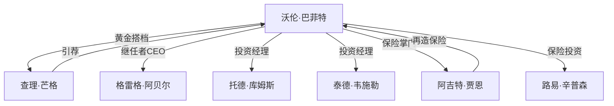
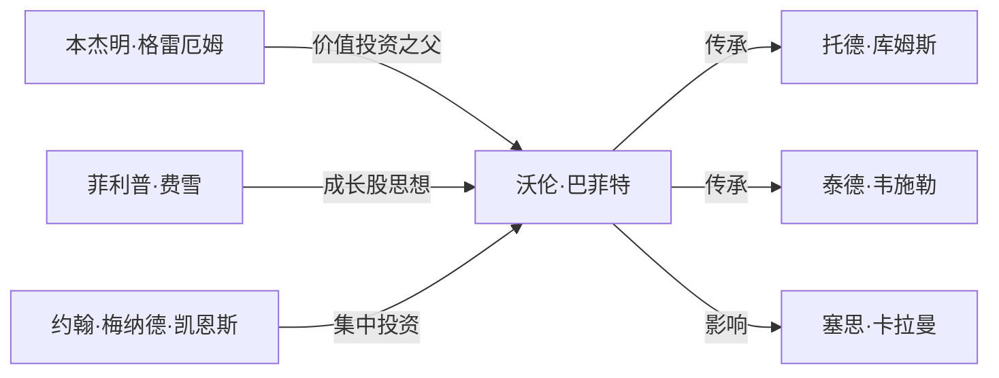
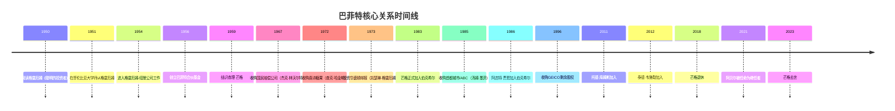

# 人物关系网络

## 巴菲特核心圈



---

## 投资大师传承



---

## 人物分类矩阵

### 伯克希尔核心层（6人）

| 人物 | 角色 | 关键贡献 |
|:---|:---|:---|
| 沃伦·巴菲特 | 董事长/CEO | 创始人，投资决策者 |
| 查理·芒格 | 副董事长 | 黄金搭档，思想碰撞 |
| 格雷格·阿贝尔 | CEO继任者 | 能源业务掌门人 |
| 托德·库姆斯 | 投资经理 | 管理部分投资组合 |
| 泰德·韦施勒 | 投资经理 | 管理部分投资组合 |
| 阿吉特·贾恩 | 保险副董事长 | 保险帝国缔造者 |

### 保险业务核心（5人）

| 人物 | 角色 | 关键贡献 |
|:---|:---|:---|
| 阿吉特·贾恩 | 保险副董事长 | 再保险业务掌门人 |
| 路易·辛普森 | GEICO投资主管 | GEICO投资决策 |
| 托尼·奈斯利 | GEICO CEO | GEICO运营掌门人 |
| 约翰·福特 | 保险精算师 | 保险定价专家 |
| 迈克尔·戈德堡 | 保险顾问 | 保险业务顾问 |

### 子公司CEO（15人）

| 人物 | 公司 | 行业 |
|:---|:---|:---|
| B夫人 | 内布拉斯加家具城 | 零售 |
| 阿尔·尤茨勒 | 飞行安全国际 | 培训 |
| 兰迪·沃森 | 贾斯汀靴业 | 制造 |
| 哈罗德·梅尔顿 | 斯科特-费泽 | 制造 |
| 弗兰克·罗尼 | H.H.布朗鞋业 | 制造 |
| 埃迪·兰珀特 | 兰珀特珠宝 | 零售 |
| 唐纳德·格雷厄姆 | 华盛顿邮报 | 媒体 |
| 斯坦利·利普西 | 布法罗新闻报 | 媒体 |
| 拉尔夫·舒伊 | 世界图书 | 出版 |
| 查克·哈金斯 | 喜诗糖果 | 食品 |
| 鲍勃·肖 | 萧氏工业 | 地毯 |
| 吉米·布莱辛 | 本布里奇珠宝 | 零售 |
| 杰克·林沃尔特 | 国民赔偿公司 | 保险 |
| 莫娜·本森 | 约旦家具 | 零售 |
| 汤姆·墨菲 | 首都城市/ABC | 媒体 |

### 被投公司CEO（10人）

| 人物 | 公司 | 关系 |
|:---|:---|:---|
| 鲍勃·戈伊苏埃塔 | 可口可乐 | 1988年投资时CEO |
| 肯·切诺特 | 美国运通 | 1990s投资时CEO |
| 杰夫·伊梅尔特 | 通用电气 | 2008年注资时CEO |
| 劳尔德·布兰克费恩 | 高盛 | 2008年注资时CEO |
| 王传福 | 比亚迪 | 2008年投资时CEO |
| 蒂姆·库克 | 苹果 | 2016年投资时CEO |
| 奎库·奥本格-耶博阿 | 加纳银行 | 早期投资 |
| 卡尔·赖卡特 | 韦斯科金融 | 旗下公司CEO |
| 彼得·林奇 | 富达投资 | 投资同行 |
| 约翰·博格 | 先锋集团 | 指数基金先驱 |

### 投资大师（8人）

| 人物 | 关系 | 核心贡献 |
|:---|:---|:---|
| 本杰明·格雷厄姆 | 导师 | 价值投资之父，《聪明的投资者》作者 |
| 菲利普·费雪 | 导师 | 成长股投资之父，《怎样选择成长股》作者 |
| 约翰·梅纳德·凯恩斯 | 思想影响 | 集中投资思想先驱 |
| 比尔·鲁恩 | 朋友/同行 | 红杉基金创始人 |
| 沃尔特·施洛斯 | 同门师兄 | 格雷厄姆学生 |
| 塞思·卡拉曼 | 受影响者 | Baupost基金创始人 |
| 霍华德·马克斯 | 朋友/同行 | 橡树资本创始人 |
| 查理·芒格 | 合伙人 | 多元思维模型倡导者 |

### 董事与顾问（8人）

| 人物 | 角色 | 关键贡献 |
|:---|:---|:---|
| 凯瑟琳·格雷厄姆 | 董事/朋友 | 华盛顿邮报前CEO |
| 汤姆·墨菲 | 董事/朋友 | 首都城市ABC创始人 |
| 丹·伯克 | 董事 | 首都城市ABC总裁 |
| 马尔科姆·蔡斯 | 董事 | 伯克希尔董事 |
| 沃尔特·斯科特 | 董事 | 伯克希尔董事 |
| 桑迪·戈特斯曼 | 董事 | 第一曼哈顿创始人 |
| 罗恩·奥尔森 | 董事 | 律师 |
| 查克·里克肖瑟 | 董事 | 医生/投资者 |

---

## 核心人物时间线



---

## 关系类型统计

| 关系类型 | 人数 | 占比 |
|:---|:---|:---|
| 子公司CEO | 15 | 19% |
| 被投公司CEO | 10 | 13% |
| 投资大师 | 8 | 10% |
| 董事与顾问 | 8 | 10% |
| 伯克希尔核心 | 6 | 8% |
| 保险业务 | 5 | 6% |
| 其他人物 | 25 | 33% |
| **总计** | **77** | **100%** |

---

## 关键人物关系深度解析

### 查理·芒格：黄金搭档

```
关系类型：合伙人、思想碰撞者
相识时间：1959年
关键贡献：
- 1972年说服巴菲特收购喜诗糖果，开启优质企业投资时代
- 引入"护城河"概念
- 多元思维模型思想
- 坦诚直言，挑战巴菲特的想法
```

### 本杰明·格雷厄姆：精神导师

```
关系类型：导师、雇主
相识时间：1950年（通过著作）
关键贡献：
- 价值投资哲学奠基
- 安全边际概念
- 《聪明的投资者》《证券分析》作者
- 1954-1956年在格雷厄姆-纽曼公司工作
```

### 阿吉特·贾恩：保险帝国缔造者

```
关系类型：下属、信任的执行者
加入时间：1986年
关键贡献：
- 建立伯克希尔再保险业务
- 将保险浮存金从数亿提升到千亿级别
- 巴菲特称"没有阿吉特，就没有今天的伯克希尔"
```

### B夫人：传奇创业者

```
关系类型：被投公司CEO
收购时间：1983年
关键贡献：
- 90岁创业，103岁退休
- 内布拉斯加家具城创始人
- 巴菲特称"如果商学院想要教学生如何经营企业，那就让B夫人来教"
```

---

> 💡 **人物网络使用建议**
> 
> 1. 从核心圈（巴菲特-芒格）开始理解决策机制
> 2. 理解投资大师传承，看巴菲特思想来源
> 3. 关注子公司CEO，理解巴菲特"买企业"的标准
> 4. 研究被投公司CEO，理解巴菲特与管理层的关系
